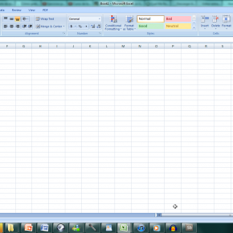
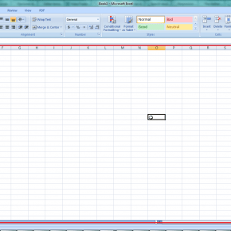
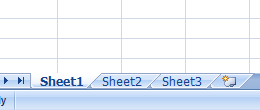
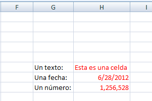

Hoy quiero contarte sobre los **tres elementos básicos** que te encontrarás en todo trabajo que realices con Excel y que tienes que conocer antes de comenzar tus aventuras con esta popular hoja de cálculo.

Sigue leyendo, porque a continuación voy a mostrarte, en palabras sencillas, el significado de los tres conceptos fundamentales para trabajar con un archivo de Excel.
<--->

## 1.- El libro

Comenzaré comentándote qué es el **libro de trabajo**, ya que es lo primero que verás al abrir Excel.

En inglés se lo denomina **"Workbook"** y es el archivo o documento Excel con el que vas a trabajar normalmente.

Cuando abres Excel y te aparece una pantalla con varias opciones e iconos, y una rejilla vacía, estás viendo un **libro de trabajo** de Excel.

A continuación te dejo una imagen que muestra cómo luce un libro de trabajo. Pincha sobre la imagen para verla más grande.

\[caption id="attachment\_230" align="alignnone" width="290"\] Ésto es un libro de trabajo.\[/caption\]

\[aviso titulo="" tipo="yellow"\]Nota como en la barra de título (la parte superior de la ventana que estás viendo) Aparece la palabra "Workbook1" o "Libro1".\[/aviso\]

#### ¿Y por qué se llama libro de trabajo?

Pues porque un libro de trabajo es, en realidad, una colección de hojas. Así es,un libro de trabajo no es otra cosa que una colección de hojas; pero en este caso se denominan **hojas de trabajo.**

Imagina que tienes un libro en tus manos. Piensa en sus características: El libro tiene un nombre. También tiene un número determinado de hojas, cada hoja tiene texto, imágenes, números, fechas... Las hojas están numeradas para poder referirnos a ellas en un momento dado...

Estas características que le pertenecen a un libro físico, también las tiene un libro de trabajo. Aunque en la pantalla no se parezca al libro que te acabas de imaginar, éste funciona igual. ¡Tenlo presente!

\[caption id="attachment\_235" align="alignnone" width="290"\] Un libro físico agrupa un número variable de hojas.\[/caption\]

Al igual que un libro físico está formado por un número indeterminado de hojas, un **libro de trabajo** también agrupa varias **hojas de trabajo**.

## 2.- La hoja

**Bien, tengo claro lo que es un libro de trabajo, pero ¿qué es la hoja de trabajo?**

La hoja de trabajo es una página de nuestro 'libro virtual'. ¿Recuerdas lo que te comenté en el punto anterior? Piensa en las hojas de trabajo, como si fueran un montón de hojas de papel amontonadas una sobre otra, donde tú vas a ingresar los datos que nececites.

**¿Ok, pero dónde están las hojas de trabajo?**

En realidad las hojas de trabajo ocupan la mayor parte de tu pantalla. Toda el área cuadriculada de tu libro de trabajo, corresponde a la hoja de trabajo.

A continuación te muestro una imagen, donde he encerrado en un recuadro rojo el área que ocupa la hoja de trabajo, Pincha en la imagen para verla más grande:

\[caption id="attachment\_260" align="alignnone" width="290"\] La hoja de trabajo es todo lo que puedes ver encerrado en el recuadro rojo.\[/caption\]

La hoja de trabajo, está formada por varias filas y columnas como puedes ver en la imagen anterior. Estas filas y columnas están formadas por varios rectángulos pequeños formando una cuadrícula (algo parecido a las hojas cuadriculadas en las que realizas las tareas de matemáticas) Nota que las filas están numeradas y las columnas están identificadas con letras.

**Las etiquetas de las hojas de trabajo.**

Como tal vez hayas notado, en la parte inferior de la hoja de trabajo, hay tres etiquetas (pueden ser más, pueden ser menos) con los nombres: "Sheet1", "Sheet2", "Sheet3" o si tienes la versión de Excel en español, éstas tendran los nombres "Hoja1", "Hoja2", "Hoja3".

Pues bien, estas etiquetas son como los separadores de tus hojas de trabajo y sirven para ponerle un nombre a cada hoja. Al igual que los separadores de una agenda, éstos sirven para facilitar la ubicación de una hoja determinada.

Cuando quieras cambiar de hoja de trabajo, sólo tienes que pinchar sobre el nombre de la hoja que quieres, e inmediatamente excel te mostrará su contenido.

A continuación te dejo una imagen que muestra cómo lucen las etiquetas de las hojas de trabajo. Pincha sobre la imagen para verla más grande.

\[caption id="attachment\_264" align="alignnone" width="260"\] Etiquetas de las hojas de trabajo. Sirven para darle un nombre a tus hojas.\[/caption\]

## 3.- La celda.

Cuando te hablo de una celda, podría decir que ésta es la "unidad mínima de información" en una hoja de Excel. Una celda es "una cajita" que puede contener letras, números, fechas, fórmulas u otros datos. Cada uno de los pequeños rectángulos que ves dentro de la **hoja de trabajo** es una **celda**.

A continuación te muestro una imagen con varias celdas en las que he escrito algunas cosas:

\[caption id="attachment\_217" align="alignnone" width="301"\] La celda puede tener cualquier valor.\[/caption\]

Todas las celdas juntas forman una cuadrícula que a su vez forman **líneas** y **columnas**. Las líneas están numeradas y las columnas se diferencian con letras en la parte superior, con el objetivo de poder localizar una celda. Regresa a ver la imagen de la hoja de trabajo y fíjate en este detalle.

#### ¿Cómo funciona este tema de las letras y los números?

Imagina que las columnas son calles que están dispuestas de forma **vertical**, cada calle tiene un nombre que será una letra: A, B, C, D, E \[...\]

Ahora imagina que cada línea son calles que están dispuestas de forma **horizontal**, cada calle tiene un nombre que será un número: 1, 2, 3, 4, 5 \[...\]

Si ya tenemos esta nomenclatura para nuestras calles imaginarias, entonces para ubicar una celda, bastará con saber su "dirección".

- Una celda que se encuentre en la **primera** columna y en la **primera** fila, se dice que está en la dirección A1, porque la primera columna es la A y la primera fila es la 1.
- Una celda que se encuentre en la **quinta** columna y en la **segunda** fila, se dice que está en la dirección E2, porque la quinta columna es la E y la segunda fila es la 2.

A esta dirección que tienen las celdas es a lo que llamamos **referencia**.

#### ¡Muy bien! Ya tengo más claro el tema. ¿Y ahora qué?

Ya lo tienes. Este es mi primer aporte en tu camino al dominio de Excel. En próximos artículos profundizaré más en sus opciones y su manejo, ampliaré conceptos, te iré desvelando trucos y mostrándote técnicas que te ayuden a liberar el poder de Excel y ponerlo al servicio de tu creatividad.

¿Te gustó el artículo? Entonces **ayúdame compartiéndolo** en las redes sociales usando los botones disponibles.

¡Nos vemos!
