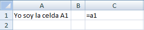
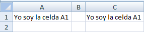

¿Te has hecho esta pregunta alguna vez?

En el mundo de MS Excel, la palabra '**referencia'** se menciona muchas veces: la escuchas en el colegio, en la univesidad, en el trabajo, en el curso de computación, en los tutoriales en Internet, etc.

¿Verdad que en algún momento te has 'encontrado' con esta palabra?

¿Pero cuál es su significado? ¿Qué significa referencia? Veamos qué dice la Real Academia Española sobre esto:

### referencia.

(Del lat. _refĕrens, -entis_, referente).

- f. Acción y efecto de [**referirse**](http://lema.rae.es/drae/srv/search?id=ZdXhBTxqGDXX2hkm7WSS#0_7)(‖ aludir).
- f. Relación, dependencia o semejanza de algo respecto de otra cosa.
- f. Combinación de signos que identifican un objeto, especialmente un producto comercial. _(La referencia figura en la etiqueta.)_

Según estas definiciones que encontramos en el diccionario, podemos decir que los significados de referencia son:

1. Una **mención** de algo o alguien.
2. Una **equivalencia** o semejanza de algo respecto de otra cosa.
3. Una **identificación** de algo o de alguien.

En Excel,  estas definiciones son igualmente válidas para el concepto de referencia.

Tener claro este concepto es clave si quieres trabajar en temas más complejos, como las fórmulas. Por eso **sigue leyendo**, ya que te voy a mostrar un poco más de cerca lo que es una referencia para Excel.

## ¿Qué es una referencia en Excel?

Dicho de una forma sencilla, referencia es el nombre de la celda, el cual está dado por la letra de la columna y el número de la fila. [\[Tweet\]](http://twitter.com/home?status=[..]+referencia+es+el+nombre+de+la+celda,+el+cual+está+dado+por+la+letra+de+la+columna+y+el+número+de+la+fila.+->+https://www.raymundoycaza.com/?p=329 "Envíar a Twitter")

Como te comenté en el artículo [Excel: la celda, la hoja y el libro](https://www.raymundoycaza.com/excel-basico/celda-hoja-libro.html "Excel: La celda, la hoja y el libro."), cada celda nace a partir de la intersección de una columna y una fila.

Recuerda que las columnas y las filas están identificadas de la siguiente forma:

1. Cada columna tiene asignada una o más letras.
2. Cada fila tiene asignado un número.

Así, cada vez que una columna se cruza con una fila, éstas se intersectan en un punto llamado celda, al que podemos identificar utilizando la forma de coordenadas. ¡Sí! Utilizamos coordenadas. ¡Igual que las coordenadas cartesianas!

En este sistema de coordenadas, cada celda se define con una letra que indica la columna en la que se encuentra y un número que indica su fila.

En consecuencia, si una celda se encuentra ubicada en la intersección de la columna C y la fila 4, se dice que su referencia es:C4

### Recuerda:

Para escribir la referencia de una celda, debes indicar primero la columna y luego la fila, es decir, primero la letra y luego el número.

## ¿Y para qué me sirve esto de la referencia?

Ya te he dicho que la referencia es el nombre con el cual Excel reconoce a cada una de las celdas. Ésto te permite 'llamar' a una celda por su nombre, desde otro lugar donde necesites utilizar el valor de dicha celda.

#### ¿Qué significa esto?

La idea de realizar ese llamado a través de la referencia, es lograr que en una celda 'X' aparezca el valor que tienes en una celda 'Y'.

Para lograrlo, debes ingresar la referencia de la celda a la cual quieres invocar, pero siempre comenzando con el signo igual '='.

Veamos un ejemplo para tenerlo más claro.

A continuación te muestro una imagen donde se ve que he escrito en la celda A1  el texto 'Yo soy la celda A1'.

Como ves, me he colocado en la celda C1 y he escrito el símbolo igual (=) seguido de la referencia a la celda A1.

En la siguiente imagen, puedes ver qué sucede cuando yo presiono la tecla **enter**, aceptando la referencia que le indiqué a Excel:

Excel devuelve el valor que tenga la celda referida

Lo que ha sucedido es que yo le he dicho a Excel que quiero que 'averigüe' el valor que tiene la celda **A1**, y me lo muestre en la celda **C1.**

Si cambias el valor que está escrito en la celda A1, observarás que también cambia en la celda C1. Excel ha creado un vínculo entre ambas celdas, haciendo uso de la referencia que le hemos dado.

Esta característica puede serte muy útil , ya que te otorga una gran flexibilidad  al momento de realizar tus trabajos con Excel.

Te permite, por ejemplo, definir un valor en una celda y llamarlo desde otros puntos donde requieras usar dicho valor para realizar tus cálculos. Así, cuando necesites cambiarlo, únicamente será necesario que realices el cambio en un sólo lugar y te libras de estar haciendo cambios por todo tu documento.

Como ves, el hacer uso de referencias en Excel puede ser una gran ayuda, si lo usas adecuadamente.

En un próximo artículo te mostraré los tipos de referencia existentes.

¿Te ha gustado esta introducción? Entonces compártela en Twitter y Facebook usando los botones de abajo.
