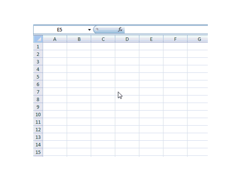
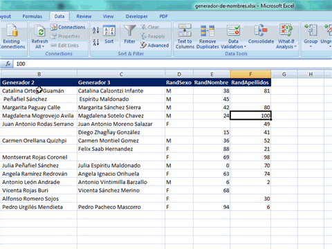

Foto cortesía de [SXC](http://www.sxc.hu/photo/285797 "SXC")

¡Hola! Hoy te traigo un consejo rápido sobre Excel para comenzar la semana con pie derecho.

En muchas ocasiones, queremos insertar un dato en varias celdas a la vez. Como podrás imaginar, hay varias formas de hacerlo; pero como siempre, no me iré por las ramas e iré directo al punto.

A continuación te muestro la forma en que yo lo hago, al más puro estilo 1,2,3:

### Insertar un dato en varias celdas

- Selecciona todas las celdas donde quieres insertar el dato.
- Escribe el dato en cuestión.
- Presiona CTRL + Enter

¡Listo!

En la siguiente animación puedes ver cómo funciona esta técnica y lo útil que puede llegar a ser en algunos casos. No la subestimes, seguramente encontrarás una tarea en la que te resultará tremendamente útil.

### ¿Un paso más allá?

Esta técnica puede combinarse con otras para **llevar nuestra productividad a otro nivel**.

Por ejemplo, **imagina** uno de esos casos en los que tienes una hoja de datos donde hay varias celdas vacías y tienes que 'rellenar' esos espacios con un cero (u otro valor).

El inconveniente es que, por lo general, estas celdas vacías están distribuidas por toda nuestra tabla y sin ningún orden. ¿Cómo podríamos seleccionarlas rápidamente?

Te mostraré cómo hacerlo en cinco pasos:

\[unordered\_list style="tick"\]

- Selecciona todas las celdas de la tabla y presiona la tecla F5
- Haz clic sobre el botón “Special”
- Selecciona la opción “Blanks” para que se seleccionen todas las celdas en blanco.
- Escribe el valor deseado (para el ejemplo, el cero)
- Presiona las teclas CTRL + Enter

\[/unordered\_list\]

¡Listo!

_**Observa esta animación para que el ejemplo quede más claro:**_

_****_

¿Conocías este dato? ¿Qué tan seguido lo usas? ¿Lo consideras interesante?

Si quieres compartir tu propio consejo o deseas agregar algo más al artículo, te invito a que lo hagas en los comentarios.

¡Buen inicio de semana!
