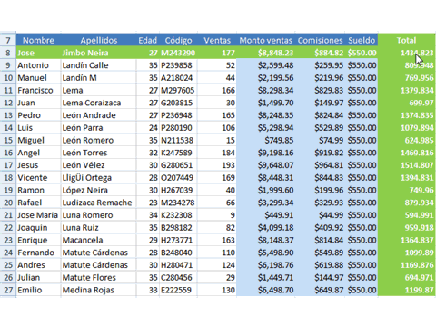
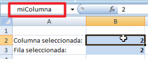
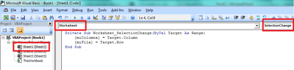
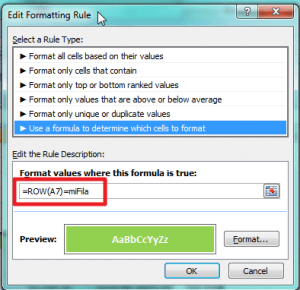

"¡Mi archivo de Excel parece una sábana!"

¿Alguna vez te has escuchado a ti mismo diciendo ésto? ¡Seguramente no te falta razón!

Y es que son muchos los usuarios que manejan gran cantidad de datos en su hoja de Excel.

A veces nos gustaría tener un apoyo visual, como el que existe en ciertos sistemas en los que en todo momento se nos muestra dónde está el cursor.

**Imagina** como sería tener esta ayuda en Excel.

¿Pero... será posible?

MS Excel no dispone de esa opción, no de forma nativa al menos; pero gracias a su gran flexibilidad, podemos realizar casi cualquier cosa que nos propongamos.

En la siguiente animación verás una muestra lo que pretendo lograr:

Interesante ¿No lo crees?

Pues **sigue leyendo**, porque te mostraré cómo puedes implementar esta útil función en tu propia hoja de Excel.

Vamos a dividir el proceso en 5 sencillos pasos:

1. **Define el área**que vas a utilizar.
    - En primer lugar, debes tener en mente el área en la cual vas a trabajar. Para el ejemplo, voy a utilizar el área que ocupa el rango A7:I27
2. **Selecciona dos celdas** que usarás para control y que estarán **fuera** del rango de trabajo.
    - En mi caso, he elegido las celdas B2 y B3
    - Dales un nombre a cada una. A la celda B2 le he dado el nombre: **miColumna** A la celda B3 le he dado el nombre: **miFila**
3. ¡Usemos macros!
    - Presiona las teclas ALT + F11 (para abrir el editor de macros)
    - En la nueva ventana que se abrió, haz clic derecho sobre el nombre de la hoja en la que estabas trabajando y selecciona la opción 'View Code' (O ver código si está en español)
    - En las listas de arriba, selecciona **Worksheet** y **SelectionChange**.
    - Excel te mostrará una función `Worksheet_SelectionChange()`que está vacía.
    - Dentro de esa función, escribe las siguientes líneas: `[miColumna] = Target.Column` `[miFila] = Target.Row` 
        
        Este código lo que hace es asignar el valor de la columna y la fila actual a su correspondiente celda de control. Por eso hemos utilizado los nombres que le dimos a estas celdas hace un momento.
        
        Haz la prueba. Cambia de celda y observa cómo se actualizan automáticamente los valores en las celdas de control.
        
        Nota: Es importante que utilices los paréntesis angulares -también llamados corchetes- ( **\[ \]** ), ya que ésta es la forma de decirle a Excel que nos estamos refiriendo a un nombre definido en la hoja y no a una variable.
        
4. **Formato condicional.** Una vez que ya tenemos la información referente a la columna y fila seleccionada, vamos a aplicar un formato condicional.
    - Selecciona el rango de tu área de trabajo. En mi caso es el `A7:I27`
    - Ve a la opción Conditional Formatting -> New Rule
    - Selecciona la última opción 'Use a formula to determine wich cells to format'
    - Ingresa la siguiente fórmula: `=COLUMN(A7)=miColumna`
    - Repite la operación para agregar otra condición al formato condicional e ingresa la siguiente fórmula: `=ROW(A7)=miFila`
        
        
        
        No olvides aplicar el formato en cada paso, indicándole el color de fondo con el que quieres que se resalte la ubicación de la celda actual.
        
        Nota: Siempre utiliza la referencia a la primera celda de tu rango. En mi caso tengo el rango A7:I27, por lo tanto, la primera celda es la A7, y es la que uso en la fórmula del formato condicional.
        
5. ¡Disfruta del resultado!
    - Ahora utiliza esta técnica en tus reportes, nóminas, tableros de comando, etc. ¡Seguramente dejarás impresionado a tu jefe!

## ¿Quieres descargar el archivo?

Si necesitas el archivo, solo haz clic para descargarlo a continuación. ¡Es gratis!

[Descargar el archivo terminado](http://raymundoycaza.com/wp-content/uploads/resaltar-celda-activa.xlsm)

### Resumiendo

Como has podido observar, el formato condicional puede ser un gran aliado para infinidad de tareas.

Yo prefiero utilizar el formato condicional para este tipo de trabajos y lo complemento con algo de código VBA. El resultado puede llegar a ser 'mágico'

La técnica mostrada es una buena forma de hacerlo desde el punto de vista del rendimiento, sobre todo si lo comparamos con opciones que usan código VBA más complejo.

Pero siempre hay más de una forma de lograrlo.

Así que **anímate y cuéntame** ¿Qué técnica utilizarías tú para resaltar la celda activa?

Espero tus comentarios.

\[firma\]
