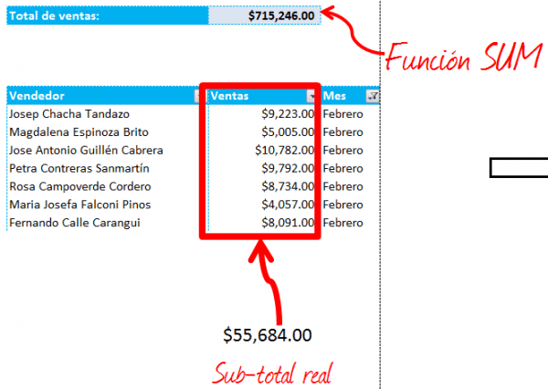
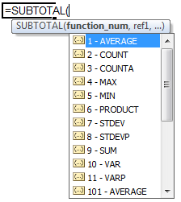

#### ¿Quieres únicamente sumar celdas visibles en Excel, sin complicaciones?

Entonces ésto te interesa.

En este artículo conocerás la forma más sencilla de realizar varias operaciones sobre las celdas que están visibles **sin considerar** las celdas ocultas**,** entre ellas **sumar celdas visibles en Excel.**

Si estás leyendo este artículo, seguramente te ha pasado que al usar la función \[abbr title="Equivalente en español: SUMAR()"\]SUM()\[/abbr\] sobre los datos de un rango filtrado, **el resultado es diferente al que esperabas** ¿No es así?

Pues te cuento que la solución a este problema es la función \[abbr title="Equivalente en español: SUBTOTALES()"\]SUBTOTAL()\[/abbr\]

### Sumando las celdas visibles:

La función  \[abbr title="Equivalente en español: SUBTOTALES()"\]SUBTOTAL()\[/abbr\] nos permite realizar la suma (y otras operaciones) sin considerar aquellas celdas que están ocultas.

Esto es especialmente útil cuando queremos realizar, por ejemplo, una suma sobre un Rango que está Filtrado.

Esta función es muy versátil ya que te permite realizar varias operaciones, entre ellas: Promedio, Conteo, Conteo de Blancos, Suma, etc.

La función \[abbr title="Equivalente en español: SUBTOTALES()"\]SUBTOTAL()\[/abbr\] te pide sólo dos cosas:

1. El tipo de operación que quieres realizar.
2. El rango sobre el que vas a realizar la operación.

Por lo tanto, la sintaxis de la fórmula es la siguiente:

\[box\]=SUBTOTAL (Tipo de Operación, Rango de Celdas)\[/box\]

**El parámetro Tipo de Operación** recibe, como su nombre indica, el tipo de operación que quieres realizar. En este ejemplo, vamos a realizar una suma, por lo tanto, colocaremos en éste parámetro el número 9.

 **El parámetro Rango de Celdas**, recibe el rango sobre el cual vas a realizar la operación. Y por si fuera poco, puedes agregar más de un rango de celdas. Ya estás pensando en las posibilidades ¿Verdad?

Si utilizamos esta función en el ejemplo anterior, podremos filtrar los datos y esta vez sí obtendremos el resultado esperado:

")

### Un paso más allá...

Seguramente ya tienes varias ideas sobre como sacarle provecho a esta útil función. En la siguiente imagen puedes ver cómo podrías aprovechar su versatilidad para realizar cálculos dinámicos:

\[box type="note"\]Si te interesa averiguar más sobre esta función, visita la siguiente dirección: [http://office.microsoft.com/es-es/excel-help/funcion-subtotales-HP010062463.aspx](http://office.microsoft.com/es-es/excel-help/funcion-subtotales-HP010062463.aspx "Función Subtotales")\[/box\]

### ¿Y tú? ¿Ya usas la función Subtotal?

La función \[abbr title="Equivalente en español: SUBTOTALES()"\]SUBTOTAL()\[/abbr\] la utilizo muy seguido en mis trabajos debido a su versatilidad. En combinación con otras fórmulas y técnicas de Excel, es capaz de cubrir los más exigentes escenarios.

¿Y qué me cuentas tú? ¿Usas la función Subtotal? ¿Tienes algún otro consejo que quieras compartir? Por favor no dudes en hacerlo usando los botones de compartir que están más abajo.

\[twitter style="horizontal" source="RaymundoYcaza" hashtag="#ExcelTips" float="left" lang="es"\] \[fblike style="standard" showfaces="false" width="450" verb="like" font="arial" locale="es\_ES"\]
