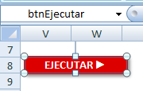
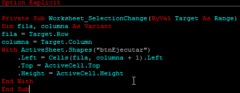
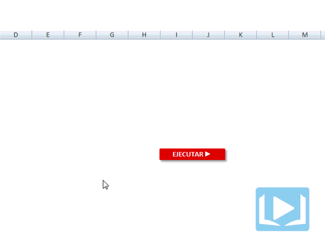

_Foto cortesía de: [jimbl](http://www.flickr.com/photos/jimbl/2358839406/ "jimbl")_

Cuando trabajas sobre una hoja con varios cientos o miles de registros, se te presenta la molestia de no saber dónde colocar el botón que ejecute la macro que has desarrollado. ¿No es verdad?

Tarea un poco difícil, porque el usuario siempre se va a estar moviendo en todas direcciones, sobre todo hacia abajo, donde nuestro botón sale del campo visual. Sería Excelente poder crear un botón flotante para nuestra macro; pero ya sea porque quieres hacerlo diferente, o porque no quieres que el usuario cierre accidentalmente la ventanita con el botón, te voy a mostrar cómo hacerlo con una autoforma.

## Botón Flotante en Excel

Primero vas a crear tu botón con una autoforma, a tu gusto. Esta es una de las ventajas de hacerlo así, porque puedes darle la forma y el color que quieras a tu botón. El mío me quedó así:

No olvides darle un nombre al botón. Yo le puse "btnEjecutar"

Ahora, vas a crear una macro **dentro de la hoja en la que dibujaste el botón**. Esto debido a que debemos controlar el evento Worksheet\_SelectionChange que se dispara cada vez que el usuario cambia la selección.

Este sería el código a utilizar:

 

En este código, le estamos indicando a Excel que cada vez que nos movamos por la hoja, calcule la posición de la celda y se la asigne a la autoforma que tiene por nombre "btnEjecutar".

1.  Con el atributo **.Left** de nuestro botón, le estamos indicando que la distancia desde la izquierda de la pantalla, sea igual a la distancia que tiene la celda que está a la derecha de la celda activa.
2. Con el atributo **.Top** de nuestro botón, estamos asignándole la misma distancia que tiene la celda activa desde la parte superior de la pantalla.
3. El atributo **.Height** es simplemente para que siempre se adapte al alto de la celda activa. Puedes quitarle esta línea si tienes una planilla con muchas filas de diferente altura.

## El botón flotante En acción

En esta imagen puedes ver a nuestro simpático botón moviéndose por toda la hoja cada vez que cambiamos la celda activa. No importa hacia dónde nos movamos, nos seguirá "como un perrito fiel"

 

## Consejos adicionales para que modifiques el código

Si no quieres que el botón flotante se mueva de columna, puedes eliminar la siguiente línea:

\[aviso tipo="code" titulo=""\].Left = Cells(fila, columna + 1).Left\[/aviso\]

Por el contrario, si quisieras que tu botón no se mueva de fila, pero sí de columna, puedes eliminar la siguiente línea:

\[aviso tipo="code" titulo=""\].Top = ActiveCell.Top\[/aviso\]

Si tu hoja tiene muchas filas con altura diferente entre si, puedes eliminar la siguiente línea:

\[aviso tipo="code" titulo=""\].Height = ActiveCell.Height\[/aviso\]

## El ejemplo terminado

Aquí te dejo el ejemplo terminado en un libro de Excel habilitado para macros. Solo haz clic en el botón y sigue las instrucciones. ¡Es Gratis!

No te olvides de permitir la ejecución de macros al abrirlo, para que funcione el código.

Eso es todo por hoy. Espero que le saques provecho a este ejemplo y lo apliques en tus proyectos.

¡Nos vemos!

\[firma\]
