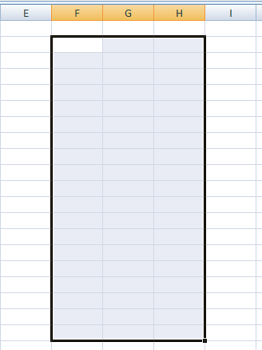
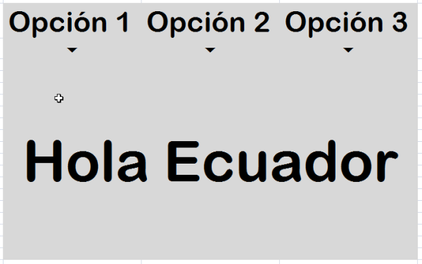
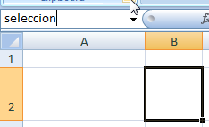
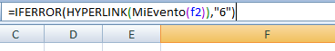
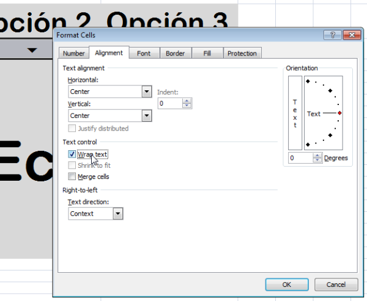
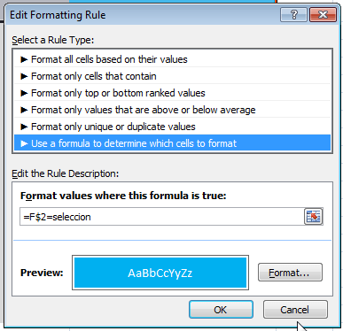
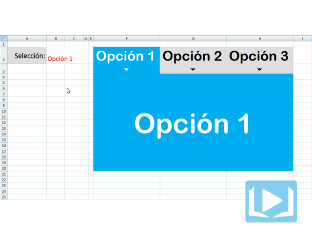

¿No te ha pasado que en varias ocasiones has considerado la idea de utilizar un **efecto MouseOver en Excel** para tus aplicaciones?

Seguramente sí. El problema es que cuando te pones a buscar en los eventos de VBA, no encuentras algo así para poder usarlo con una celda.

¡Pero sí es posible lograrlo! Hoy voy a mostrarte cómo podrías implementar un 'evento MouseOver' en tus desarrollos en Excel. ¡Esto va a ayudarte a sorprender a tu jefe!

## Efecto MouseOver en Excel, en 5 pasos

Vamos a hacer este efecto paso a paso y con paciencia. Te darás cuenta que en realidad es muy sencillo de lograr.

Para el ejemplo he decidio realizar un recuadro sencillo con tres "solapas", que detectarán cuando el puntero del ratón pase encima de ellas y cambiarán el valor mostrado en el recuadro.

#### _01_ Definiendo el área del cuadro.

Aquí seleccionarás el área que contendrá a tu recuadro con sus tres solapas. El área que seleccioné yo es: **F2:H20**

\[caption id="attachment\_1613" align="aligncenter" width="328"\] Seleccionando el área para nuestro recuadro.\[/caption\]

Le pondrás bordes, la rellenarás de un color gris y poco más, a tu gusto.

#### _02_ Ingresando unos cuantos datos.

Ahora vas a ingresar unos cuántos datos en tu recuadro para darle forma. Yo he decidido ponerle el texto Opción 1, Opción 2 y Opción 3 en cada columna.

Debajo de estas etiquetas, en la siguiente fila, he colocado unos iconos especiales que puedes obtener simplemente escribiendo el número 6 y cambiando la fuente a **Webdings**.

Adicionalmente, el rango **F4:H20** lo he **combinado** y en él he escrito la  frase 'Hola Ecuador' como prueba.

\[caption id="attachment\_1614" align="aligncenter" width="600"\] El recuadro listo. Ya lo has formateado y definido dónde irán las solapas.\[/caption\]

#### _03_ Defines un nombre

Ahoras vas a definir un nombre en la celda **B2**. Este servirá para almacenar el resultado de la selección actual, para que sepas cuál es la solapa activa. En mi caso, lo he llamado '**seleccion**'

\[caption id="attachment\_1615" align="aligncenter" width="234"\] Nombras la celda B2 como 'seleccion'\[/caption\]

#### _04_ Creas una pequeña macro.

Ahora deberás de crear una sola función que tendrá una línea. No suena tan complicado, ¿verdad?

`` `Public Function MiEvento(rngCelda As Range)` ``Range("seleccion").Value = rngCelda.ValueEnd Sub

_No olvides crearla en un módulo aparte, para ser ordenados._

La función recibe como parámetro un rango, que será una celda (esto lo veremos en el siguiente paso).

El objetivo de la función, será poner en la celda que nombramos como 'seleccion', el valor de la celda que le hemos pasado por parámetro. Así, cada vez que ejecutemos esta función, el valor de la celda 'seleccion' se actualizará.

#### _05_ El secreto: Usa hipervínculos.

¿Recuerdas las celdas donde pusimos los iconos en forma de flechas apuntando hacia abajo? Pues ahora en lugar de escribir en ellas el número 6, colocaremos la siguiente fórmula:

\[caption id="attachment\_1618" align="aligncenter" width="368"\] Usando la fórmula Hipervínculo, para simular el efecto MouseOver.\[/caption\]

#### Explicación:

La fórmula **HYPERLINK()** la utilizamos para convertir el contenido de la celda en un enlace (como los de una página web); pero en lugar de pasarle una dirección como parámetro, le pasamos el nombre de nuestra función **MiEvento()** definida en el código VBA.

A esta función le debemos pasar como parámetro la celda que tiene el nombre de nuestra solapa, es decir, la que se encuentra en la línea superior. Para el ejemplo, usamos la **F2**

Al no ser una dirección válida, nuestra fórmula nos dará un error. Aquí es donde entra al rescate la función **IFERROR()**

La función **ISERROR()**va a evaluar el contenido de la fórmula **HYPERLINK()**, si devuelve un error, entonces mostrará el valor que le pasemos como segundo parámetro, en este caso, el 6; de manera que se muestre el mismo caracter que teníamos al principio.

Recuerda copiar la fórmula a las tres celdas que figuran como nuestras solapas.

#### _06_ Un retoque en el formato.

Hasta aquí, ya has logrado el **efecto MouseOver** **en Excel**. Si pasas el puntero del ratón sobre los iconos, notarás que la celda **B2** (que nombramos como 'seleccion') cambia su valor por el de la etiqueta activa.

Sin embargo, tenemos un pequeño inconveniente aquí: para que se active el evento, debemos pasar el puntero del ratón exactamente sobre el icono. Sería mucho mejor si el evento se disparara con solo pasar el puntero sobre la celda. Eso lo podemos conseguir ajustando la alineación de la celda a Wrap Text (Ajuste de Texto).

\[caption id="attachment\_1619" align="aligncenter" width="600"\] Activas el ajuste de texto para que toda la celda se considere como un hipervínculo.\[/caption\]

> En la celda **F4**, vas a colocar la fórmula **\=seleccion**. Con esto simulamos el cambio en el panel central cada vez que pasemos el puntero del ratón sobre una solapa.

Una última mejora que haremos en nuestro archivo será resaltar con otro color la solapa activa. Para esto selecciona las tres solapas con sus respectivos iconos y utiliza el **Formato Condicional**, tal y como te muestro en la imagen:

\[caption id="attachment\_1620" align="aligncenter" width="387"\] Utiliza el formato condicional para dar un efecto de animación a tus solapas.\[/caption\]

#### Nota:

Debes utilizar el ancla delante del número de línea para que la fórmula no se 'desplace' hacia abajo. Lo que nos interesa es comparar el valor de la línea 2 contra el valor de la celda 'seleccion'.

## El ejemplo en acción

Aquí puedes ver el ejemplo funcionando tal cual nos propusimos. **Imagínate** los usos que le podrías dar a esta técnica en tus modelos.

\[caption id="attachment\_1621" align="aligncenter" width="640"\] El ejemplo funcionando.\[/caption\]

## Descarga el archivo terminado

Sólo pincha en cualquiera de los botones siguientes y descárgate el archivo para que puedas jugar con él y consultar cualquier duda que puedas tener con el funcionamiento de la hoja. En realidad no es tan complicado ;)

 

[Pincha aquí para descargar el archivo terminado.](http://raymundoycaza.com/descargas/evento-mouseover.xlsm)

 

## ¿Y tú, qué opinas de esta técnica?

A mi me gusta esta técnica porque me permite extender las posibilidades de diseño para mis modelos en Excel. Y tú, ¿qué opinas? ¿Te ha gustado el truco? Me gustaría saber tu opinión.

No olvides ayudarme a difundir este artículo en las redes sociales. ¡Gracias!

#### _**Más información:**_

[Fórmula Hyperlink](http://office.microsoft.com/en-gb/excel-help/hyperlink-function-HP010062412.aspx "F&oacute;rmula Hyperlink")

[Fórmula ISError](http://office.microsoft.com/en-us/excel-help/is-functions-HP010342632.aspx "F&oacute;rmula ISError")
