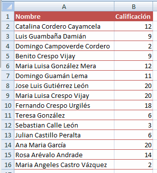
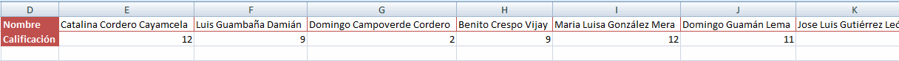
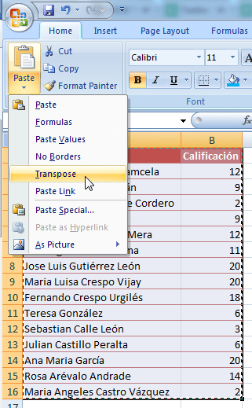
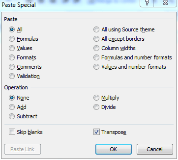

 

> Pregunta de un alumno: ¿Cómo puedo convertir filas de datos en columnas dentro de Excel, sin copiar y pegar una por una?

Pues usando la opción transponer. ¿Y cómo transponer en Excel? Ahora te lo cuento.

### Como transponer en Excel.

Cuando tienes los datos en una tabla y de forma vertical como esta:

Y quieres convertirlo a un rango de datos dispuestos de forma horizontal, como este:

Para lograrlo, basta con que utilices la opción Transponer que te ofrece el pegado especial. En Excel 2007 lo encontrarás directamente en el menú de pegar, como te muestro en la imagen:

### ¿Y si no tengo Excel 2007?

Para la versión de Excel 2003 deberás utilizar la opción Pegado Especial que te aparece cuando das clic derecho (primero debes tener copiado el rango):

Y luego, en el cuadro de diálogo, debes marcar la opción Transpose (Transponer en español)

 

De esta forma habrás realizado la tarea de convertir líneas en columnas en menos de un minuto :)

### Un paso más allá

Haciendo uso del viejo atajo de teclado que aún utilizábamos en Excel 2003, podemos ahorrarnos más tiempo al momento de hacer una transposición de datos.

\[box type="note"\]Luego de copiar los datos, usa el atajo ALT + E+S+E para realizar la transposición de texto sin tocar el mouse.\[/box\]

#### ¿Y el atajo para el Excel 2007?

En realidad el atajo anterior sirve para la versión 2007; pero si quieres otra opción, te dejo el nuevo atajo:

\[box type="note"\]En Excel 2007, luego de copiar los datos, usa el atajo ALT + H+V+T .\[/box\]

Con estas dos formas alternativas para realizar una transposición de datos, puedes ahorrarte algo de tiempo, sobre todo si estás en una laptop o si tu gato se comió tu ratón. De todo puede pasar en esta vida.

#### ¿Y si quiero hacerlo al revés?

Solo sigue los mismos pasos. ¡No es más! Incluso podrías utilizar el mismo ejemplo para transponer de vertical a horizontal y luego seguir el proceso inverso. ¡Te divertirás un monton!

A continuación te dejo \[ilink url="http://static.raymundoycaza.com/transponer-en-excel.xlsx" style="download"\]el archivo ejemplo\[/ilink\]  para que juegues con él y hagas tus propias pruebas.
