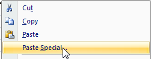

> Pregunta de un alumno: 쮺칩mo puedo convertir filas de datos en columnas dentro de Excel, sin copiar y pegar una por una?

Pues usando la opci칩n transponer. 쯏 c칩mo transponer en Excel? Ahora te lo cuento.

### Como transponer en Excel.

Cuando tienes los datos en una tabla y de forma vertical como esta:

Y quieres convertirlo a un rango de datos dispuestos de forma horizontal, como este:

Para lograrlo, basta con que utilices la맖pci칩nTransponer que te ofrece el pegado especial. En Excel 2007 lo encontrar치s directamente en el맔en칰맋e pegar, como te muestro en la imagen:

### 쯏 si no tengo Excel 2007?

Para la versi칩n de Excel 2003 deber치s utilizar la opci칩n Pegado Especial que te aparece cuando das clic derecho (primero debes tener copiado el rango):

Y luego, en el cuadro de di치logo, debes marcar la opci칩n Transpose (Transponer en espa침ol)

De esta forma habr치s realizado la tarea de convertir l칤neas en columnas en menos de un minuto :)

### Un paso m치s all치

Haciendo uso del viejo atajo de teclado que a칰n utiliz치bamos en Excel 2003, podemos ahorrarnos m치s tiempo al momento de hacer una transposici칩n de datos.

\[box type="note"\]Luego de copiar los datos, usa el atajo ALT + E+S+E para realizar la transposici칩n de texto sin tocar el mouse.\[/box\]

#### 쯏 el atajo para el Excel 2007?

En realidad el atajo anterior sirve para la versi칩n 2007; pero si quieres otra opci칩n, te dejo el nuevo atajo:

\[box type="note"\]En Excel 2007, luego de copiar los datos, usa el atajo ALT + H+V+T .\[/box\]

Con estas dos formas alternativas para realizar una transposici칩n de datos, puedes ahorrarte algo de tiempo, sobre todo si est치s en una laptop o si tu gato se comi칩 tu rat칩n. De todo puede pasar en esta vida.

#### 쯏 si quiero hacerlo al rev칠s?

Solo sigue los mismos pasos. 춰No es m치s! Incluso podr칤as utilizar el mismo ejemplo para맚ransponer맋e vertical a horizontal y luego seguir el proceso inverso. 춰Te divertir치s un monton!

A continuaci칩n te dejo \[ilink url="http://static.raymundoycaza.com/transponer-en-excel.xlsx" style="download"\]el archivo ejemplo\[/ilink\] 맗ara que juegues con 칠l y hagas tus propias pruebas.
