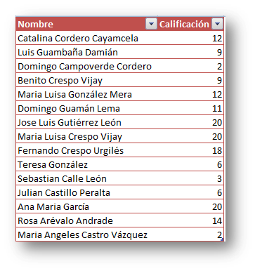
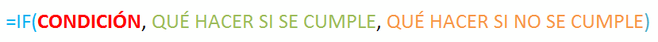
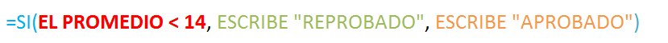
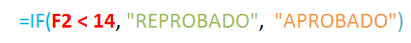
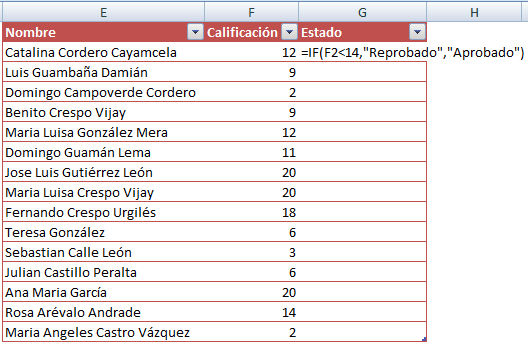
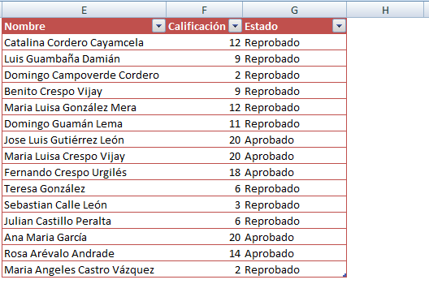

¿Te has encontrado con la necesidad de generar un valor dependiendo de una o varias condiciones? ¿Sí? Pues yo en algún momento también lo he necesitado.

Ahora te voy a contar cómo utilizo la función \[abbr title="Equivalente en español: SI"\]IF\[/abbr\] en Excel y en qué casos podría serte útil.

## La función IF al desnudo.

La función \[abbr title="Equivalente en español: SI"\]IF\[/abbr\] realmente puede ser de mucha ayuda en nuestros modelos realizados en Excel, ya que su finalidad es la de "tomar una decisión" en base a una condición que tú le indiques. De esta forma puede "decidir" mostrar un valor o no, siempre y cuando la condición dada se cumpla o no.

**Imagina** que  tienes un listado de alumnos y sus calificaciones. Las calificaciones estarán dentro del rango 0 - 20.

Sería muy cómodo poder utilizar una fórmula que automáticamente nos diga quiénes reprobaron, ¿no lo crees?

Vamos a suponer que todos aquellos alumnos que obtuvieron menos de 14 puntos han reprobado. Entonces para que Excel nos diga cuáles de estos alumnos han reprobado, debemos darle la instrucción a través de la función \[abbr title="Equivalente en español: SI"\]IF\[/abbr\], de la siguiente forma:

Esta es la anatomía de la función  \[abbr title="Equivalente en español: SI"\]IF\[/abbr\]. Esta función recibe tres parámetros: condición, valor a mostrar si se cumple la condición, valor a mostrar si no se cumple la condición.

Para el caso del ejemplo, en palabras normales, sería decirle a Excel lo siguiente:

Con esto le estaríamos diciendo a Excel que si el promedio de un alumno es menor que 14, escriba la leyenda "Reprobado" y en caso de que no se cumpla la condición, es decir, que el promedio sea igual o mayor a 14, entonces escriba la leyenda "Aprobado".

Si lo escribimos respetando la sintaxis que nos exige Excel, la fórmula nos quedaría así:

 

Entonces, voy a escribirlo así en la tabla que te mostré anteriormente:

Ahora voy a copiar la fórmula IF en todas las líneas para que realice la misma evaluación en todo el listado:

¡Y listo! Con esta fórmula Excel nos "dirá" cuáles son los alumnos que han reprobado y cuáles han aprobado, en base a la condición que nosotros hemos establecido: **solo aprueban aquellos alumnos que han obtenido 14 puntos o más.**

Por supuesto que puedes encontrarte en situaciones más complejas en las que necesites considerar más condiciones; pero este ejemplo sirve para aclarar las ideas respecto de esta fórmula tan útil para nuestros modelos en Excel.

Te dejo el \[ilink url="http://static.raymundoycaza.com/formula-if.xlsx" style="download"\]archivo con el ejemplo\[/ilink\]  para que lo revises más de cerca.
