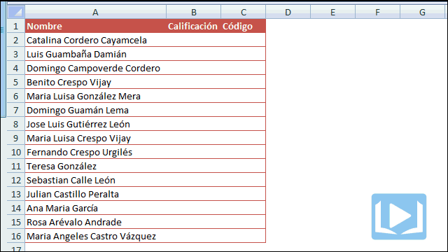
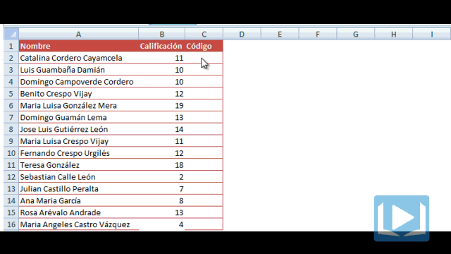

Has terminado de crear tu modelo en Excel y estás listo para las pruebas; pero, ¿y los datos?

Generarlos manualmente, claro. Sin embargo, ¿no resulta algo engorroso estar escribiendo 10, 20, 50 líneas en cada tabla?

Por eso hoy te voy a contar cómo genero yo mis datos de prueba para las planillas de Excel que desarrollo.

## Generar datos de prueba en Excel 2007

Imagínate el típico caso de la planilla para un docente. Quieres generar datos aleatorios de calificaciones en un listado de estudiantes, para realizar tus pruebas. Si no quieres escribir uno por uno, los datos puedes hacer uso de la función \[abbr title="En español: ALEATORIO.ENTRE"\]RANDBETWEEN()\[/abbr\]

Esta función recibe dos parámetros: el primero es el número más bajo que puede devolver y el segundo es el más alto. Es decir, que si quieres generar números aleatorios desde el 2 hasta el 20 (como el ejemplo que te muestro a continuación), deberías escribir la función así: \[abbr title="En español: ALEATORIO.ENTRE"\]RANDBETWEEN\[/abbr\](2,20)

En la siguiente imagen puedes ver el uso de la función:

 

Bien, hemos creado unos datos de prueba rápidamente para las calificaciones. Ahora, ¿qué hacemos con la columna código?

Supongamos que el código debe ser una letra seguido de tres números. Entonces podemos utilizar la misma función \[abbr title="En español: ALEATORIO.ENTRE"\]RANDBETWEEN()\[/abbr\] y nos apoyaremos en otra función: \[abbr title="En español: CARACTER()"\]CHAR()\[/abbr\]

La función \[abbr title="En español: CARACTER()"\]CHAR()\[/abbr\], devuelve el caracter correspondiente a un código que le pasemos por parámetro. Este es el correspondiente al código ASCII.

Considerando que el código ASCII para la letra A (mayúscula) es el 65 y así sucesivamente hasta la Z (mayúscula) que es el código ASCII 90, entonces podemos usar la función \[abbr title="En español: ALEATORIO.ENTRE"\]RANDBETWEEN()\[/abbr\] con los parámetros 65 y 90, así:

\[box\]\[abbr title="En español: ALEATORIO.ENTRE"\]RANDBETWEEN(65,90)\[/abbr\]\[/box\]

Con esto hemos generado nuestro carácter aleatorio. Ahora para generar un número aleatorio de 3 dígitos, debemos utilizar la función \[abbr title="En español: ALEATORIO.ENTRE"\]RANDBETWEEN()\[/abbr\] de la siguiente forma:

\[box\]\[abbr title="En español: ALEATORIO.ENTRE"\]RANDBETWEEN(100,999)\[/abbr\]\[/box\]

Y concatenamos ambos resultados en una celda para generar el código completo, de acuerdo a lo que necesitamos.

En la siguiente imagen te muestro cómo se realizaría el proceso completo:

Y así hemos generado nuestros primeros datos de prueba de forma semi-automática. Si quieres agilizar el proceso, puedes generar tus propias fórmulas y guardarlas en un bloc de notas para luego pegarlas en tu planilla de Excel y así ahorrar aún más tiempo ;)

## ¿Qué me cuentas tú?

Anímate y cuéntame cuál es el método que utilizas tú para generar datos de prueba en Excel, en tus propios modelos. Yo ya te he contado el mío.

¡Nos vemos!
