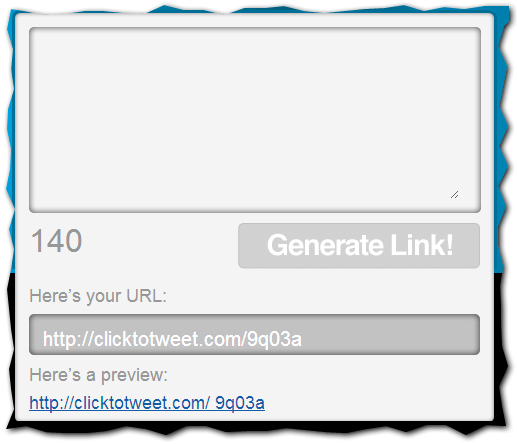
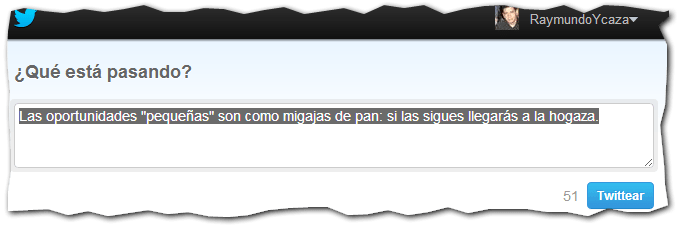
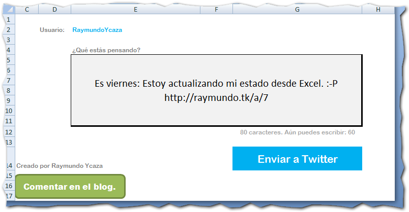
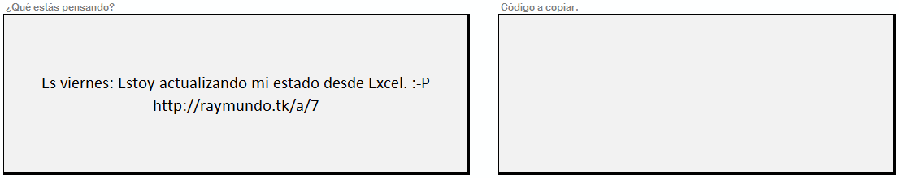
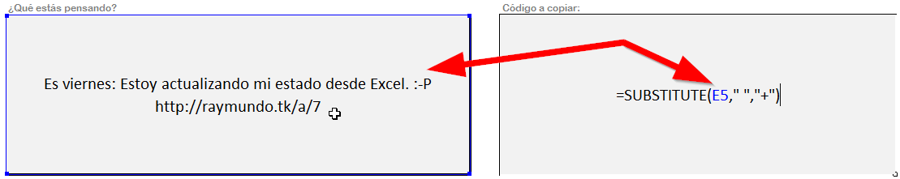
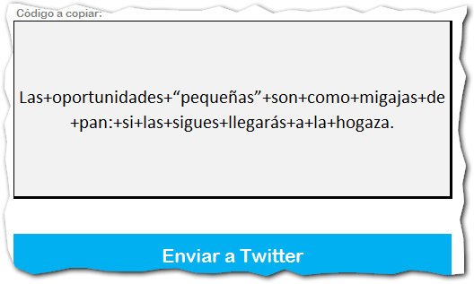
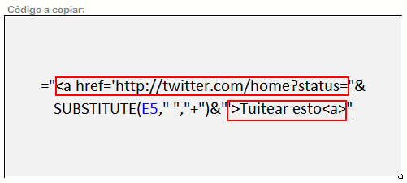
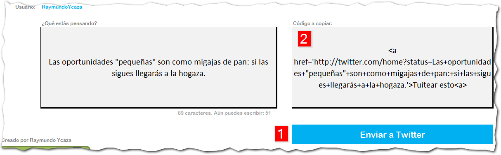

\[quote\]Las oportunidades "pequeñas" son como migajas de pan: si las sigues llegarás a la hogaza.\[/quote\]

[Click to tweet](http://clicktotweet.com/) es una de esas aplicaciones que nos ayudan (y mucho) en nuestra tarea de promocionar contenidos. En este caso, para Twitter.

Este servicio lo que hace es poner el texto que quieres en un enlace para que al ser pinchado por los usuarios, automáticamente sea redirigido a la caja de publicación de Twitter, **lista para publicarse** en su línea de tiempo.

Con esto cualquier frase célebre que te guste, o alguna frase tuya que resulte interesante, podrá ser fácilmente compartida en Twitter, con un simple clic de ratón.

Así, si quisiera compartir la frase con la que he iniciado esta entrada, el proceso sería tan fácil como escribirla dentro de la caja de [ClickToTweet](http://clicktotweet.com) y presionar en el botón "Generate Link"

Una vez realizado este paso, la página en cuestión te daría un enlace que "apunta" al contenido que acabas de ingresar y que ha quedado **almacenado** en esa página.

En este caso, la URL http://clicktotweet.com/9q03a es la que tendrás que usar para tus enlaces donde pedirás a tus usuarios que pinchen para compartir el texto que quieres. Entonces ellos serán redirigidos a su cuenta de Twitter y les aparecerá esto:

Solo tendrán que pinchar en el botón "Twittear" y tu contenido se compartirá. ¡Misión cumplida!

No se puede negar que es fácil de realizar, tanto para ti, como para tus usuarios. Pero, ¿que pasaría si esta página **dejara de funcionar**, temporal o definitivamente?

Todos nuestros enlaces creados dejarían de funcionar, tal y como lo expone David en [una de sus entradas](http://davidcantone.com/enlaces-retweet/) donde habla precisamente de Click To Tweet.

¿Entonces? ¿Cómo nos arreglaríamos para crear estos textos fáciles de compartir en Twitter, sin arriesgarnos con los enlaces rotos? ¡Claro! Creándolos manualmente.

Para esto, debes utilizar la URL **twitter.com/home?status=** seguido de tu texto a tuitear. Con el cuidado de reemplazar cada espacio en blanco por un signo más (+).

Es decir, tendrías que dejar tu texto más o menos así:

\[box\]http://twitter.com/home?status= Este+es+mi+mensaje. +Por+favor+compartir.\[/box\]

Pero no termina de convencerme esta idea. Así que te propongo la siguiente alternativa.

## Excel como alternativa a Click to Tweet

En una [entrada anterior](http://raymundoycaza.com/aprendiendo-excel/excel-consejo/enviando-tweets-desde-excel), te mostraba cómo hacer un sencillo cliente de Twitter en Excel.

Hoy voy a usar ese mismo ejemplo para mostrarte cómo tú puedes crear tu propio generador de enlaces listos para compartir contenido en Twitter. Sin depender de terceros.

Para comenzar, \[ilink url="http://raymundoycaza.com/descargas/twitter-facebook-con-excel.xls" style="download"\]descárgate el ejemplo anterior\[/ilink\] . Lo usaremos como base para este nuevo ejemplo.

Al abrir el archivo, te encontrarás con algo como esto:

 

A este archivo le vas a hacer un simple cambio: vas a agregarle un cuadro adicional a la derecha del existente, de manera que quede más o menos así:

En el nuevo cuadro que acabas de hacer, vas ingresar la fórmula \[abbr title="En español: SUSTITUIR()"\]SUBSTITUTE()\[/abbr\]. Tal y como te muestro en la siguiente imagen:

### Explicación:

La fórmula \[abbr title="En español: SUSTITUIR()"\]SUBSTITUTE()\[/abbr\], lo que hace es sustituir un caracter o conjunto de caracteres por otro, en una cadena de texto que le indiques.

En el ejemplo, la referencia E5 apunta a la celda donde escribimos nuestro mensaje a tuitear. El segundo parámetro (" "), representa un espacio en blanco, el mismo que vamos a sustituir por un signo más (+) que es el que está indicado como tercer parámetro ("+")

\[box\]En resumen, la orden es: Toma el contenido de la celda A5 y busca todos los espacios en blanco. Luego sustitúyelos por el signo más (+)\[/box\]

## ¿Por qué has usado esta fórmula?

Como te indiqué unos párrafos más arriba, el formato para publicar un texto en Twitter, exige que cada espacio en blanco sea representado por un signo más (+). Y esto es precisamente lo que hace la fórmula \[abbr title="En español: SUSTITUIR()"\]SUBSTITUTE()\[/abbr\].

Usaré el ejemplo de la frase inicial de la entrada para que veas cómo queda después de usar esta función.

Y esto lo hemos logrado automáticamente. Sin hacer nada más que escribir o pegar nuestro texto, de forma natural, en la caja de nuestro generador como si lo hiciéramos en la web de Click to Tweet.

Ahora, para facilitarnos aún más las cosas, vamos a configurar nuestro generador para que nos complete el código HTML necesario para simplemente copiar y pegar en nuestro blog. Esto lo conseguimos concatenando el HTML con la URL de Twitter que te indiqué anteriormente y nuestro texto generado. Quedándote así:

 

##  ¡Está listo!

Has terminado de crear tu generador de enlaces para compartir contenido en Twitter. Y además, ¡usando Excel!

Lo único que debes hacer es copiar el resultado de la caja de la derecha y pegarlo en el código HTML de tu blog. En mi caso, el resultado luce así:

Las oportunidades “pequeñas” son como migajas de pan: si las sigues llegarás a la hogaza. [{Tuitear esto}](http://twitter.com/home?status=Las+oportunidades+"pequeñas"+son+como+migajas+de+pan:+si+las+sigues+llegarás+a+la+hogaza.+@RaymundoYcaza)

Ahora, \[ilink url="http://static.raymundoycaza.com/click-to-tweet.xls" style="download"\]descárgate el ejemplo terminado\[/ilink\]  y realiza tus pruebas. Ya tienes un archivo con dos funcionalidades: 1) envías tuits desde Excel. 2) generas enlaces con texto listo para compartir en Twitter para que tus usuarios la tengan fácil... ¡y tú también!

## ¿Qué otros usos le has dado a Excel?

Aparte de usarlo para cálculos, hoy lo hemos usado como una herramienta para el Marketing de Contenidos. ¿Y tú, qué otros usos le has dado a esta versátil herramienta?

Si te ha gustado, no dejes de compartirlo en las redes sociales usando los botones que aparecen al final.

¡Hasta luego.!

\[box type="info" icon="http://static.raymundoycaza.com/icono.gif"\]

#### _Créditos_

_La imagen de portada la hice con uno de los íconos de: [iconmonstr.com](http://iconmonstr.com/)_

\[/box\]
