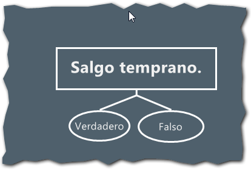
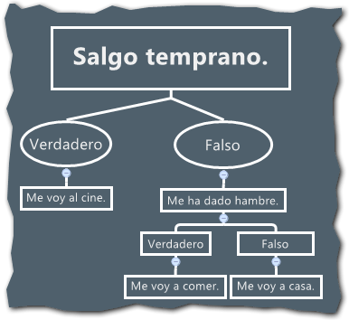
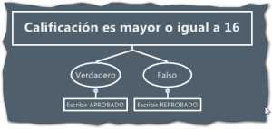
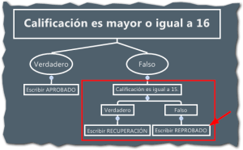
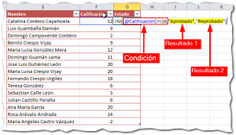
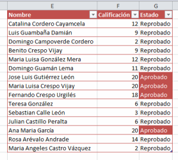
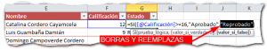
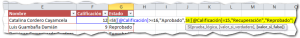
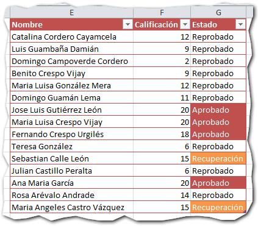
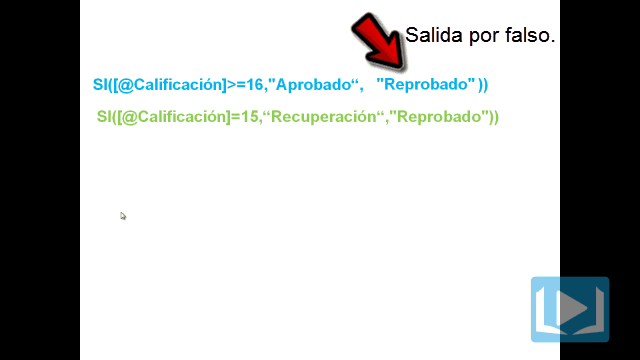

Foto cortesía de: [sxc.hu](http://www.sxc.hu/photo/1412540 "martius")

\[resumen\]En esta entrada te explico cómo puedes usar la función SI, una dentro de otra, como si fueran muñecas rusas. Ésto te servirá para afrontar situaciones en las que debes evaluar varias posibilidades en una misma fórmula.\[/resumen\]¿Cuántas veces has dicho alguna frase similar a esta?

> Si salgo temprano hoy, me voy al cine.

En este ejemplo, has establecido una condición "**Si salgo temprano hoy.**"

Después de la coma, vemos la acción que tomarás si la condición se cumple: "**me voy al cine**".

Viendo la figura completa: "Si salgo temprano hoy, me voy al cine."

En caso de que no se cumpla la condición, o sea que no salga temprano, se sobrentiende que no podré ir al cine; pero como a una computadora no le puedes dejar nada (o casi) como sobrentendido, se lo expresarías así:

\[aviso titulo="" tipo="green"\]" Si salgo temprano hoy, me voy al cine, sino me voy a casa." \[/aviso\]

Esta es una forma de ver a las condicionales de forma natural y sin muchos tecnicismos.

En Excel [la función SI](http://raymundoycaza.com/aprendiendo-excel/funciones/funcion-si) te ayuda a realizar tareas que requieren una toma de decisión automática y es por eso que figura entre las favoritas de muchos usuarios.

Ahora vamos a ver cómo trabaja la **función SI anidada**. Sigue leyendo y entérate.

## ¿Qué es una condición? El "límite binario" de la función SI

En programación, una condición es una sentencia de la que se puede determinar si es falsa o verdadera.

Una condición solo puede arrojar uno de dos resultados: O es verdadera, o es falsa.

Siendo tan tajantes, yo me iría a casa si no salgo temprano del trabajo. Punto.

Pero, ¿y si me da hambre a la salida y quisiera pasar por un restaurante? ¡Pues que no! Tú dijiste que si no salías temprano te ibas para la casa, no hay medias tintas con una condicional.

Esto nos limita en algunos casos ya que pueden presentarse "puntos medios" en los que necesitaríamos evaluar más criterios antes de tomar una decisión.

### Llegaron las condiciones múltiples! ¿Y ahora?

Las condiciones múltiples son una realidad que manejas a diario, aunque tal vez no te has puesto a meditar en ello.

Tú no te manejas solo con dos opciones para cada decisión que tomas en la vida y siempre habrán muchas cosas que tener en cuenta antes de tomar una decisión.

\[aviso titulo="" tipo="green"\]"¿Compro esta camisa? Depende de cuánto cueste. ¿La dejan a crédito? ¿Esta semana pagan el sueldo? ¿Tengo cupo en la tarjeta?"\[/aviso\]

Siguiendo con mi ejemplo, ¿qué pasa si quiero agregar una condición más? Por ejemplo que me diera hambre al salir.

¿Te diste cuenta? Hemos agregado una condición dentro de uno de los resultados de la condición principal: **¡Hemos anidado una condición dentro de otra!**

## ¿Para qué es útil una función SI anidada?

Pues mira, una función SI anidada puede ayudarte a resolver ese tema que te está dando vueltas por la cabeza desde hace rato.

Su principal utilidad es ayudarte a tomar decisiones basadas en más de una condición, permitiéndote devolver un resultado de entre varias opciones en lugar de las dos que podrías conseguir con una función SI normal.

Podrías por ejemplo, mostrar indicadores para tus índices de ventas: **_Alto, Medio, Bajo, Preocupante._**

También podrías asignar una calificación dependiendo del cumplimiento de una serie de requisitos que tú establezcas. Por ejemplo, la aprobación de un crédito o la calificación en el buró de crédito, etc.

## Anidando una función SI: ejemplo práctico.

Cuando tenemos un archivo en el que debemos mostrar un valor que dependa de más de una condición, la función SI ya se queda corta como te comenté.

Ahora imagina que tienes un reporte de calificaciones. Normalmente decimos algo así:

**Si la calificación es mayor o igual a 16, mostrar la leyenda 'aprobado', sino mostrar 'reprobado'**

Entonces viene el profesor y te dice: **_"Necesito que además en los casos en que la calificación sea 15, mostrar la leyenda  'recuperación'."_**

¡Ups! ¿Y ahora? Pues te recomiendo que siempre comiences por tomar una hoja y un lápiz. ¡Dibuja tu solución!

Fíjate cómo "apareció" una nueva condición dentro de uno de los resultados de la condición principal (la sección que está encerrada en el recuadro rojo).

## Insertando una fórmula SI anidada.

Tal como lo hacemos siempre, [insertamos una función SI](http://raymundoycaza.com/aprendiendo-excel/funciones/funcion-si) en nuestra hoja. En ella reflejamos la condición principal "Calificación es mayor o igual a 16".

**\=SI(\[@Calificación\]>=16,"Aprobado","Reprobado")**

Con esta fórmula hemos logrado el primer objetivo, el cual es mostrar los alumnos aprobados y reprobados. Esto representa el primer nivel de nuestro diagrama de decisión.

### ¿Cómo se anida una función SI en la práctica?

Lo único que debes hacer es reemplazar uno de los resultados por otra condicional que vas a "armar" de igual forma que lo hiciste con la anterior.

¿Cuál de los dos resultados debo cambiar? Depende del camino que quieras seguir, por eso recomiendo que dibujes tu solución primero.

En mi diagrama, el resultado en el que voy a anidar el siguiente SI, es el que sale por falso. De manera que ese es el que voy a reemplazar en mi fórmula o función, tal y como te muestro a continuación.

Como ves, hemos anidado una segunda función SI, dentro de nuestra función principal, colocándolo en el resultado que sale por falso.

Así, has dado solución al requerimiento de nuestro estimado profesor y ahora, si le colocamos la calificación de 15 a un par de alumnos, vemos que nuestro modelo en Excel se comporta como se esperaba.

Observa la siguiente animación para que quede más claro el procedimiento que hemos seguido:

## ¿Cuántos niveles puedo anidar? Todo tiene su límite.

Nada es infinito o ilimitado en esta vida y la función SI anidada no es la excepción. Si usas la versión Excel 2003, podrás anidarla hasta 7 veces, salvo que uses algún truco como el de usar el operador &.

En la versión Excel 2007 y 2010 puedes anidar hasta 64 veces una función SI.

En la mayoría de los casos esto debería ser más que suficiente y, aún así, llegar a este número de niveles puede ser exagerado. Replantéate la situación antes de hacer una fórmula tan complicada que luego olvides cómo estaba armada.

### Recomendaciones finales.

- No uses una fórmula en la que estén anidadas más de diez funciones SI, a menos que lo hayas estudiado muy bien y sea la única alternativa.
- Plantéate otras posibles soluciones como la función ELEGIR() o la función BUSCARV(), etc.
- Cada nivel que anides es un nivel más de dificultad para darle mantenimiento a la fórmula: No anides a lo loco.
- Acostúmbrate a dibujar los posibles caminos que la evaluación de tu fórmula puede tomar, especialmente si ves que la fórmula será compleja. Te ahorrarás tiempo.

## En resumen.

Has visto al detalle cómo se comporta una función SI() anidada y para qué sirve. Te he mostrado que es posible tomar decisiones en tiempo de ejecución con tus fórmulas y esto puede ayudarte a resolver situaciones más complejas en un momento dado.

La función SI anidada puede darte una flexibilidad que no tal vez no conocías hasta ahora; pero también te he contado que si abusas de esta característica puedes caer en todo un suplicio al momento de darle mantenimiento a tu fórmula. Así que ten cuidado y úsala con criterio.

## Descarga el ejemplo terminado.

[Haz clic aquí para descargar el archivo.](http://static.raymundoycaza.com/funcion-si-anidada.xlsx "Descargar el archivo.")

## ¿En qué utilizas la función SI?

Ahora te toca a ti. Cuéntame en qué sueles utilizar la función SI. ¿Qué tan seguido haces un SI anidado?

Si te ha gustado este artículo o quieres continuar nuestra conversación, te invito a dejar un comentario.

¡Hasta la próxima!
