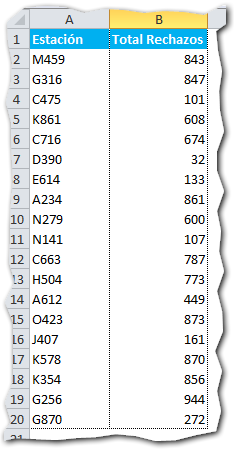
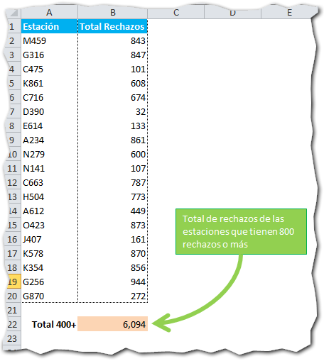

## ¿Para qué sirve?

La función Sumar.Si () se usa para sumar los valores de un rango que le pasemos como parámetro, únicamente si se **cumple una condición** que también se pasa como parámetro.

## ¿Cómo se usa?

Esta función recibe tres parámetros de los cuales dos son obligatorios y uno es opcional.

En la siguiente imagen, te especifico los parámetros que recibe la función Sumar.Si (), cada uno en un color diferente:

 

1. Rango **(obligatorio)**.- Aquí escribes el rango donde la condición se evaluará.
2. Condición **(obligatorio)**.- En este parámetro escribes la condición que debe cumplirse para que la suma se realice.
3. Rango de Suma **(opcional)**.- El rango que debe sumarse. Si no lo escribes se sumará el rango del primer parámetro.

## Ejemplo práctico.

#### Ejemplo #1: Escribiendo los tres parámetros

Mi jefe me pidió que realice un reporte en el que muestre el listado de los proveedores que participaron en la última licitación, especificando los aprobados y los no aprobados.

En una celda al final debo sumar los presupuestos de los proveedores, considerando únicamente aquellos que están marcados como **aprobados**.

Una posible solución a este ejercicio es la propuesta en la imagen de abajo. En ella puedes ver que he creado un reporte sencillo de tres columnas: Proveedor, Presupuesto y Estado con sus respectivos valores.

Para satisfacer el requerimiento de sumar únicamente los proveedores marcados como "Aprobado", he utilizado la función Sumar.Si (), especificando cada parámetro de acuerdo a como lo muestra la siguiente figura:

 

#### Ejemplo #2: Escribiendo solo dos parámetros.

Mi jefe me pidió ahora un reporte que le muestre el número de unidades rechazadas por estación y que además, al final se sumen todos los rechazos de aquellas estaciones que tienen **800** o más.

La imagen anterior muestra un sencillo reporte que se ajusta a lo solicitado por mi jefe. Ahora, me resta cumplir con el requerimiento de sumar todos aquellos rechazos que igualan o superan las 800 unidades.

Para lograrlo, he utilizado la función Sumar.Si () indicándole únicamente los dos primeros parámetros.

Esto es debido a que en esta ocasión, el rango donde voy a realizar la evaluación de mi condición y el rango a sumar, son uno mismo. En la siguiente imagen te muestro cómo lo hice:

 

Como ves, solo le he indicado un rango a la fórmula. Además, he utilizado un operador de comparación "Mayor o igual que" ( **\>=** ) para indicarle a la fórmula que únicamente sume aquellas celdas cuyos valores sean **mayores o iguales** a 800.

Este es el resultado final:

