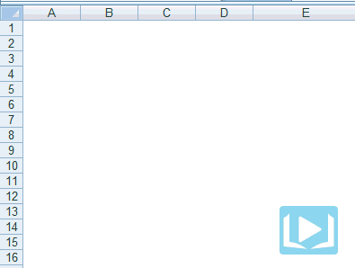
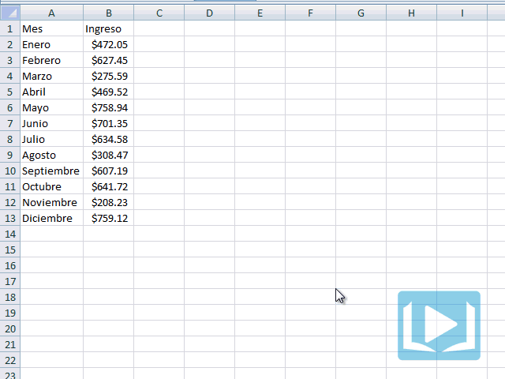
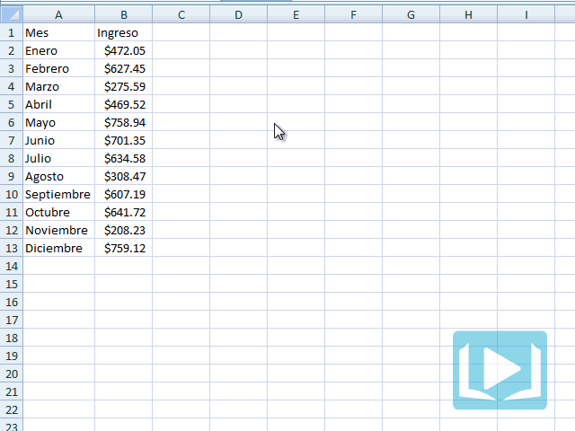
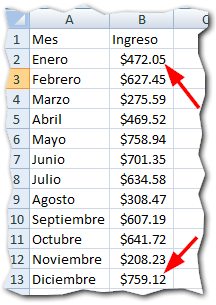
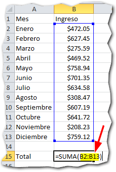
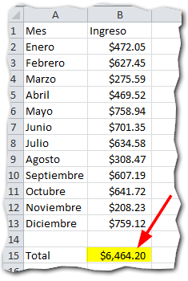

\[resumen\]**Típico**: Comenzamos una entrada de Excel diciendo "seleccionamos el rango deseado y..."\[/resumen\]

Pero ¿qué rábanos es un rango? Tal vez esa sea la pregunta que te hagas si es la primera vez que escuchas el término o si aún no te había quedado totalmente claro.

Si es ese tu caso, aquí te muestro en muy pocas palabras qué es un **rango en Excel**.

## ¿Qué es un rango?

Un rango en Excel es un conjunto de **celdas contiguas** (una junto a la otra) que pueden ser seleccionadas para realizar una operación igual con todas ellas.

Este conjunto de celdas puede tener desde una sola celda, hasta 'x' celdas. \[highlight\]Es decir que una celda por sí misma ya representa un rango en Excel\[/highlight\].

Los rangos se identifican por [las referencias](http://raymundoycaza.com/excel-basico/que-es-la-referencia) (una 'dirección' que nace a partir de la intersección de las columnas con las filas).

### Seleccionando un rango.

Ahora vas a hacer el siguiente ejercicio:

Ingresa algunos números y/o letras en las celdas A1, A2 y B1, B2.

Ahora pincha con el ratón en la celda A1 y, sin soltar el botón, arrastra hasta la celda B2.

Fíjate como una porción de las celdas de tu hoja han quedado marcadas. Esto significa que ese grupo de celdas está **seleccionado**.

En esta animación verás el ejercicio en acción:

 

Has seleccionado un **rango de celdas** y este rango tiene un nombre que está dado por los nombres de la primera y la última celda de la selección, separadas por el **signo** dos puntos.

Así, el nombre de nuestro rango anterior sería "A1:B2" porque la primera celda que pinchamos fue la A1 y terminamos en la B2.

Fácil, ¿no es verdad?

## ¿Para qué sirve un rango en Excel?

Como te comenté hace un rato, un rango representa a un **conjunto de celdas**, desde una sola hasta la totalidad de las celdas de tu hoja.

Entonces, si trabajas con **celdas** trabajas con **rangos** y viceversa. Los rangos son utilizados para casi todo lo que hagas dentro de Excel:

- Seleccionas un rango para darle formato a un conjunto de celdas.
- Un [Gráfico](http://raymundoycaza.com/aprendiendo-excel/como-crear-un-grafico-en-excel) utiliza los datos contenidos en un rango de celdas.
- Una [Tabla](http://raymundoycaza.com/aprendiendo-excel/crear-tablas-en-excel-paso-a-paso) se forma a partir de los datos de un rango de celdas.
- Una Tabla Pivote o "Pivot Table" genera reportes a partir de los datos de un rango de celdas.
- Una fórmula generalmente recibe como parámetros los datos contenidos en un rango de celdas.

Y así un largo etc.

Como puedes ver, un rango sirve para casi todo lo que hagas en Excel. Siempre que trabajes con tu hoja de cálculo, estarás utilizando un rango.

## ¿Cómo se usa un rango?

La forma sencilla de usar un rango, es seleccionándolo con el ratón en cada situación en la que necesitas referirte a un conjunto de celdas.

Otra forma de usar un rango es escribir su "nombre" directamente en lugar de desplazarte por la hoja para buscarlo. Pero esto demanda que tú sepas de memoria dónde comienza y dónde termina tu rango.

### Un ejemplo sobre cómo usar un rango en Excel.

Supongamos que tienes un listado con los doce meses del año y junto a cada uno, está el total de ingresos de tu negocio. Tal y como te muestro en la siguiente imagen:

Si quisieras hacer una suma de estos valores, puedes valerte de la función SUMA() a la que le pasarás como parámetro el rango correspondiente al grupo de celdas que tienen los ingresos.

Para usar un rango, primero debemos conocer su nombre.

Recuerda que el nombre del rango se forma por la unión de la primera y la segunda celda del grupo con el que te interese trabajar. En la imagen ya te he señalado con flechas cuáles son estas celdas.

En este ejercicio, vamos a crear el nombre de nuestro rango en tres pasos:

1. La **primera celda**, es la B2. Por lo tanto, la primera mitad del nombre de nuestro rango será B2.
2. La **segunda celda** es la B13. Por lo tanto, la segunda mitad del nombre de nuestro rango será B13.
3. **Unimos** estos dos nombres colocando de por medio el símbolo "dos puntos" ( : ) de la siguiente forma: **B2:B13**

Ahora que ya conocemos el nombre de nuestro rango, solo debemos pasárselo como parámetro a nuestra función SUMA(), colocándolo entre los paréntesis, así:

\[box type="tick" icon="none"\]=SUMA(B2:B13)\[/box\]

En la siguiente imagen puedes ver cómo lo he hecho yo.

Date cuenta de que no he incluido la celda B1 debido a que no me interesa sumarla, ya que no es un número ni forma parte de los datos que necesito.

La parte resaltada en color amarillo, representa al rango que busco sumar en este caso. Se lo he pasado como parámetro a la función SUMA() para que, como su nombre lo indica, realice la suma de los valores que están contenidos en dicho rango.

Excel automáticamente evaluará el rango que le hemos indicado y buscará qué valores existen en cada una de las celdas dentro del rango especificado.

Una vez realizado esto, Excel será capaz de realizar las operaciones que le solicites ya sea a través de comandos o, como en este caso, a través de fórmulas que realicen cálculos con los valores contenidos en las celdas del rango de interés.

Observa la siguiente imagen en la que te muestro el resultado de la función SUMA() ejecutada sobre el rango **B2:B13**, comprueba que el resultado es la sumatoria de todos los valores contenidos en dicho rango:

## ¿Cómo "se ve" un rango para Excel?

Cuando le indicas un rango a Excel, como en el caso anterior para pasárselo a la función SUMA(), este lo ve como una matriz de datos; tal y como lo ves tú, aunque no de forma gráfica.

En el caso más sencillo, un rango de una sola columna como B2:B13, que puedes ver en la imagen anterior, Excel la vería así:

\[box type="tick" icon="none"\]472.05**;** 627.45**;** 275.59**;** \[...\]\[/box\]

Es por eso que si  tú le pasas a la función SUMA() los valores directamente, de la forma:

\[box type="tick" icon="none"\]SUMA(472.05**;** 627.45**;** 275.59**;** \[...\])\[/box\]

Devolverá correctamente el resultado de la sumatoria de todos esos elementos, ya que le has pasado una matriz de datos a Excel, aunque lo hayas hecho manualmente.

## ¿Qué más te gustaría saber sobre los rangos en Excel?

Espero que esta entrada haya aportado en algo a tu aprendizaje y la mayoría de tus dudas sobre lo que es un rango en Excel, hayan quedado despejadas.

¿Se me ha olvidado aclarar algo? Pues, por favor, dímelo en los comentarios y seguiremos esta conversación.

Hasta la siguiente entrada y no lo olvides: el rango es tu amigo ;)

\[box type="note" icon="none"\]

##### ¿Quieres leer más sobre el rango en Excel? Échale un ojo a esta otra página (no es mía).

- [La Nación](http://www.lanacion.com.ar/178967-definicion-de-rangos-de-celdas-en-excel)

\[/box\]
