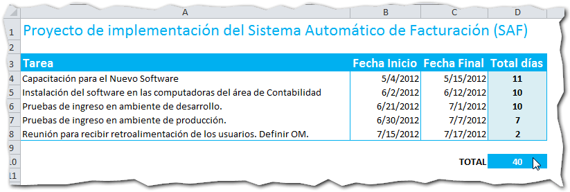
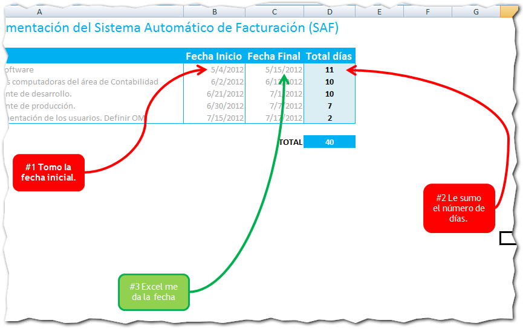
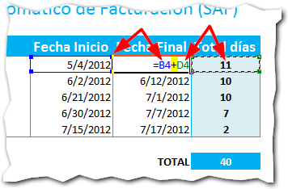
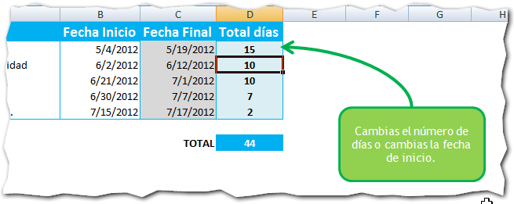
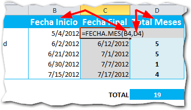
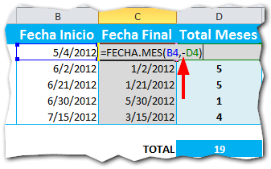
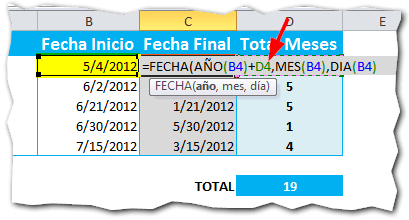
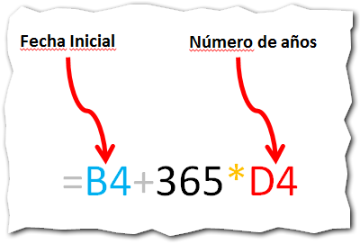

## La historia

Un buen día, hace varios  años, mi jefe me solicitó un reporte donde constaban las fechas de inicio y fin de los proyectos que teníamos en curso hasta ese momento. Por supuesto que me puse inmediatamente en ello y lo terminé muy rápido. Pero...

No mucho tiempo después de entregar el susodicho reporte, me encontré con que tenía que hacer **ajustes a las fechas** finales y cambios en las fechas de inicio.

Para realizar estimaciones debía de hacer pruebas y realizar ajustes una y otra vez para ir cuadrando los periodos de tiempo para cada etapa de los proyectos.

Entonces me nació la pregunta:

## ¿Cómo sumar fechas en Excel?

Ante la necesidad de **sumar fechas en Excel** (o restarlas) me puse a investigar y pude averiguar lo siguiente:

### 1.   Sumando y restando días.

Sucede que en la tarea "_Capacitación para el Nuevo Software_", hubo un retraso y debo extender la fecha de inicio 3 días más.

Debería de existir una forma de evitarme el cálculo mental para sumar fechas en Excel. ¡Y existe!

El principio básico que vas a seguir es este: Súmale (o réstale) tantas unidades a tu fecha, como días le quieras aumentar.

Entonces, para darle un uso práctico a la idea y tomando en cuenta el cuadro de la imagen anterior, yo podría usar una fórmula que utilice la fecha de inicio, le sume el total de días que la tarea tiene asignados y me debería de dar la fecha final. Pues bien, ¡comencemos!

La idea es sencilla: Tomaré la fecha inicial y le sumaré el número de días que quiero y el resultado será la fecha final, al haber transcurrido esos días.

Voy a utilizar el operador de suma (+) para adicionar los días a la fecha de inicio, de la siguiente forma:

Así, al final tienes una tabla en la que se ajustará automáticamente la fecha final contando el número de días especificado a partir de la fecha de inicio establecida.

### 2.   Sumando y restando meses.

¿Y si lo que necesito es sumarle o restarle meses en lugar de días? Pues la cosa es igual de sencilla. Solo debes usar la función Fecha.Mes() tal y como te muestro en la siguiente imagen:

Como puedes ver, el primer argumento de esta función debe ser la fecha de inicio, mientras que en el segundo argumento le vas a pasar el número de meses que quieres sumar a esta fecha.

En el ejemplo, yo he pasado la referencia a las celdas donde están estos valores. Las flechas te muestran qué argumento apunta a qué columna.

¡Espera! ¿Y si lo que quiero es restar meses? ¿Cómo lo hago con esta formulita?

Una forma sencilla de hacerlo utilizando la función Fecha.Mes() es anteponiendo el símbolo de resta o el famoso 'menos' (-) al argumento del mes. En este caso debes anteponerlo a la referencia que apunta a la columna de meses, así:

En la imagen anterior, la flecha te señala dónde he colocado el signo menos.

Así, en lugar de sumar o restar días, estarás sumando o restando meses completos en tus estimaciones de tiempo.

### 3.   Sumando y restando años.

Todo está muy bien. Pero ¿qué tal si tú tienes un caso en el que no necesitas sumar días, ni meses, sino años?

Para darte a la tarea de sumar años en Excel, puedes utilizar una fórmula como esta:

En la parte azul irá tu fecha de inicio, aquella a la que le quieres sumar años. Y en la parte en rojo irá el número de años que le quieres sumar a dicha fecha.

En la práctica, utilizando nuestro ejemplo, la fórmula nos quedaría así:

Fíjate que he señalado con una flecha la referencia al número de años que quiero sumar (celda D4) todas las demás referencias apuntan a la celda B4, que es donde tengo mi fecha de inicio.

Al final, le cambio el título a la columna y tendré una tabla donde se sumen años a las fechas de inicio en cada tarea.

## Cuidado con las alternativas.

Si bien es cierto que podrías simplemente sumarle 365 días a la fecha inicial, no es la mejor forma de hacerlo si vas a necesitar un número variable de años.

Por ejemplo, si necesitas sumarle dos años ya serían 730, 1095 días para tres años y así sucesivamente... ¡Imagínate esto!

Tal vez te acomodes mejor si utilizas una variante de esta fórmula como la que te muestro a continuación:

Parece más sencillo, ¿verdad?

 

\[box type="alert" border="full" icon="none"\]_**¡Pero no es exacta!**_

El problema con esta forma de sumar años en Excel, es que no estás considerando los años bisiestos y tendrás diferencia de 1 o más días dependiendo de cuántos años le sumes.\[/box\]

Como todas las soluciones, la mejor es la que se adapte a tus necesidades puntuales. Aquí te he mostrado aquellas que creo tendrán un alcance lo más genérico posible.

Tú eres quien decide cuál es la solución más adecuada a tus necesidades. La que se adapte a tu entorno de trabajo y realidad operativa. ¡Esa será la mejor solución!

## ¿Para qué necesitas sumar fechas en Excel?

Ya hemos visto cómo sumar fechas en Excel utilizando como unidad de medida los días, los meses y los años. También vimos un par de posibles alternativas y sus eventuales consecuencias.

Ahora me gustaría saber en qué utilizas tú la técnica para sumar fechas en Excel. ¿Lo utilizas para control de proyectos? ¿O tal vez para control de nómina? Estaré atento a tu respuesta.

¡Nos vemos!
