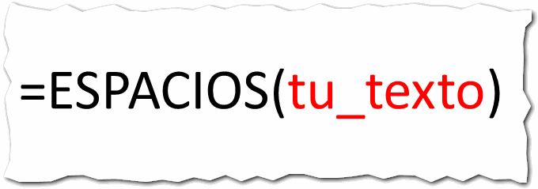
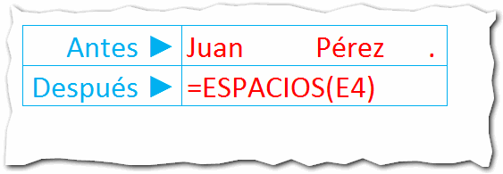

## ¿Qué hace?

¿Alguna vez te has visto desesperado tratando de eliminar el espacio en un texto a un montón de celdas? ¿Y quién no?

La buena noticia, es que existe una función que te permite **eliminar espacios en Excel**.

Su finalidad es la de remover todos los espacios que un texto tenga de más. Es decir, elimina los espacios al principio, los espacios al final y todos aquellos espacios repetidos entre dos palabras, **respetando los espacios normales** que deben existir entre las palabras.

Mágico, ¿verdad?

## ¿Para qué sirve?

Como ya podrás intuir, esta función sirve para limpiar esos textos que tenemos con espacios sobrantes.

Por ejemplo, cuando bajas información de un ERP o de otro sistema en que los campos, al tener una longitud fija, te arroja los nombres de los empleados con varios espacios al final.

Imagina que tienes dos archivos, el maestro de empleados que bajaste de tus sistema y otro archivo en el que tienes un listado de empleados a los que debes aplicarle un bono.

Cuando quieras hacer la búsqueda de 'Juan Pérez', tal vez no lo encuentres porque, en el archivo que bajaste, dice 'Juan Pérez         '

Sí, el mismo nombre pero con varios espacios al final. Tú los ves iguales; pero para excel son dos cadenas de texto distintas.

## ¿Cómo se usa?

La sintaxis de la función ESPACIOS, es la que sigue a continuación:

 

Esta función utiliza un único argumento que será la cadena de texto a tratar.

Es decir, que debes pasarle como arguento el texto al que le quieres quitar los espacios.

### El ejemplo práctico

Supongamos que tengo un texto como este:

Como ves, tengo muchos espacios entre la palabra 'Juan' y 'Pérez', además existen varios espacios entre la palabra 'Pérez' y el punto final.

Lo único que debes hacer, es utilizar la función ESPACIOS, tal y como te he mostrado, para eliminar espacios en Excel, de esta forma:

La referencia E4 apunta al texto al que le quiero quitar los espacios.

Al final, tu texto quedará 'limpio' de espacios innecesarios:

## Recuerda que puedes eliminar espacios en Excel

\[highlight\]¿Cuántas veces los espacios innecesarios te han provocado un dolor de cabeza?\[/highlight\]

No una, sino varias veces los espacios innecesarios en un texto han provocado un ataque de nervios en aquellas personas que tienen poco tiempo para terminar ese reporte y sus fórmulas no funcionan.

Excel solo te dice que ese nombre o ese código ¡no existe!

La próxima vez que te encuentres con este problema, recuerda que existe la función ESPACIOS y libérate de ese dolor de cabeza.

## ¿Y tú, ya usas la función ESPACIOS?

Yo ya la uso ¿y tú?

Me gustaría que me contaras en qué usas la función ESPACIOS y cómo te ha ayudado en tu día a día con Excel.

¡Que los elimines bien!

## Descarga el archivo de ejemplo.

\[mybox bgcolor=" #b3e1f3" border="full"\]\[ilink url="http://static.raymundoycaza.com/eliminar-espacios-en-excel.xlsx" style="download" title="Eliminar espacios en Excel"\] Pincha aquí \[/ilink\] para descargarte el archivo terminado\[/mybox\]

## ¡Sigue investigando!

\[mybox bgcolor=" #ffffb2" border="full"\]**¿Quieres saber más?**

[Función ESPACIOS - Microsoft](http://office.microsoft.com/es-hn/excel-help/funcion-espacios-HP010062581.aspx)

[Función ESPACIOS - Tutolandia \[Vídeo\]](https://www.youtube.com/watch?v=EZrisHb-AGU) \[/mybox\]
