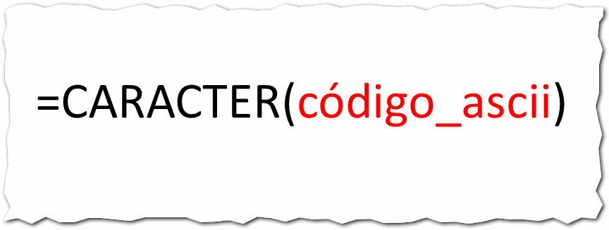
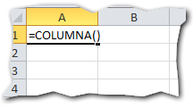
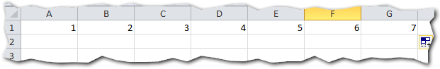
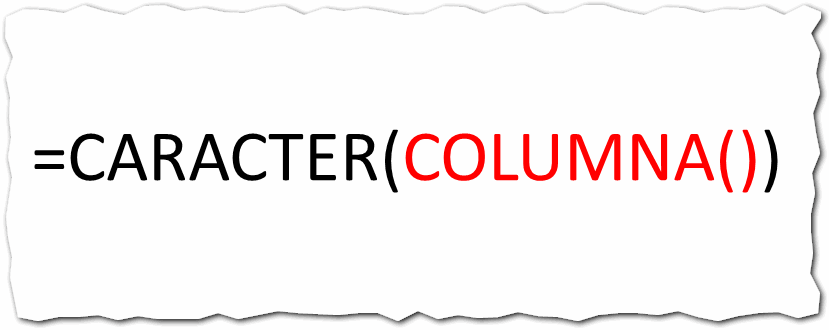
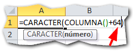
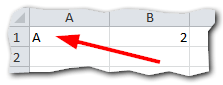

## ¿Qué hace?

La función CARACTER sirve para obtener una letra a partir de un número que le pases como argumento.

¿Qué?

Ok, más despacio. La función CARACTER recibe como parámetro un número que debe ser el equivalente a su código ASCII.

Cada computadora tiene un juego de caracteres denominado ASCII (se pronuncia asqui)

Este juego de caracteres va desde el 1 hasta el 255 y cada número representa un carácter. Así por ejemplo, el 64 representa a la archiconocida arroba (@)

Es por eso que cuando tú presionas la combinación de teclas ALT + 64, aparece la arroba. Si presionas ALT + 164 aparece la letra ñ, etc.

En total, tienes 255 símbolos que puedes obtener usando cualquier número entero dentro de este rango: 1 - 255 ([pincha aquí](http://ascii.cl/es/) si quieres ver una tabla de equivalencia)

Tomando en cuenta lo que acabo de contarte, si a esta función le pasas un número entero comprendido entre el 1 y el 255, te devolverá el carácter correspondiente.

\[box type="tick" border="full" icon="none"\]

**¡Funciona igual que con tu teclado!** Si le pasas el número 64 a la función CARACTER, obtendrás el carácter arroba. Si le pasas el número 164, obtendrás el carácter ñ, etc. =CARACTER(64) =CARACTER(164)

\[/box\]

## Para qué sirve?

¿Y a mí para qué me sirve esto? Tal vez te estés preguntando.

Pues mira, puedes utilizarlo para generar caracteres a voluntad, controlando cuál carácter quieres y bajo qué condiciones.

Puedes, por ejemplo, utilizarlo para generar una letra de verificación como en los DNI u otros tipos de código.

Inclusive, podrías utilizarlo para [generar datos al azar](http://raymundoycaza.com/articulos/excel-consejo/generar-datos-de-prueba-en-excel) que usarás para hacer pruebas con tus modelos de Excel. Como siempre, el límite está en tu imaginación.

## ¿Cómo se usa?

El uso de esta función es muy sencillo. Únicamente debes pasarle como parámetro el código del carácter que quieres obtener y te lo devolverá. ¡Sí! Así de fácil.

 

### Un ejemplo

Como siempre, vamos a trabajar con un ejemplo para que quede más claro el tema.

Imagina que quieres lograr que las letras que aparecen en los encabezados de las columnas, aparezcan en una de sus celdas.

Pues bien primero tomemos en cuenta dos cosas:

1. En el listado de códigos ASCII, las letras no aparecen sino hasta el número 65 ([pincha aquí](http://ascii.cl/es/) si quieres ver una tabla de equivalencia)
2. El alfabeto en esta tabla, tiene 26 letras, por lo que si la letra A es el número 65, entonces la letra Z será el número 90.

Una vez teniendo claro dónde encontrarás los códigos correspondientes a las letras del alfabeto, vamos a iniciar con nuestra prueba.

### Encontrando el número ordinal de la columna

Para lograrlo, nos vamos a valer de la función COLUMNA que devuelve el número ordinal de la columna actual, así:

Esto nos devolverá, en el caso de la columna A, el número 1. Se entiende que para la columna B corresponde el número 2, para la columna C el número 3 y así sucesivamente.

###  Obteniendo el carácter equivalente.

Ahora, vamos a decirle a Excel que queremos que nos devuelva el carácter que corresponde al número ordinal de la columna, así:

 

Como ves, lo que he hecho es encerrar la función COLUMNA dentro de la función CARACTER.

Esto nos devolverá un carácter que ahora mismo, no es el correcto y ya te explico el por qué.

### Saltándonos los caracteres que no nos interesan

Como ya te comenté, las letras no aparecen sino hasta el número 65 en el listado ASCII, por lo tanto, todos los códigos desde el 1 hasta el 64, no nos interesan.

Como las columnas comienzan desde el número 1, entonces debemos 'saltarnos' todos los códigos hasta el 64 sumándole esta cantidad al número de columna.

Entonces, si yo le sumo 64 al número 1 de la primera columna, obtendré 65, que corresponde a la letra A:

 

 

Con esto nos hemos 'saltado' los 64 caracteres que no nos interesaban y hemos apuntado directamente a las letras.

Ahora, basta con copiar la fórmula hacia las demás columnas y obtendremos el resultado esperado:

## ¿Qué ideas se te ocurren para sacarle partido a la función CARACTER en Excel?

Si te ha parecido interesante o se te ha ocurrido alguna idea para aplicar esta función en tu trabajo, me gustaría que me lo dejaras saber en los comentarios.

¡Nos vemos!

\[box type="note" border="full" icon="none"\]

**¿Quieres saber más?** [Función CARACTER en Excel - Microsoft](http://office.microsoft.com/es-es/excel-help/funcion-caracter-HP010062559.aspx)

[Char Function - TechOnTheNet](http://www.techonthenet.com/excel/formulas/char.php)

 

\[/box\]
