Luego de haber repasado lo que era un [rango en Excel](http://raymundoycaza.com/que-es-un-rango-en-excel/), es probable que ya te hayas encontrado con la necesidad de manejar **nombres de rango en Excel**.

Pero, ¿Cuál es la finalidad de los nombres de rango en Excel?

La más notable sería la de facilitar la selección de un rango, evitándote tener que recordar algo como AAC2345:AAD5456.

Imagínate si tienes unos diez o veinte rangos de esos.

Y si no te los memorizas, debes estar desplazándote por la hoja pinchando aquí y allá con el ratón para poder ubicar tus rangos...

En lugar de utilizar el estilo de referencia A1, podríamos ponerle un nombre a nuestro rango, algo más descriptivo como: **Promedios2012**

¿No te parece que es más fácil de recordar? ¡Claro que sí!

Pues esa es la finalidad de los nombres de rango en Excel, en palabras sencillas, facilitarte la vida.

## Asignar nombres de rango en Excel.

Para asignar un nombre a un rango, debes seleccionar previamente el rango deseado:

[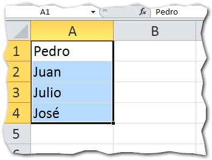](http://raymundoycaza.com/wp-content/uploads/nombres-de-rango-en-excel-0001291.png)

 

Luego, escribes el nombre deseado en el cuadro de nombre que está ubicado arriba a la izquierda:

Y presiona la tecla Enter.

Ahora, cuando quieras referirte a este rango, en lugar de escribir A1:A4, podrás escribir directamente 'Alumnos'.

Algo más elegante, ¿no crees?

También puedes crear nombres de rango en Excel, utilizando la herramienta 'Asignar nombre' que se encuentra en la ficha 'Fórmulas'.

[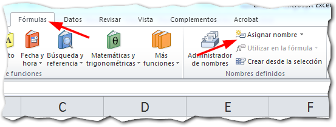](http://raymundoycaza.com/wp-content/uploads/nombres-de-rango-en-excel-0001321.png)

Pinchas sobre el botón 'Asignar nombre' y luego en la opción 'Definir nombre...'

[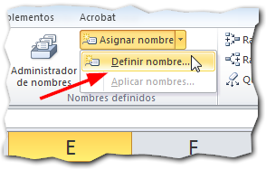](http://raymundoycaza.com/wp-content/uploads/nombres-de-rango-en-excel-0001331.png)

Enseguida aparecerá el asistente pidiéndote los datos necesarios para definir tu nombre de rango:

[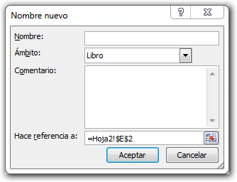](http://raymundoycaza.com/wp-content/uploads/nombres-de-rango-en-excel-0001341.png)

En el cuadro 'Nombre', escribirás el nombre que le asignarás a tu rango. Si utilizamos el ejemplo anterior, aquí escribimos el texto 'Alumnos'.

En 'Ámbito', seleccionarás el ámbito en el que se desenvuelve la variable.

En 'Comentario', puedes escribir un comentario o una nota explicativa para referencia más adelante.

Y por último en 'Hace referencia a:' vas a escribir el rango al que le vas a poner el nombre o puedes seleccionarlo pinchando con el ratón.

[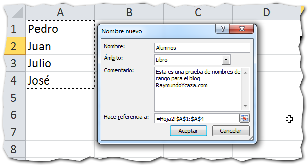](http://raymundoycaza.com/wp-content/uploads/nombres-de-rango-en-excel-0001351.png)

 

## Utilizando el nombre de rango: un ejemplo práctico.

Para complementar la explicación, vamos  a aplicar lo aprendido en un sencillo ejemplo práctico, en el que necesito promediar las calificaciones de un grupo de cinco alumnos.

Primero lo vamos a hacer de la forma convencional y luego con nombres de rango:

### La forma convencional.

Imagina que tienes los promedios de cinco alumnos en el rango B2:B6

[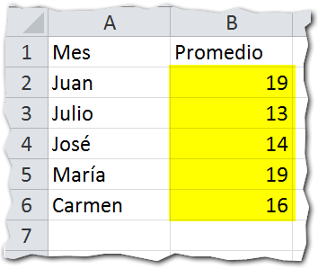](http://raymundoycaza.com/wp-content/uploads/nombres-de-rango-en-excel-0001361.png)

 

Lo que nos interesa es la parte que está resaltada en amarillo, porque vamos a promediarla.

Entonces lo que normalmente haríamos sería aplicar una función adecuada, utilizando directamente el rango, más o menos así:

[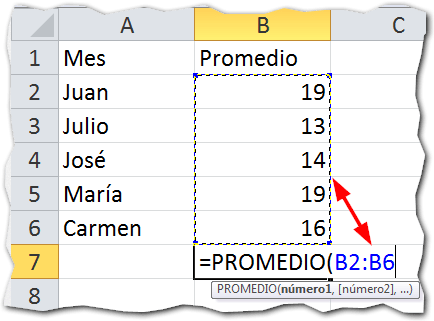](http://raymundoycaza.com/wp-content/uploads/nombres-de-rango-en-excel-0001371.png)

 

Lo que nos daría el siguiente resultado:

[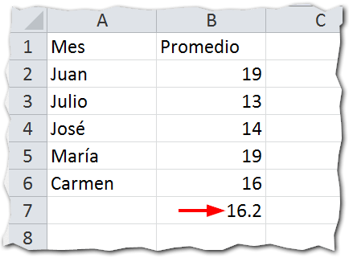](http://raymundoycaza.com/wp-content/uploads/nombres-de-rango-en-excel-0001381.png)

### Usando nombres de rango

Ahora, vamos a realizar los pasos para asignar nombres de rango en Excel, que ya te mostré hace un momento:

Pestaña 'Fórmulas' y luego la opción 'Asignar nombre':

 

Escribir el nombre y seleccionar el rango al que se lo vamos a aplicar:

[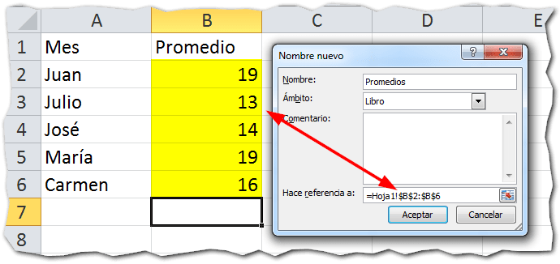](http://raymundoycaza.com/wp-content/uploads/nombres-de-rango-en-excel-0001391.png)

 

Ahora ya podemos usar el nombre 'Promedios' en lugar de la referencia B2:B6 y nuestra fórmula quedaría así:

[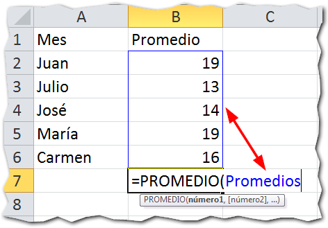](http://raymundoycaza.com/wp-content/uploads/nombres-de-rango-en-excel-0001401.png)

 

Y el resultado es el mismo, como tú mismo puedes comprobar:

[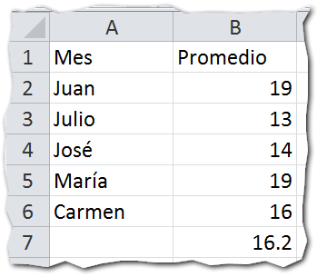](http://raymundoycaza.com/wp-content/uploads/nombres-de-rango-en-excel-0001411.png)

## Aplica lo aprendido.

Ahora ya te he dado una idea para que puedas mejorar esa hoja de Excel que tienes por ahí; pero que no se quede en idea ¡ponlo en práctica!

Haz la prueba, implementa los nombres de rango en tus futuros modelos y verás como muchas de tus rutinas más tediosas pueden resultar mucho más llevaderas.

¿Ya estás utilizando los nombres en Excel? Déjame tu respuesta en los comentarios.

¡Nos vemos!

\[mybox bgcolor="#ffffb2" border="full"\]

_**¿Quieres saber más?**_

_[Definir nombres de rango en Excel - Gerencie.com](http://www.gerencie.com/definir-nombres-de-rango-en-excel.html) [Borrar o Editar un Nombre de Rango - ExcelAvanzado.com](http://www.excelavanzado.com/2011/02/borrar-o-editar-un-nombre-de-rango.html)_

\[/mybox\]
