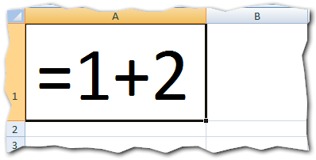
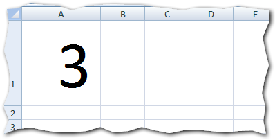
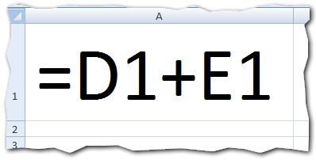
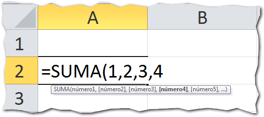

> ### Un BlackBerry sin conexión a internet, no es más que un simple teléfono.

Pues lo mismo pasaría con Excel. Sin las fórmulas, Excel solo nos serviría para escribir y dar formato a los datos. Poco más.

Y es que la principal ventaja que uno encuentra en una hoja de cálculo, son las herramientas que nos facilitan la tarea para calcular y para manipular datos. Figurando como estrellas, las famosas fórmulas que tanto aparecen en las entradas de este blog.

Pero ¿qué son? Si recién estás ingresando en el mundo de las hojas de cálculo, esta es una pregunta natural.

Entonces sigue leyendo y entérate de un par de cosas sobre las fórmulas que tal vez aún no tenías claras.

## ¿ Qué es una fórmula en Excel ?

Una fórmula en Excel es una expresión utilizada para hacer cálculos sobre uno o más datos y produce un nuevo valor. Este valor será devuelto en la misma celda en la que ingresaste la fórmula.

¿Una expresión?

Sí, es una expresión porque se trata de una secuencia de caracteres que respetan ciertas reglas para su escritura y sirven para expresar o dar a entender algo. Es igual a las [expresiones matemáticas](http://es.wikipedia.org/wiki/Expresi%C3%B3n_matem%C3%A1tica) que viste alguna vez en el colegio.

Luego de haber procesado los datos, el resultado será devuelto en la misma celda en la que escribiste la fórmula. Esto significa, que una vez que termines de escribir la fórmula y la aceptes, no verás la expresión sino que verás el resultado de dicha expresión.

\[mybox bgcolor="#bae3a5" border="full"\]

_**Dato importante**_

Para que Excel considere a un texto como fórmula, debes primero escribir el signo 'igual a' (=)

\[/mybox\]

Veamos una fórmula sencilla:

Esta es una fórmula, una expresión que sugiere que a la unidad, le sumes dos más.

Por supuesto, el resultado es obvio. La respuesta es 3. Entonces lo que verás en la celda, después de presionar la tecla Enter, no será esta expresión sino su resultado: 3

¿Ves? A pesar de que escribimos la expresión =1+2, excel lo que muestra es el resultado de la evaluación que realiza dicha expresión o fórmula.

## Las partes de una fórmula en Excel

En general, las fórmulas están compuestas por uno o más de los siguientes elementos:

### Constantes

Son los valores escritos directamente en la fórmula. Un ejemplo es el caso anterior en el que escribimos la fórmula 1+2. En este caso, el 1 y el 2 son los valores constantes, porque siempre mantendrán su valor y no cambiarán en la fórmula a menos que tú modifiques la fórmula.

### Referencias

La forma de darle mayor flexibilidad a una fórmula es utilizando referencias. [Las referencias de celdas](http://raymundoycaza.com/que-es-la-referencia/) son valores que apuntan a una celda que contiene el valor que queremos utilizar y se comportan como valores variables.

Basta con cambiar el valor de la celda y podemos variar los resultados, sin modificar la fórmula.

### Operadores

Los operadores sirven para especificar el tipo de operación que deseas realizar con elementos determinados de tu fórmula.

En su mayoría son operadores que ya has visto, como los operadores aritméticos  que utilizamos para la suma (+), la resta (-), la multiplicación (\*) y la división (/).

En el camino, te encontrarás con cuatro tipos diferentes de operadores: aritméticos, de comparación, de texto y de referencia.

### Funciones

Una función es una fórmula predefinida que te provee Excel para hacer un determinado cálculo con uno o varios valores.

Una de las primeras funciones que seguramente utilizarás, es la función Suma().

Esta función se encarga de tomar uno o varios valores y sumarlos entre sí. Al igual que con cualquier fórmula escrita en Excel, esta te mostrará directamente el valor resultante del cálculo realizado.

Una fórmula puede tener una o varias funciones en su definición. Todo depende de qué tan complejo sea el cálculo que quieres realizar. Muchas veces, una función te ayuda a escribir fórmulas más cortas.

## Escribe tu primera fórmula.

Ahora que ya sabes qué es una fórmula en Excel y cómo está compuesta, comienza a practicar y escribe tus propias fórmulas. No importa si son ejemplos muy sencillos.

**Un consejo:** Utiliza como "excusa" cualquier tarea de la casa u oficina que requiera hacer cálculos. Tanto sirve la lista de compras en el mercado, como el control de horas laboradas en la oficina. Lo importante es aplicarlo a un caso real.

¿Y tú, ya dominas las fórmulas en Excel?

¡Nos vemos!
