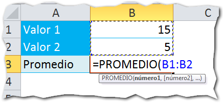
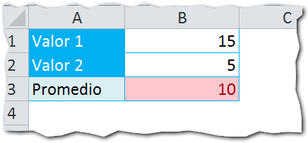
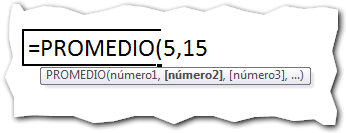

## ¿Qué hace la función PROMEDIO ?

La función Promedio en Excel sirve para obtener la media aritmética entre un grupo de valores que le pasemos como parámetros.

Básicamente, lo que hace es sumar todos los valores que le pasemos y los divide entre el conteo de los mismos.

## ¿Para qué sirve?

Como ya te conté, esta función sirve para obtener el promedio entre los valores que le pasemos por parámetro. Entonces, _un Profesor_ podría utilizarlo para obtener el promedio de calificaciones de un alumno o de toda la clase.

_Un Analista_ podría utilizarlo para obtener el promedio de pérdidas o ganancias mensuales o el promedio de producto no conforme por semana.

Puedes utilizarlo en un sinfín de escenarios. Seguramente a ti también te podría resultar útil.

## ¿Cómo se usa?

Pues bien, como te comentaba hace un momento, esta función busca obtener la media aritmética entre los valores que le pasamos como parámetros y lo hace sumando todos los valores entre sí, para luego dividirlos entre el conteo de estos.

Así, por ejemplo si quisieras sacar el promedio de dos valores, 15 y 5 por ejemplo, el procedimiento sería así:

1. Cantidad de parámetros: 2
2. Suma entre 15 y 5: 20
3. Dividir el resultado entre la cantidad de parámetros: 20 / 2 = 10
4. Promedio: 10

Veamos este ejemplo en una hoja de Excel:

Como ves, a la función promedio le estoy pasando los valores 15 y 5 colocando una [referencia](http://raymundoycaza.com/que-es-la-referencia/) a las celdas donde están ubicados.

El resultado que arroja la función Promedio es el mismo que obtuvimos manualmente:

Así como he utilizado una referencia a un [rango de celdas](http://raymundoycaza.com/que-es-un-rango-en-excel/) con los valores que deseo promediar, puedo utilizar valores constantes, tal y como te conté en la entrada donde explico [qué son las fórmulas](http://raymundoycaza.com/que-es-una-formula-en-excel/):

## ¡Promédialo!

Hoy has visto cómo utilizar la función Promedio en Excel y cuál es su utilidad, así como unos posibles casos en los que te resultará muy útil. Yo sé que tú tendrás muchos otros escenarios donde puedes sacarle un gran provecho a esta función.

Las fórmulas son herramientas geniales que nos ayudan a realizar nuestro trabajo más rápido y/o con mayor facilidad. Así que tómate tu tiempo y aprende a utilizarlas. El tiempo invertido valdrá la pena.

_**¿Quieres saber más**_ _**sobre la función Promedio en Excel**__**?**_[Función Promedio en Excel - Microsoft](http://office.microsoft.com/es-es/excel-help/funcion-promedio-HP010062482.aspx)

¿Ya utilizas esta función? ¿Qué otra función te gustaría que explicara? Déjame tu respuesta en los comentarios.

¡Nos vemos!
