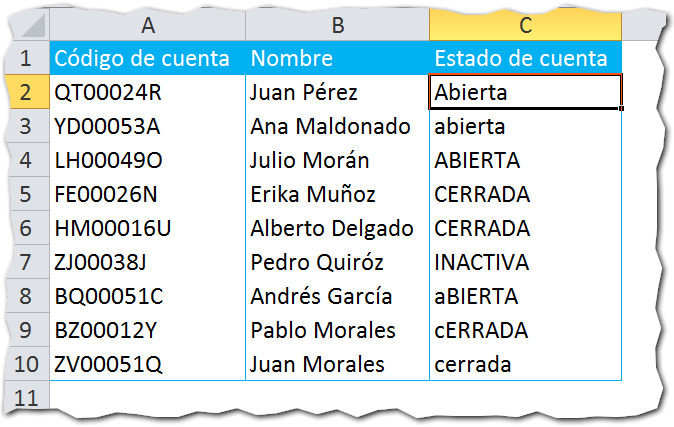
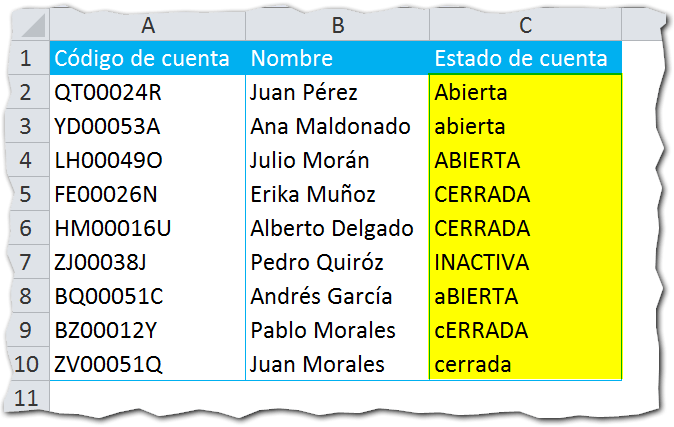
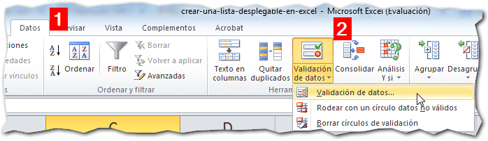
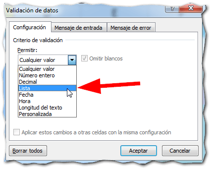
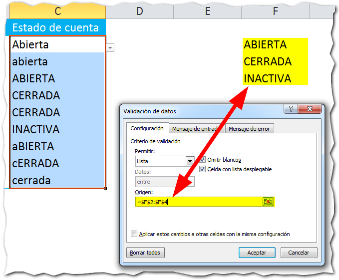
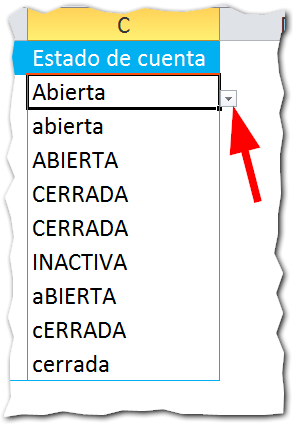
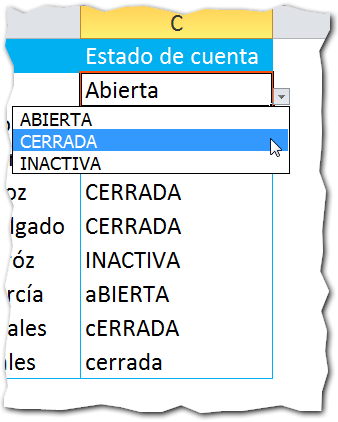
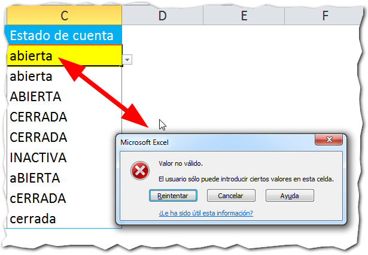
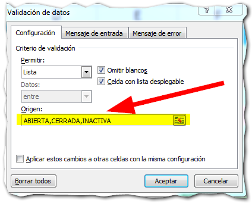

## ¿Para qué crear una lista desplegable en Excel?

Crear una lista desplegable en Excel es una forma de validación que te permite proteger la consistencia de tus datos.

Sirve para asegurarte de que el usuario solo pueda ingresar uno de entre varios valores que se le muestran en una lista, reduciendo el riesgo de errores al momento de ingresar datos en tu modelo de Excel.

Si no utilizas ninguna validación en tus hojas de Excel, corres el riesgo de que se ingresen valores distintos a los esperados, porque el usuario no se da cuenta de que lo está haciendo.

Esto no te conviene, ya que cuando tengas que analizar los datos, tendrás un desorden tan grande, que te tomará demasiado tiempo reorganizarlo todo. Por eso sigue leyendo y entérate de cómo puedes crear una lista desplegable en Excel para tener datos 'más limpios'.

## Creando una lista desplegable paso a paso.

Imagínate que tienes una tabla de los clientes de un banco. En esta tabla imaginaria tenemos solo tres columnas: Código de cuenta, Nombre y Estado de Cuenta.

En la columna 'Estado de Cuenta', tenemos que especificar si la cuenta está abierta, cerrada o inactiva.

Si no utilizáramos una validación, es muy probable que tengas algo como esto:

 

Ya has visto casos como este, ¿verdad?

En la columna 'Estado de cuenta', tenemos las leyendas 'Abierta', 'Cerrada' e 'Inactiva'; pero nuestro operador encargado, no ha hecho distinción entre mayúsculas y minúsculas.

¿Y cuál es el problema?

Pues que cuando necesites consolidar estos datos, no te van a aparecer las tres categorías: Abierta, Cerrada e Inactiva, sino que vas a tener una categoría por cada forma de escribir cada leyenda. Algo así:

- Abierta
- abierta
- ABIERTA
- CERRADA
- cerrada
- cERRADA
- etc.

¡Imagínate cómo analizarías esos datos!

Por suerte existe la validación de datos y las listas desplegables. Veamos cómo hacer una paso a paso:

1. Selecciona el rango que deseas validar. 
    
2. Dirígete a la pestaña 'Datos' y selecciona la opción 'Validación de datos'. Luego pincha en la opción 'Validación de datos...' 
    
3. En el cuadro que te aparece, para el criterio de evaluación, vas a seleccionar la opción 'Lista', como te muestro en la siguiente imagen: 
    
4. Por último, en la caja de texto de 'Origen', vas a escribir el rango donde se encuentran los valores que deseas que aparezcan en la lista, así: 
    
5. Pinchas en aceptar y ahora verás que cuando te colocas sobre una de las celdas que tienen validación, aparece una pequeña flecha junto a ella. Pincha sobre esta y verás que aparece un listado con las opciones que ingresaste en el paso anterior:  Haz la prueba tratando de ingresar un valor distinto al especificado. Excel no te permitirá continuar hasta que ingreses en la celda uno de los valores especificados en la validación.
    

Es decir, que si no lo escriben exactamente como lo exige la validación, el usuario no podrá escribir el valor en la celda validada.

## Una variante

Si no quieres utilizar un rango como criterio de evaluación, también puedes escribir directamente los valores separados por comas.

\[mybox bgcolor="#f89cc6" border="full"\]

_**¡**__**Precaución**__**!**_

_Esta medida solo te sirve para evitar que los usuarios escriban por error (o por pereza) valores que no sean consistentes con los que se requieren; pero no evita que un usuario copie y pegue directamente un valor cualquiera. La validación no puede evitar esto._ \[/mybox\]

## ¿Qué te parece esta técnica de validación?

Esta es una de las técnicas de validación básica que utilizo en los modelos de Excel más sencillos y me ha dado buenos resultados hasta el momento.

Y tú, ¿opinas que es útil? ¿O piensas que no representa mayor ventaja? Si ya las estás utilizando, me gustaría saber cómo te va con las listas desplegables. Déjame tu opinión en los comentarios.

¡Nos vemos!

## Descarga el archivo terminado.

\[ilink url="http://static.raymundoycaza.com/crear-una-lista-desplegable-en-excel.xlsx" style="download"\]Pincha aquí para descargar el archivo con el ejemplo.\[/ilink\]

\[mybox bgcolor="#ffffb2" border="full"\] _**¿Quieres saber más?**_

[Crear una lista desplegable - Microsoft Excel](http://office.microsoft.com/es-mx/excel-help/crear-una-lista-desplegable-de-un-rango-de-celdas-HP010072599.aspx) \[/mybox\]
