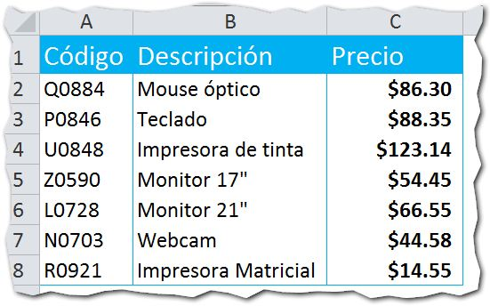
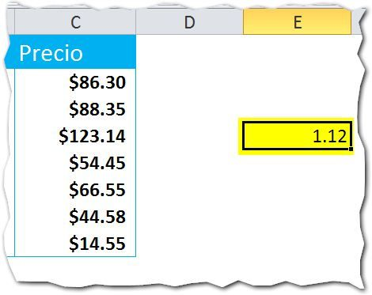
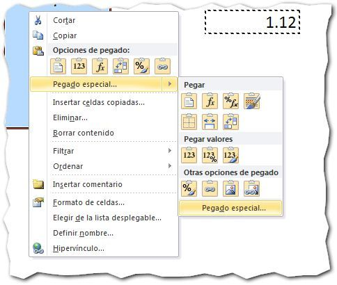
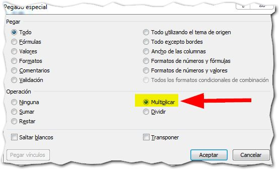
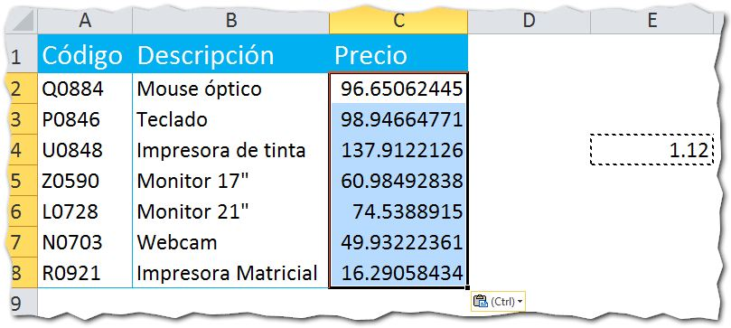

\[resumen\]Hoy te traigo un consejo rápido para Excel, en el que te muestro cómo aplicar funciones matemáticas sobre un valor o grupo de valores, sin la necesidad de utilizar fórmulas.\[/formulas\]

Imagina que tienes una lista de productos con sus precios, así:

 

Ahora, supongamos que quieres aumentarle el 12% del IVA a todos los precios, sin utilizar fórmulas ni mover los datos de su lugar.

¿Cómo lo hago?

Veamos el procedimiento, paso a paso:

1. Escribe en una celda aparte el valor 1.12 (\[highlight\]si quisieras aumentarle el 8% escribe 1.08, para el 2% escribe 1.02 etc.\[/highlight\])  
    
2. Selecciona esta celda y cópiala con clic derecho copiar o \[highlight\]CTRL C\[/highlight\]:
    
3. Selecciona el rango que deseas incrementar, en este caso, el rango donde están los precios y utiliza el pegado especial: 
    
4. Ahora, en el cuadro que aprece, selecciona la opción 'Multiplicar': 
    
5. Verás que los valores se han incrementado. Si sacas las cuentas, confirmarás que subieron un 12% o el porcentaje que le hayas especificado en la celda auxiliar: 
    

¡Y eso es todo!

Ahora ya puedes realizar ajustes en tus tablas de precios a golpe de clic de ratón, sin tener que escribir fórmulas ni estar moviendo tus datos de su lugar. ¡Como sacar el mantel sin retirar los platos!

Anímate y pon este truco en práctica. Verás que te resulta útil.

¡Nos vemos!
