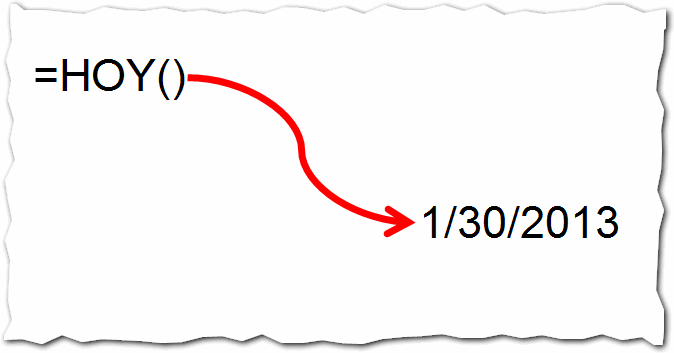
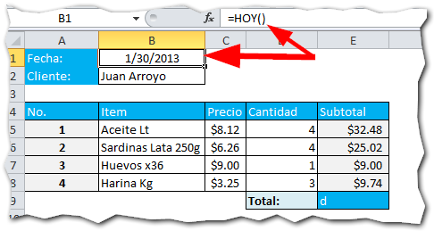

## ¿Qué hace?

La **función Hoy** lo que hace es devolver la fecha actual del sistema, sin fracciones; es decir, no devuelve horas, minutos ni segundos.

## ¿Para qué sirve?

Como ya te conté, la función Hoy sirve para obtener la fecha actual. Esto puede servirnos para, por ejemplo, mostrar la fecha de compra en una factura o nota de venta que imprimamos, u otro tipo de documentos imprimibles.

## ¿Cómo funciona?

La función Hoy, no necesita parámetros y se usa con los paréntesis vacíos, así:

Entonces, por ejemplo, podríamos utilizarla para obtener la fecha en la que se realiza una venta para imprimir una factura o nota de venta.

Como puedes ver en la barra de fórmula, tengo escrita la función Hoy en la celda B1 y esta se encarga de recuperar la fecha actual.

Esta factura, una vez terminada, se va a imprimir y la fecha quedará fija en el papel (obviamente).

Pero si guardas el archivo y lo abres al día siguiente, obtendrás la fecha de ese día, de manera que no te sirve para guardar fechas si lo usas de esta manera.

\[mybox bgcolor="#ee0676" border="full"\] _**¡**__**Precaución**__**!**_

Como te dije, la fecha que devuelve la función Hoy, es la del sistema. Si tu computadora no tiene la fecha correcta, la función Hoy te dará resultados erróneos también.

\[/mybox\]

### La función Hoy tiene varias aplicaciones.

Podrías inclusive construir un modelo en Excel que te "avisara" cuando una fecha ya expiró, comparándola con la fecha actual, a través de la función Hoy, \[highlight\]tal y como tratamos de esto en la lista de correo\[/highlight\]. ¿Aún no estás suscrito/a ? Pues no esperes más y [suscríbete ahora](http://raymundo.me/Suscribete).

Otra idea, sería utilizarla en el formato condicional para crear un calendario que resalte el día actual. El límite está en tu imaginación.

En próximas entradas voy a aprovecharme de esta función para poner en práctica algunas de estas ideas.

Y tú, ¿ya le estás sacando provecho a la función Hoy?

¡Nos vemos!

\[mybox bgcolor="#ffffb2" border="full"\] _**¿Quieres saber más?**_

[Función Hoy - Microsoft](http://office.microsoft.com/es-es/excel-help/funcion-hoy-HP010062297.aspx) \[/mybox\]

## Descarga el archivo terminado.

¿Quieres descargarte el ejemplo de esta entrada? \[ilink style="download" url="http://static.raymundoycaza.com/funcion-hoy.xlsx"\]Pincha aquí.\[/ilink\]
