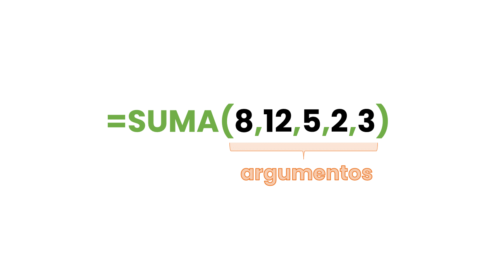
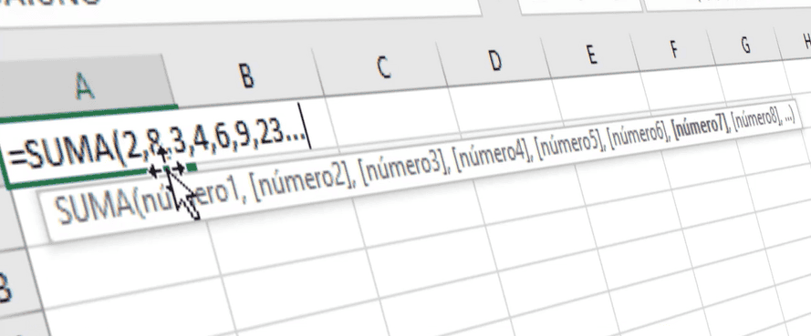

¿Alguna vez te has preguntado qué son los argumentos en Excel?

¿Sí?

Pues bien, espero que cuando salgas de este blog, esa pregunta quede respondida.

Aquí te dejo la versión en video de esta entrada, si eres más de videos, esta opción es para ti:

https://www.youtube.com/watch?v=mhUiItl7SS8

Si, por el contrario, prefieres más una versión breve, en formato entrada, aquí la tienes:

¿Alguna vez te has preguntado qué son los argumentos en Excel?

¿Sí?

Pues bien, espero que al término de esta entrada esa pregunta quede respondida.

## ¿Qué son?

En el ambiente informático, se le llama **argumento** o parámetro a un valor variable que le "pasamos" a una rutina o, en el caso de Excel, a una función.

## ¿Para qué sirven?

Toda función tiene un propósito. Una tarea que realizar. La mayoría de las funciones necesitan datos para poder procesarlos y cumplir su propósito.

Por ejemplo, la [función SUMA](https://raymundoycaza.com/automatizacion-con-excel/formulas-en-excel/la-funcion-suma-en-excel/)() tiene el propósito, como su nombre lo indica, de sumar valores. Estos valores debemos de indicarlos nosotros, en forma de argumentos (o parámetros):

Imagínate que la función SUMA(), sumara siempre los mismos valores. No tendría sentido, ¿verdad?

Para que la función SUMA() tenga más utilidad, debería de sumar un conjunto de valores que nosotros le indiquemos. Así, podemos decirle que sume los valores a, b y c, por ejemplo.

## ¿Cómo se utilizan los argumentos en Excel?

Para poder indicarle a una función los valores que deseamos que procese, utilizamos los argumentos o parámetros, que no serían otra cosa que los vehículos en los cuales se "transportan" nuestros valores hasta el interior de la función.

Por ejemplo, si seguimos el ejemplo de la función SUMA(), para poder  indicarle que sume los números 1,2,3,4 y 5, deberíamos de "pasarlos" a la función como argumentos, así:

Como puedes ver, cada uno de los argumentos está separado por una coma, para poder diferenciarlos.

**Nota**: En tu caso podría ser necesario que utilices el punto y coma, si tienes otra configuración en español.

### El orden importa.

Además de poder diferenciarlos entre sí, el orden en que los ingresas también importa y mucho. Imagina que la función no fuera de suma, sino de división. ¿Acaso es lo mismo dividir dos entre cuatro, que cuatro entre dos?

Por esta razón, cada argumento debe ser ingresado en el orden adecuado y separado por una coma, de manera que la función reciba instrucciones claras y precisas para poder procesar los datos.

En el caso de la función SUMA() no importa el orden, ya que el orden de los sumandos, no altera la suma.

## Conclusión.

Hemos visto que los argumentos en Excel son los "espacios" en los cuales debes indicar los valores con los que quieres que trabaje determinada función.

Es como si le pidieras a un amigo que te haga un depósito en tu cuenta de ahorros: Necesitas darle el dinero, el nombre del banco y el número de cuenta. Si le faltara uno de estos "argumentos" nuestro amigo no podría ejercer su "función" ¿verdad?

Entonces, la próxima vez que una función "se queje" porque no le has dado los parámetros necesarios, tenle más paciencia. Recuerda que necesita de estos datos para realizar su labor :)

## ¿Te ha quedado alguna duda?

Recuerda que el aprendizaje es un proceso continuo, y espero que encuentres en este blog el material necesario para darte un empujón en cada paso del camino. Como siempre te digo, pon en práctica lo aprendido y construye tus propias soluciones. ¡Así aprenderás mucho más!

Si te ha quedado alguna duda referente al tema tratado en esta entrada, no te quedes con ella y déjame tu comentario, seguiremos la conversación ahí.

¡Nos vemos!

🐌

[Argumento (Informática) - Wikipedia](http://es.wikipedia.org/wiki/Argumento_(inform%C3%A1tica))
