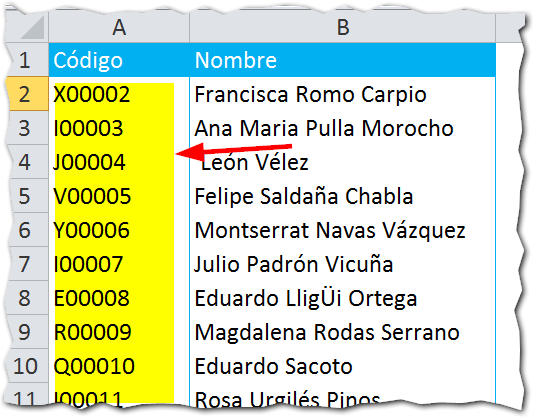
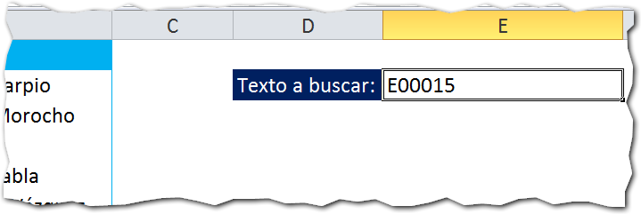
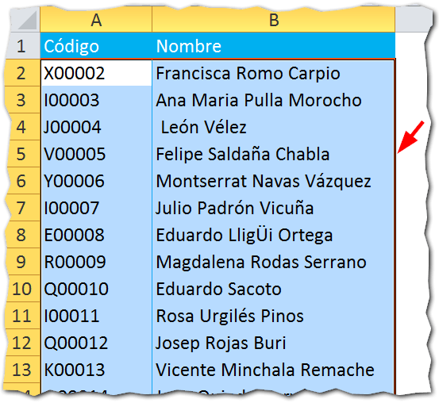
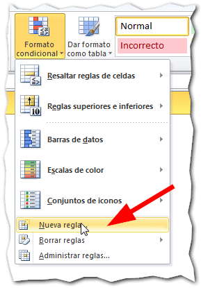
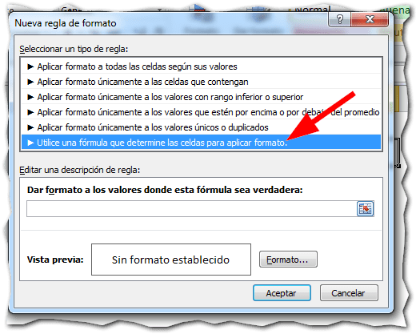
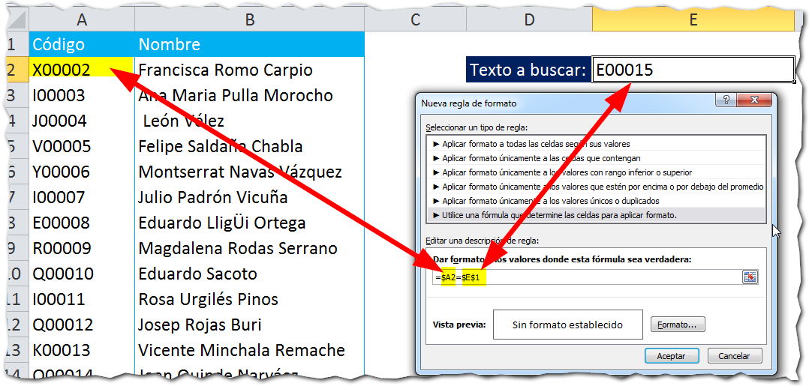
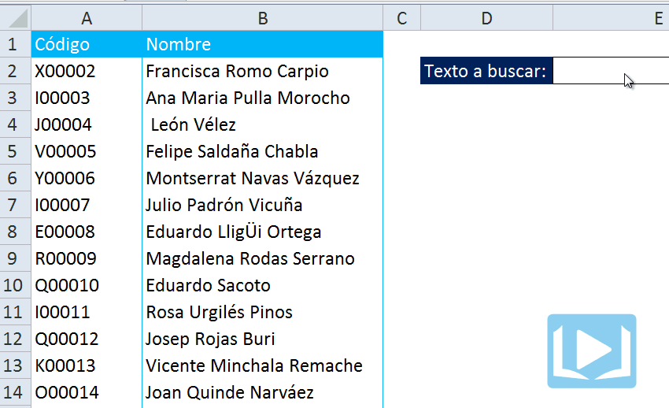

## El formato condicional en la presentación de datos.

El **formato condicional** es realmente una herramienta muy útil, principalmente en la presentación de datos ya que, si lo sabes usar, podrás lograr efectos increíbles en tus hojas de Excel, automatizando muchos aspectos relativos al formato de tus datos y aplicando determinadas condiciones que tú especificarás.

Como siempre te digo, el límite está en tu imaginación. Hoy quiero contarte acerca de la posibilidad de utilizar el formato condicional como un "buscador" en Excel que te ayudará a localizar determinados valores de un vistazo, con solo escribirlo en una caja de búsqueda.

¿Te interesa? Entonces sigue leyendo y entérate de cómo buscar un valor en Excel usando el formato condicional.

## Buscar usando el formato condicional.

Supongamos que tú tienes un listado como el de la siguiente imagen.

En este listado, tienes una columna llamada 'Código' y otra columna llamada 'Nombre'. Como la mejor forma de identificar unívocamente un registro es a través de un código único, entonces nosotros vamos a realizar las búsquedas sobre la columna 'Código'.

Ahora te voy a mostrar el procedimiento que deberás seguir para lograrlo y, como ya es costumbre, vamos a verlo paso a paso:

### La caja de búsqueda.

Este es el paso más sencillo. Elige una celda que será tu caja de búsqueda, en la que escribirás el texto a buscar.

En mi caso, he elegido la celda E2 y le he hecho unos retoques para que se vea mejor:

### El rango que será afectado.

Para aplicar el formato condicional, primero debemos elegir el rango que se verá afectado por el mismo.

Para elegir el rango, debes decidir dependiendo de cuál sea el efecto deseado:

- ¿Quieres la fila completa se 'pinte' de naranja cuando el valor sea encontrado? Entonces selecciona todo el rango.
- ¿Quieres que solo la columna de código se 'pinte'? Entonces selecciona solo la primera columna.

Como yo quiero que se marque la fila completa, entonces voy a seleccionar todo el rango de la tabla (sin los títulos de las columnas).

Ahora ve a la pestaña 'Inicio' y pincha sobre el botón 'Formato Condicional'. En el menú que se te muestra, pincha en sobre la opción 'Nueva Regla':

Ahora, en el cuadro de diálogo que te aparece, selecciona la opción 'Utilice una fórmula que determine las celdas para aplicar formato.', tal y como te indica la siguiente imagen:

### La fórmula para encontrar el dato exacto.

Para lograr este efecto con el formato condicional, requerimos de una fórmula que haga la comparación entre la caja de búsqueda y la tabla donde están todos nuestros datos.

Una comparación simple, utilizando el signo 'igual a' ( = ), debería bastar. Si la columna 'Código' es igual al valor buscado, entonces pintar la fila.

Teniendo clara esta parte, vamos a utilizar la siguiente fórmula.

\[box type="tick" border="full"\]=$A2=$E$1\[/box\]

En el gráfico anterior, puedes ver que la celda A2 hace referencia a la primera celda de la tabla donde están nuestros datos. Necesariamente, debe ser aquella donde está el código que vamos a comparar.

Esta celda, la comparo con la celda E2, que es la celda donde está nuestra caja de búsqueda. Con el signo 'igual a' le estamos haciendo la pregunta: ¿Son iguales?

### Aplicando el formato.

En el paso anterior, ya hemos resuelto la parte lógica. Es decir, ya le hemos expresado nuestra pregunta a Excel a través de una fórmula.

Ahora, si la respuesta es verdadera, es decir, que Excel nos responda con un Sí, entonces se aplicará el formato elegido.

¿Pero cuál formato se aplicará?

Pues el que nosotros le indiquemos.

Guíate con la siguiente imagen y pincha en el botón 'Formato...' que aparece en la parte inferior del mismo cuadro de diálogo (1)

Ahora, en el segundo cuadro que se muestra, pincha en la pestaña 'Relleno' (2) y elige un color de fondo. En mi caso, he elegido el naranja.

Como último paso, presiona el botón 'Aceptar' (3) y nuevamente 'Aceptar'.

### Probando nuestro modelo.

Si has seguido correctamente todos los pasos, ahora tendrás listo tu flamante buscador en Excel, basado en el formato condicional. Un efecto llamativo, ¿no lo crees?

## ¿Qué te ha parecido este buscador?

Esta es una forma llamativa de realizar un buscador en Excel y sin utilizar macros. Me parece una opción muy interesante cuando tienes muchos datos a buscar y te interesa resaltar un dato en particular para detectarlo de un vistazo.

¿Qué opinas tú? ¿Cuáles son las ventajas y las desventajas que ves en este modelo?

No olvides dejarme tu respuesta en los comentarios, más abajo, ni dejes de poner en práctica esta técnica.

¡Nos vemos!

## Descarga el archivo terminado.

¿Quieres descargarte el archivo usado en el ejemplo? Entonces \[ilink url="http://static.raymundoycaza.com/formato-condicional.xlsx" style="download"\]pincha aquí\[/ilink\] .

\[mybox bgcolor="#ffffb2" border="full"\] _**¿Quieres saber más?**_

_[Formato Condicional - Microsoft](http://www.microsoft.com/spain/office/eventosonline/trucos11.mspx)_

_**Créditos Foto**_

[Sxc.hu](http://www.sxc.hu/photo/497769) \[/mybox\]
