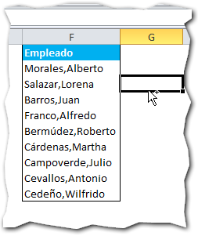
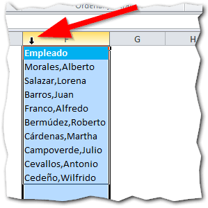
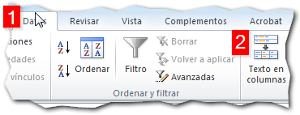
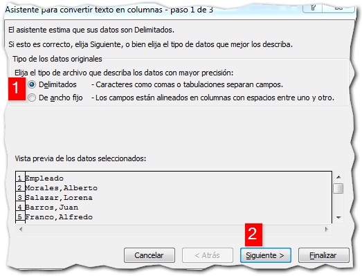
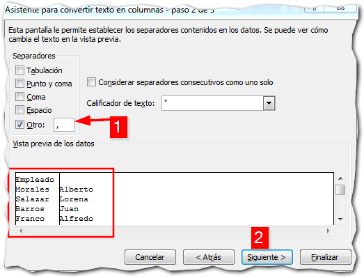
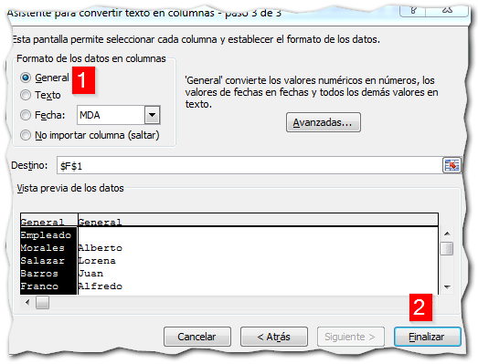
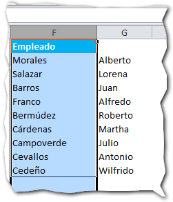
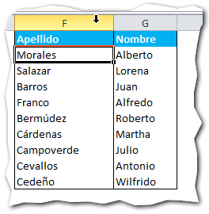

\[quote\]¿Y por qué yo querría separar un texto en Excel?\[/quote\]

A veces tenemos listados de datos que en su momento los creamos sin tomar la precaución de "atomizarlos" (separar los datos independientes en sus respectivas columnas).

Generalmente sucede con los datos de empleados o similares: Los nombres y los apellidos están juntos en una misma columna.

Pero, ahora resulta que necesitamos tenerlos separados ¿entonces qué hacer?

Si la lista no es muy amplia, la primera opción que te venga a la mente sería la de hacerlo manualmente, registro por registro una y otra vez. Pero ya me contarás cuando tu listado tiene más de 100 filas.

## Pasos para separar un texto en Excel.

Nos aprovecharemos de que en el ejemplo, los nombres están separados de los apellidos por una coma (también podría ser cualquier otro símbolo). Para hacer fácilmente una tarea tan tediosa como esta, seguiremos los siguientes pasos:

1. Selecciona toda la columna.
    
    Con el ratón selecciona toda la columna, pinchando sobre el cartel con la letra de la columna en la que están tus datos a separar. 
    
2. Selecciona la opción Texto en Columnas.
    
    Dirígete a la pestaña "Datos" (1) en la que encontrarás la opción "Texto en columnas" (2), pincha sobre esta. 
    
3. Elige el tipo de datos que vas a separar.
    
    Se abrirá una ventana en la que seleccionarás la opción "Delimitados" (1). Pincha en el botón 'Siguiente' (2). 
    
4. Selecciona la opción 'Otro'.
    
    Y escribe una coma en el cuadro que está junto a la misma (1)Fíjate como las columnas automáticamente se han separado en el ejemplo que se muestra encerrado en el recuadro rojo. Esto es porque Excel ha usado la coma para dividir el texto de tu columna. Si el texto tuviera otro carácter separador, solo deberías escribirlo aquí en lugar de la coma. Ahora pincha en "Siguiente" (2)
    
    
5. Has terminado.
    
    Asegúrate que esté seleccionada la opción "General" (1). Deja todas las opciones como están y pincha en "Finalizar" (2). 
    

###  El ejemplo terminado

Una vez realizados estos pasos, Excel te mostrará lo siguiente: 

Como puedes ver, en pocos y sencillos pasos has realizado una tarea que no dejaría de ser tediosa si la hicieras registro a registro y si la tabla fuera mucho más extensa.

Ahora solo le darías algo de formato y estarías listo/a para comenzar la nueva etapa de tu listado o base de datos: 

\[mybox bgcolor="#944ab2" border="full" color="#fff"\]**Precaución**: Debes tener cuidado al momento de separar datos con esta opción. Primero inserta tantas columnas como sean necesarias para tus nuevos datos que nacerán a partir de la separación que hará Excel. En mi caso, al tener solo dos datos, necesito únicamente dos columnas.\[/mybox\]

Hoy has aprendido a utilizar una excelente herramienta de Excel que nos ahorra mucho tiempo a la hora de realizar tratamiento de datos.

Si quieres profundizar en esta opción, te dejo un enlace más abajo.

¡Nos vemos!

\[mybox bgcolor="#ffffb2" border="full"\]

_**¿Quieres leer más del tema?**_

[Separar texto en Excel - Microsoft](http://office.microsoft.com/es-es/excel-help/dividir-nombres-con-el-asistente-para-convertir-texto-en-columnas-HA010102340.aspx "Separar texto en Excel")

\[/mybox\]
