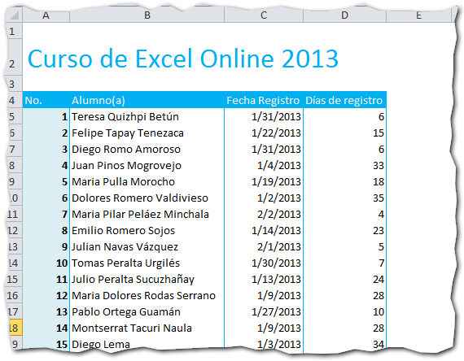
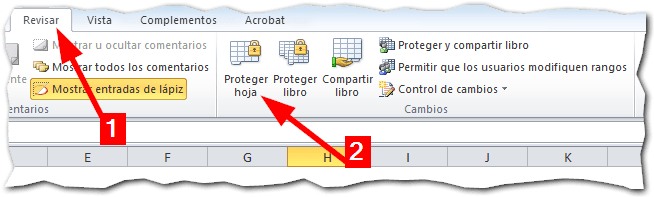
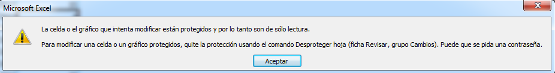
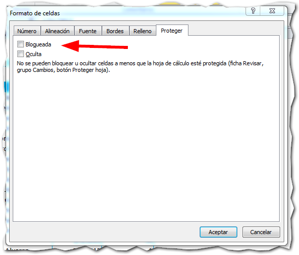
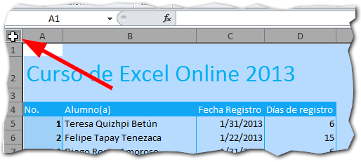
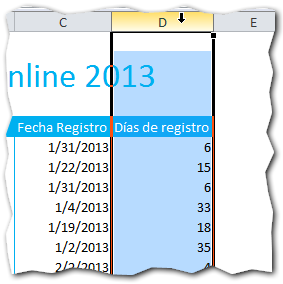
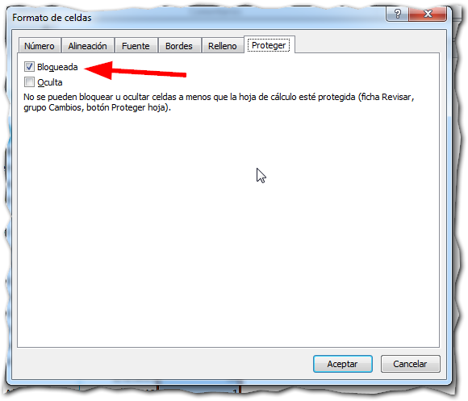

¿Por qué necesitarías proteger una hoja en Excel?

Imagina que terminas ese formato en Excel, que tanto trabajo te ha costado hacer. Luego, viene tu primer usuario y le mueve una fórmula o le borra una columna: Todo comenzó a fallar y el responsable eres tú.

¿Te suena conocida la historia?

Probablemente sí. Entonces sigue leyendo y entérate de cómo proteger una hoja de Excel de los cambios accidentales.

## Pasos para proteger una hoja en Excel.

Imagina que tienes un listado de alumnos para el curso, como el mío, el cual necesito enviarlo a la imprenta para que imprima los respectivos certificados de asistencia.

Por supuesto, me interesa que nadie vaya a cambiar accidentalmente el nombre de algún alumno, porque ocasionaría un error en las impresiones. Entonces, para asegurarte de que no pase nada de esto, proteges tu hoja siguiendo estos pasos:

1. Pincha en el botón 'Proteger Hoja' Busca la pestaña 'Revisar' en la cinta de opciones. Debería de ser la sexta pestaña de izquierda a derecha (1) y ubica la sección 'Cambios' que se encuentra a la derecha. En esta parte, debes localizar el botón 'Proteger Hoja' y pinchas sobre él (2): 
2. Elige los cambios permitidos. Aparecerá un cuadro de diálogo. En este debes seleccionar los cambios que **sí serán permitidos** en tu hoja de Excel. Todo lo que no esté marcado, no se podrá cambiar a menos que le quites la protección a la hoja: 
3. Asigna una clave. En el cuadro de texto que aparece en la parte superior, puedes especificar una clave para que nadie más que tú, pueda desproteger la hoja. Esta clave es opcional y si no quieres usarla, simplemente déjala en blanco. \[highlight\]**Atención**: Si escribes una clave aquí, Excel te pedirá que la escribas nuevamente para confirmar.\[/highlight\]
4. Pincha en el botón Aceptar. Si ya terminaste de editar los permisos, pincha en el botón 'Aceptar' y tu hoja quedará protegida contra los cambios accidentales.

Ahora, si alguien trata de cambiar algo en tu hoja, le aparecerá un mensaje como este:

Indicándole así, que no es posible realizar modificaciones a la hoja.

## ¿Cómo puedo quitarle la protección?

Si necesitas editar algo en tu hoja, vas a necesitar quitarle la protección primero. Esto es muy sencillo: solo vuelve a pinchar en el mismo botón, que ahora habrá cambiado su nombre a 'Desproteger Hoja'.

Si no has puesto ninguna clave, al momento de proteger la hoja, esta se desbloqueará sin hacer nada más. Si le hubieras asignado una clave, antes de hacerlo Excel te pedirá la clave indicada.

 

Si no ingresas correctamente la clave, no te permitirá hacer ningún cambio. Así que asegúrate de la clave que elijas la tienes apuntada en algún lugar seguro o de que te la sabes de memoria.

## ¿Y si quiero que sí puedan editar algunas áreas?

Si quieres que algunas áreas de tu hoja no estén protegidas, ya sea porque hay valores que cambian con el tiempo o que deberían actualizarse a diario, lo único que tienes que hacer es desbloquear el [rango de celdas](http://raymundoycaza.com/que-es-un-rango-en-excel/) deseado, antes de proceder a proteger la hoja.

Para desbloquear un rango de celdas en tu hoja, solo debes seleccionar el rango deseado y hacer un clic derecho, entonces selecciona 'Formato de Celdas' o, más rápido, presionar el atajo **CTRL + 1.**

Imagina que a te interesa desbloquear el rango donde están las fechas. Entonces realizas los pasos y aparecerá el cuadro 'Formato de Celdas'.

Te diriges directamente a la pestaña 'Proteger' y le quitas la marca a la casilla de verificación 'Bloqueada', entonces pinchas en el botón 'Aceptar'.

Listo. Si realizas los 4 pasos para proteger tu hoja, verás que ahora es posible realizar cambios solo en el rango donde están las fechas de nuestro listado.

## ¿Cómo proteger una columna en Excel?

Si solo quieres proteger una columna de tu hoja, primero debes **des-proteger todas las celdas de la hoja**.

Para realizar esto, lo más rápido es que pinches con el puntero del ratón en la esquina izquierda, justo en el punto que te señalo en la siguiente imagen:

Después de hacer esto, se habrá seleccionado toda la hoja. Ahora debes hacer un clic derecho, entonces selecciona 'Formato de Celdas' o, más rápido, presionar el atajo **CTRL + 1.**

Te diriges directamente a la pestaña 'Proteger' y le quitas la marca a la casilla de verificación 'Bloqueada', entonces pinchas en el botón 'Aceptar'.

Supongamos que solo quieres proteger la columna 'Días de registro', en la que hay una fórmula. Lo que debes hacer es seleccionar toda la columna D:

Ahora debes hacer un clic derecho, entonces selecciona 'Formato de Celdas' o, más rápido, presionar el atajo **CTRL + 1.**

Te diriges directamente a la pestaña 'Proteger' y le **pones** la marca a la casilla de verificación 'Bloqueada', entonces pinchas en el botón 'Aceptar'.

Si ahora realizas los 4 pasos para proteger tu hoja, notarás que puedes realizar cambios en todas las celdas, menos en la columna que dejamos bloqueada.

¿Interesante o no? ¿Tú que dices?

## Protege tus hojas como medida de seguridad.

Como te comentaba al principio, proteger tus hojas de trabajo es una medida de seguridad que puede ahorrarte más de un dolor de cabeza. Adóptalo como práctica común en tus desarrollos y cúrate en salud.

También es una buena idea para esos reportes que envías a otras áreas de tu empresa. Recuerda que un dato cambiado en el camino, puede generar más de un disgusto a muchas personas. ¡Anímate a hacerlo! Solo toma un minuto.

¿Y tú, ya estás protegiendo tus hojas?

¡Nos vemos!

\[aviso type="creditos"\] _**¿Quieres más?**_

_[Mira este vídeo de Javi Santamans.](https://www.youtube.com/watch?v=C22qqtvLgrI)_ \[/aviso\]

## Descarga el ejemplo terminado.

\[ilink url="http://static.raymundoycaza.com/proteger-una-hoja-en-excel.xlsx" style="download"\]Pincha aquí\[/ilink\]  para descargarte el archivo usado en el ejemplo.
