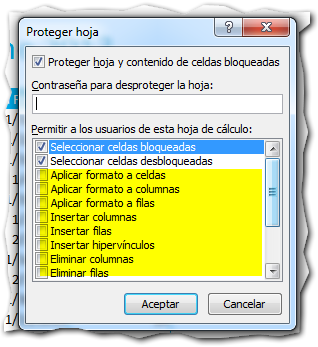

쯇or qu칠 necesitar칤as proteger una hoja en Excel?

Imagina que terminas ese formato en Excel, que tanto trabajo te ha costado hacer. Luego, viene tu primer usuario y le mueve una f칩rmula o le borra una columna: Todo comenz칩 a fallar y el responsable eres t칰.

쯊e suena conocida la historia?

Probablemente s칤. Entonces sigue leyendo y ent칠rate de c칩mo proteger una hoja de Excel de los cambios accidentales.

## Pasos para proteger una hoja en Excel.

Imagina que tienes un listado de alumnos para el curso, como el m칤o, el cual necesito enviarlo a la imprenta para que imprima los respectivos certificados de asistencia.

Por supuesto, me interesa que nadie vaya a cambiar accidentalmente el nombre de alg칰n alumno, porque ocasionar칤a un error en las impresiones. Entonces, para asegurarte de que no pase nada de esto, proteges tu hoja siguiendo estos pasos:

1. Pincha en el bot칩n 'Proteger Hoja' Busca la pesta침a 'Revisar' en la cinta de opciones. Deber칤a de ser la sexta pesta침a de izquierda a derecha (1) y ubica la secci칩n 'Cambios' que se encuentra a la derecha. En esta parte, debes localizar el bot칩n 'Proteger Hoja' y pinchas sobre 칠l (2): 
2. Elige los cambios permitidos. Aparecer치 un cuadro de di치logo. En este debes seleccionar los cambios que **s칤 ser치n permitidos** en tu hoja de Excel. Todo lo que no est칠 marcado, no se podr치 cambiar a menos que맓e quites la protecci칩n a맓a hoja: 
3. Asigna una clave. En el cuadro de texto que aparece en la parte superior, puedes especificar una clave para que nadie m치s que t칰, pueda desproteger la hoja. Esta clave es opcional y si no quieres usarla, simplemente d칠jala en blanco. \[highlight\]**Atenci칩n**: Si escribes una clave aqu칤, Excel te pedir치 que la escribas nuevamente para confirmar.\[/highlight\]
4. Pincha en el bot칩n Aceptar. Si ya terminaste de editar los permisos, pincha en el bot칩n 'Aceptar' y tu hoja quedar치 protegida contra los cambios accidentales.

Ahora, si alguien trata de cambiar algo en tu hoja, le aparecer치 un mensaje como este:

Indic치ndole as칤, que no es posible realizar modificaciones a la hoja.

## 쮺칩mo puedo quitarle la protecci칩n?

Si necesitas editar algo en tu hoja, vas a necesitar quitarle la protecci칩n primero. Esto es muy sencillo: solo vuelve a pinchar en el mismo bot칩n, que ahora habr치 cambiado su nombre a 'Desproteger Hoja'.

Si no has puesto ninguna clave, al momento de proteger la hoja, esta se desbloquear치 sin hacer nada m치s. Si le hubieras asignado una clave, antes de hacerlo Excel te pedir치 la clave indicada.

Si no ingresas correctamente la clave, no te permitir치 hacer ning칰n cambio. As칤 que aseg칰rate de la clave que elijas la tienes apuntada en alg칰n lugar seguro o de que te la sabes de memoria.

## 쯏 si quiero que s칤 puedan editar algunas 치reas?

Si quieres que algunas 치reas de tu hoja no est칠n protegidas, ya sea porque hay valores que cambian con el tiempo o que deber칤an actualizarse a diario, lo 칰nico que tienes que hacer es desbloquear el [rango de celdas](http://raymundoycaza.com/que-es-un-rango-en-excel/) deseado, antes de proceder a proteger la hoja.

Para desbloquear un rango de celdas en tu hoja, solo debes seleccionar el rango deseado y hacer un clic derecho, entonces selecciona 'Formato de Celdas' o, m치s r치pido, presionar el atajo **CTRL + 1.**

Imagina que a te interesa desbloquear el rango donde est치n las fechas. Entonces realizas los pasos y aparecer치 el cuadro 'Formato de Celdas'.

Te diriges directamente a la pesta침a 'Proteger' y le quitas la marca a la casilla de verificaci칩n 'Bloqueada', entonces pinchas en el bot칩n 'Aceptar'.

Listo. Si realizas los 4 pasos para proteger tu hoja, ver치s que ahora es posible realizar cambios solo en el rango donde est치n las fechas de nuestro listado.

## 쮺칩mo proteger una columna en Excel?

Si solo quieres proteger una columna de tu hoja, primero debes**des-proteger맚odas las celdas de la hoja**.

Para realizar esto, lo m치s r치pido es que pinches con el puntero del rat칩n en la esquina izquierda, justo en el punto que te se침alo en la siguiente imagen:

Despu칠s de hacer esto, se habr치 seleccionado toda la hoja. Ahora debes hacer un clic derecho, entonces selecciona 'Formato de Celdas' o, m치s r치pido, presionar el atajo **CTRL + 1.**

Te diriges directamente a la pesta침a 'Proteger' y le quitas la marca a la casilla de verificaci칩n 'Bloqueada', entonces pinchas en el bot칩n 'Aceptar'.

Supongamos que solo quieres proteger la columna 'D칤as de registro', en la que hay una f칩rmula. Lo que debes hacer es seleccionar toda la columna D:

Ahora debes hacer un clic derecho, entonces selecciona 'Formato de Celdas' o, m치s r치pido, presionar el atajo **CTRL + 1.**

Te diriges directamente a la pesta침a 'Proteger' y le **pones** la marca a la casilla de verificaci칩n 'Bloqueada', entonces pinchas en el bot칩n 'Aceptar'.

Si ahora realizas los 4 pasos para proteger tu hoja, notar치s que puedes realizar cambios en todas las celdas, menos en la columna que dejamos bloqueada.

쯀nteresante o no? 쯊칰 que dices?

## Protege tus hojas como medida de seguridad.

Como te comentaba al principio, proteger tus hojas de trabajo es una medida de seguridad que puede ahorrarte m치s de un dolor de cabeza. Ad칩ptalo como pr치ctica com칰n en tus desarrollos y c칰rate en salud.

Tambi칠n es una buena idea para esos reportes que env칤as a otras 치reas de tu empresa. Recuerda que un dato cambiado en el camino, puede generar m치s de un disgusto a muchas personas. 춰An칤mate a hacerlo! Solo toma un minuto.

쯏 t칰, ya est치s protegiendo tus hojas?

춰Nos vemos!

\[aviso type="creditos"\] _**쯈uieres m치s?**_

_[Mira este v칤deo de Javi Santamans.](https://www.youtube.com/watch?v=C22qqtvLgrI)_ \[/aviso\]

## Descarga el ejemplo terminado.

\[ilink url="http://static.raymundoycaza.com/proteger-una-hoja-en-excel.xlsx" style="download"\]Pincha aqu칤\[/ilink\] 맗ara descargarte el archivo usado en el ejemplo.
