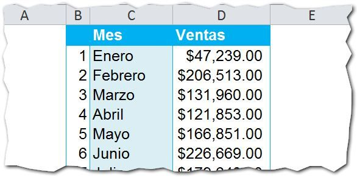
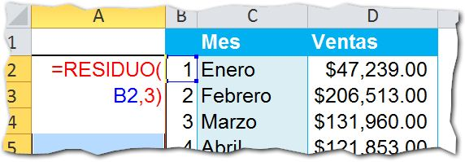
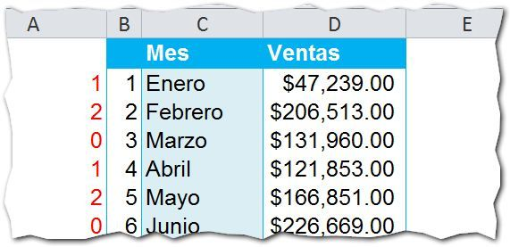
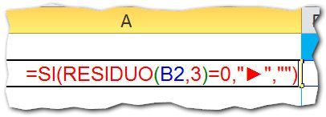
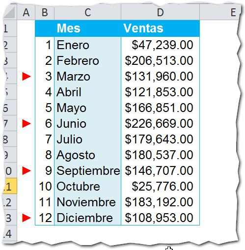

La **función RESIDUO**, pertenece al grupo de Funciones Matemáticas y Trigonométricas.

## ¿Qué hace la función RESIDUO?

La función RESIDUO devuelve el valor residual de una división entre dos números, los cuales debes especificar en sus dos [argumentos](http://raymundoycaza.com/que-son-los-argumentos-en-excel/ "¿ Qué son los argumentos en Excel ?").

Por ejemplo: Si realizas la división de 15 entre 2, el cociente es 7, ¿verdad?

\[latex fg="944ab2" s="4"\]15/2 = 7\[/latex\]

Pero sobra un residuo que es igual a 1. Este sería el valor que devolvería la función residuo si lo usas con los números 15 y 2.

Por lo tanto, el residuo de 15 dividido entre 2 es igual a 1.

## ¿Para qué sirve?

Como te dije, la función RESIDUO se usa para obtener el residuo de una división. **Puedes utilizarlo para** calcular si un número es divisible entre otro o no.

¿Y para qué quiero saber si un número es divisible entre otro? Yo ya terminé la escuela.

Pues cuando escribes [fórmulas](http://raymundoycaza.com/que-es-una-formula-en-excel/ "¿ Qué es una fórmula en Excel ?"), necesitas realizar cálculos que dependen de ciertas condiciones. ¿Verdad? A veces, es más sencillo utilizar condiciones que dependan de la divisibilidad de un número entre otro y, dependiendo del caso, realizar una u otra acción.

Recuerda que ninguna fórmula está demás en Excel.

## ¿Cómo se usa?

La sintaxis de la función RESIDUO es la siguiente:



**Divisor**: Es el número que será dividido. (Obligatorio)

**Dividendo**: Es el número entre el cual se va a dividir al Divisor. (Obligatorio)

Si la división es exacta, el residuo será cero. Cualquier otro número en caso contrario.

## Un ejemplo práctico.

Imagina que tienes un reporte de ventas por mes como el siguiente:

Ahora, supongamos que necesitas destacar el último mes de cada trimestre, de alguna forma. ¿Cómo lo harías?

### Divisible entre 3.

Como te comentaba hace un rato, la función RESIDUO te permite averiguar si  un número es divisible entre otro o no. Para calcular el cambio de trimestre, vamos a usar la función RESIDUO para evaluar la divisibilidad del mes en curso entre 3, si es divisible, quiere decir que es el último mes del trimestre.

¿Por qué entre 3?

Porque cada trimestre tiene 3 meses.

Recuerda que cuando el divisor es divisible entre el dividendo, la función RESIDUO te devolverá un cero y cualquier otro número en caso de que no sea divisible.

Siguiendo esta línea, nuestra función RESIDUO, lucirá así:

Si copias la fórmula hacia abajo, el resultado será el siguiente:

Como puedes ver en la imagen anterior, cada vez que aparece un cero, significa que estamos en el último mes de un trimestre. Con esto hemos conseguido detectar los 'límites' de cada trimestre.

Ahora, para poder hacerlo 'más bonito' y práctico, nos ayudaremos de la función SI y el carácter "►", de esta manera:

 

Lo que estoy haciendo aquí, es 'preguntar' si el residuo del número del mes actual, dividido entre tres, es igual a cero. En caso afirmativo, mostrar el carácter ►, caso contrario, mostrar una cadena vacía.

Ahora copiamos la fórmula hacia abajo y tendremos un muy buen resultado:

 

###  Ahora, ¡a practicar!

Con esto ya tienes un punto de partida para sacar más ideas de cómo aprovechar la función RESIDUO en tus desarrollos en Excel. No dejes de practicar para convertirte en un Maestro del Excel.

¡Nos vemos!
