Revisando entre las publicaciones en la Internet sobre temas relacionados con Excel, me topé con un vídeo interesante que me recordó una técnica vista hace algún tiempo: Cómo dibujar un barco usando un gráfico en Excel.

Esta técnica tiene un fin más bien recreativo que práctico; pero a mi me consta que estas técnicas creativas bien pueden aplicarse a nuestro trabajo para lograr lo que parece imposible de hacer con Excel.

## ¿Cómo dibujar dentro de un gráfico?

Para realizar nuestro dibujo, vamos a hacer uso de ciertos valores que colocaremos en dos columnas, como el que te muestro en la imagen:

[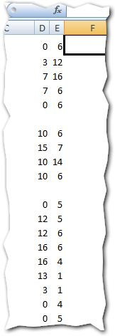](http://raymundoycaza.com/wp-content/uploads/dibujar-dentro-de-un-grafico-0011.jpg)

_El listado completo lo podrás ver en el archivo adjunto que dejo al final._

Ahora, solo tienes que insertar tu gráfico usando como fuente de datos estos valores.

El gráfico que utilizaremos es el de 'Dispersión con Líneas Rectas' que te muestro en la imagen:

[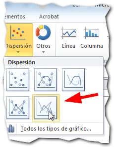](http://raymundoycaza.com/wp-content/uploads/dibujar-dentro-de-un-grafico-0021.jpg)

Con el gráfico vacío, pincha sobre él y haz un clic derecho. En el menú contextual que aparece, selecciona la opción 'Seleccionar Datos...'

[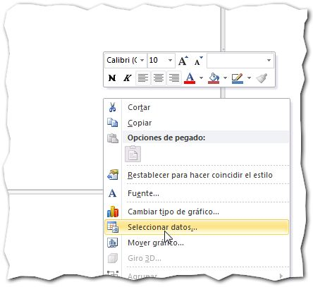](http://raymundoycaza.com/wp-content/uploads/dibujar-dentro-de-un-grafico-0031.jpg)

Y en el cuadro que te aparece, elige como fuente de datos las dos columnas que habíamos creado antes:

[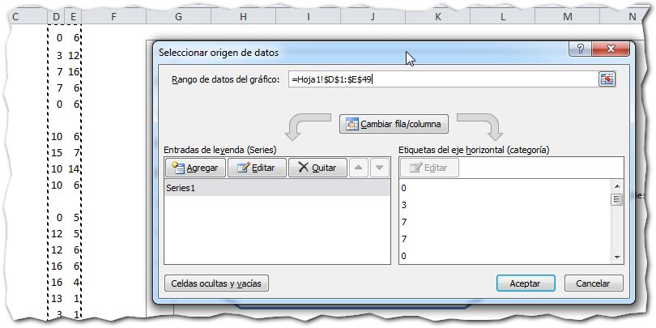](http://raymundoycaza.com/wp-content/uploads/dibujar-dentro-de-un-grafico-0041.jpg)

Una vez que has realizado esto, verás cómo se ha dibujado un pequeño barco en tu gráfico ¡y está listo para navegar! :)

[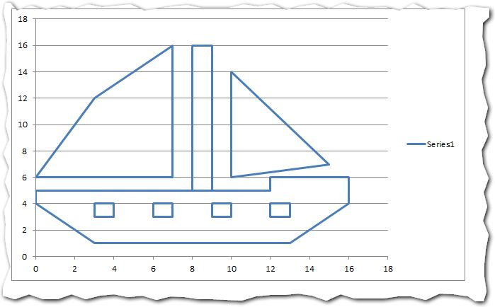](http://raymundoycaza.com/wp-content/uploads/dibujar-dentro-de-un-grafico-0051.jpg)

##  Soltando amarras.

Ahora, vamos a darle un toque adicional. Primero que nada, cámbiale en las opciones de cada eje, el valor mínimo y el máximo (de cero a cien) tal y como te muestro en la imagen:

[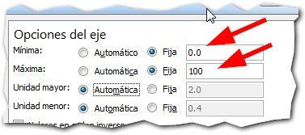](http://raymundoycaza.com/wp-content/uploads/dibujar-dentro-de-un-grafico-0061.jpg)

Luego, solo dale unos cuántos retoques al gráfico, a tu gusto:

[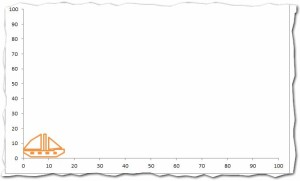](http://raymundoycaza.com/wp-content/uploads/dibujar-dentro-de-un-grafico-0071.jpg)

### ¿Te gustaría que el barco se moviera? ¡Entonces a navegar!

En la celda P1, vas a escribir el número cero y lo usarás como un control.

En la celda A1, escribirás esta fórmula:

[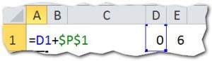](http://raymundoycaza.com/wp-content/uploads/dibujar-dentro-de-un-grafico-0081.jpg)

En la fórmula B1, escribirás esta fórmula:

Y copias hasta abajo estas dos fórmulas, de manera que se correspondan con los valores de las columnas D y E.

Ten la precaución de eliminar las fórmulas que se corresponden con los espacios vacíos en las columnas de valores:

[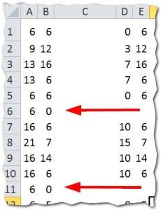](http://raymundoycaza.com/wp-content/uploads/dibujar-dentro-de-un-grafico-0101.jpg)

### Nuestro truco está casi listo.

Ahora lo que tenemos que hacer es cambiar la fuente de datos del gráfico a las columnas con fórmulas que acabamos de editar.

Por último, ¿recuerdas la celda de control que dejamos en el rango P1? Ahora vamos a utilizarlo; pero, para mayor comodidad, utilizaremos un control de número el cual insertaremos desde la pestaña 'Programador':

[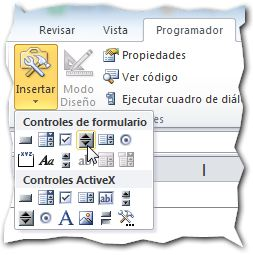](http://raymundoycaza.com/wp-content/uploads/dibujar-dentro-de-un-grafico-0111.jpg)

Lo acomodaremos debajo de la celda P1 y haremos sobre él un clic derecho / 'Formato de control...'

[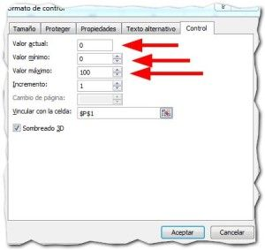](http://raymundoycaza.com/wp-content/uploads/dibujar-dentro-de-un-grafico-0121.jpg)

- En 'Valor actual' colocaremos un 0.
- En 'Valor mínimo' colocaremos un 0.
- En 'Valor máximo' colocaremos un 100.
- En 'Incremento' asegúrate que esté con un valor de 1.
- En 'Vincular con la celda' debes escribir el rango de la celda P1 o la celda con la que quieras establecer la relación.

### El ejemplo funcionando.

[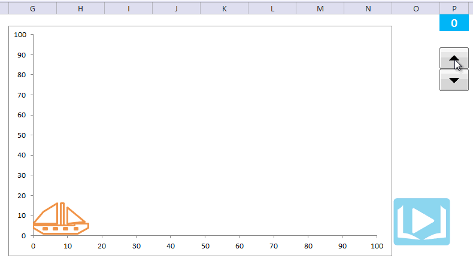](http://raymundoycaza.com/wp-content/uploads/dibujar-dentro-de-grafico-animacion1.gif)

Si pinchas en el control, podrás ver cómo nuestro barco inicia su travesía por el mar y todo sucede dentro de un gráfico de Excel común y silvestre :)

## ¿Quieres descargar el archivo terminado?

[Pincha aquí para descargar el archivo.](http://raymundoycaza.com/wp-content/uploads/dibujar-dentro-de-grafico.xlsx "Descarga el archivo terminado.")

\[aviso titulo="Créditos"\] El vídeo fue visto en Youtube, [pincha aquí para verlo](https://www.youtube.com/watch?feature=player_embedded&v=f_92kU2M_Ww "Ver vídeo"). \[/aviso\]

## ¿Qué te ha parecido esta técnica?

Espero que te haya gustado y en el mejor de los casos, te haya dado ideas para tus proyectos futuros. Esta es una prueba más de que en Excel se puede hacer casi cualquier cosa.

¿Y tú, qué opinas de este truco?

Seguimos en los comentarios.

¡Nos vemos!
