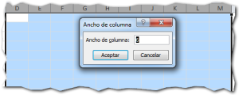
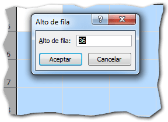
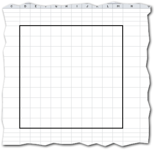
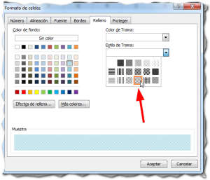
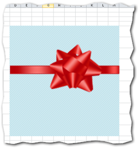
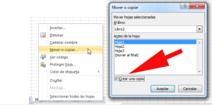
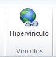
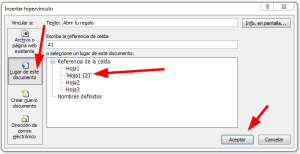
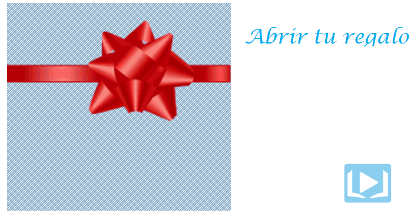

El próximo jueves 14 de febrero, se celebra el denominado 'Día del amor y la amistad'.

En esta fecha solemos aprovechar para entregar algún presente o tener un detalle con esa persona especial o con nuestros amig@s.

Por regla general, a todos nos gusta ser originales y buscamos algo diferente que pueda impresionar a la otra persona o, al menos, robarle una sonrisa.

Ya sea porque quieres hacerlo o simplemente para aprender un poco más de Excel, no dejes de leer este artículo en el que te muestro cómo hacer una sencilla tarjeta para entregar a tu pareja en este día del amor y la amistad. ¡Comencemos!

## Prepara el lienzo.

Necesitamos preparar nuestro lienzo para comenzar a dibujar nuestra tarjeta, así que lo primero que harás será seleccionar unas 10 columnas a las que le darás un ancho de 6:

También usarás 10 filas a las que le darás una altura de 36:

La idea es que te quede un cuadrado como el siguiente:

El borde que le he puesto, solo es para que se vea el recuadro con mayor claridad. No forma parte del proceso.

### Envuelve tu regalo.

Ahora, vas a seleccionar y pintar el cuadro con un color suave, el que sea de tu agrado.

Con el cuadro todavía seleccionado, presiona el atajo CTRL + 1 y ve a la pestaña 'Relleno'. En 'Color de trama', elige el blanco y en 'Estilo de trama' elige el que más te agrade. Yo elegí el que ves en la imagen:

Ahora, tu cuadro luce como si estuviera cubierto de aquel papel con el que se envuelven los regalos y va tomando forma. ¿Lo puedes ver?

¡Bien! Sigamos.

### El lazo para nuestro regalo.

El siguiente paso es buscar en Internet una imagen de algún lazo o moño, que sea gratuita y se acomode a nuestro diseño. Debe tener un fondo transparente, así que elige imágenes PNG o GIF.

Lo acomodas en tu cuadro de la forma que más te guste, elimina la rejilla para que no se vea el cuadriculado del fondo y habrás terminado con la primera parte:

Ahora vas a duplicar esta hoja. Para hacerlo, haz un clic derecho sobre la pestaña de la hoja actual y elige la opción 'Mover o copiar...'

En el cuadro de diálogo que aparece, asegúrate de marcar la opción 'Crear una copia' y presiona en el botón 'Aceptar'.

Ahora, mueve la hoja para que quede justo después de la actual (si no lo está ya).

Debes tener dos hojas exactamente iguales. Si no es así, repite los pasos hasta que te salga bien. Una vez que ya lo tengas listo, pasemos a la siguiente parte.

## Abriendo el regalo.

Elimina el moño, ya que el regalo será abierto y no lo necesitamos.

Pinta el cuadro de color blanco o, si prefieres de un color diferente simulando el fondo de nuestra caja.

Ahora, coloquemos el contenido de nuestro regalo. Ve a la ficha 'Insertar', elige el botón 'Autoformas' y selecciona la forma 'Corazón' y colócalo dentro de nuestra caja, centrado y suficientemente grande.

Elige el color que quieras para el corazón, yo lo pintaré de rojo para ser original :D

Ahora, pincha sobre el corazón y haz un clic derecho, en el menú que se despliega, elige la opción 'Modificar texto' y escribe ese mensaje especial para tu amada ;)

A mí me quedó así:

¿Cómo te quedó a ti?

 

### El toque final.

Para terminar, necesitamos que sea fácil de abrir nuestro regalo, ¿no es verdad?

Para hacerlo, en la primera hoja usaremos un hipervínculo que apunte a la segunda. De manera que cuando ella pinche en el hipervínculo, pase a la siguiente hoja y se crea la ilusión de que nuestro regalo se abrió.

Elige una celda junto a tu regalo y escribe la leyenda 'Abrir tu regalo'. Ya que terminaste de escribirla, selecciona la misma celda y presiona el atajo de teclado CTRL + ALT + K o ve a la pestaña 'Insertar' y pincha sobre el botón 'Hipervínculo'.

En el cuadro que se abre, a la izquierda, pincha sobre el botón 'Lugar de este documento'. A la derecha aparecerá un listado de las hojas existentes. Elige el nombre de la segunda hoja y presiona en el botón aceptar.

Si haces esto, cuando pinche sobre el hipervínculo, pasará a la siguiente hoja 'abriendo' el regalo.

Pero, un momento... ¡Ese hipervínculo se ve feo! Vamos a retocarlo un poco.

Selecciónalo con un clic sostenido y dale el formato que más te guste. Más grande la letra, otra fuente... otro color... Y nos quedará, más o menos así:

### ¡Está listo!

Hemos terminado. Si has seguido todos los pasos, habrás terminado tu tarjeta para el día del amor y la amistad, con tus propias manos y sin usar acuarelas ni lápices de colores. ¡Muy mono, verdad?

Y no te quedes ahí, dale tu toque personal y cámbiale algunas cosas. Usa un moño distinto, otro color de caja, usa un borde para la caja... ¡Tu imaginación es el límite!

## Que pases un feliz Día del Amor y la Amistad.

Espero que tengas un feliz día y que esta idea te haya servido para generar otras ideas para aplicar el próximo 14 de febrero. Si tienes alguna duda, no dudes en dejarla en los comentarios.

¿Qué me dices tú? ¿Ya tienes lista tu tarjeta para el 14 de febrero?

¡Nos vemos!

## ¿Quieres descargar el archivo terminado?

Si quieres descargar el archivo usado en el ejemplo, \[ilink url="http://static.raymundoycaza.com/dia-del-amor-y-la-amistad2.xlsx" style="download"\]pincha aquí\[/ilink\] .
