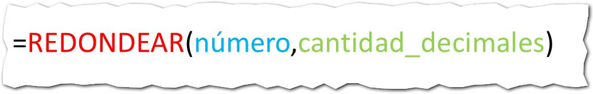

## ¿Qué hace la Función REDONDEAR?

La función REDONDEAR lo que hace es redondear una cantidad al número de decimales que le indiques como [argumento](http://raymundoycaza.com/que-son-los-argumentos-en-excel/ "¿ Qué son los argumentos en Excel ?").

## ¿Cómo se usa?

La función REDONDEAR utiliza dos [argumentos](http://raymundoycaza.com/que-son-los-argumentos-en-excel/ "¿ Qué son los argumentos en Excel ?"): El primero indica el número al cual vamos a redondear y el segundo indica el número de decimales que necesitamos.

La sintaxis de esta función es la siguiente:

## ¿Para qué me sirve?

Esta función te permite realizar un redondeo real en tus cálculos con Excel, lo que es especialmente útil cuando trabajas con presupuestos u otros tipos de formato que realice cálculos financieros, ya que puedes redondear a dos decimales, los que representan a los centavos.

Esta función te devuelve realmente el número redondeado y no se comporta como el formato de celdas que lo único que hace es mostrarte un número redondeado; pero en el fondo, el número nunca sufrió ningún cambio en su valor absoluto.
