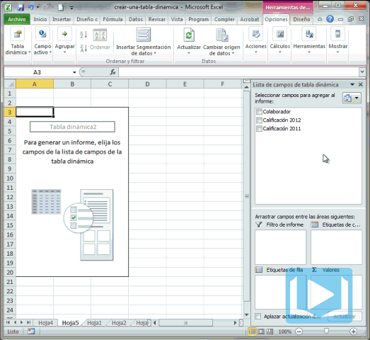

Ya conversamos sobre lo que son las [Tablas Dinámicas](http://raymundoycaza.com/las-tablas-dinamicas-que-son-y-para-que-sirven/?utm_source=como-crear-una-tabla-dinamica) en Excel y el asunto ha quedado más claro, ¿cierto? Ahora, para ir entrando en calor, sería bueno que crearas tu primera **Tabla Dinámica**.

¿Pero cómo? ¿Así nada más?

Pues tranquilo/a que vamos a verlo, como siempre, paso a paso :)

## Creando una Tabla Dinámica.

Para crear una Tabla Dinámica, primero debes tener creada tu hoja de datos. Esto quiere decir que debes tener un rango de celdas en el cual hayas tabulado los datos con los que necesitas trabajar.

### Seleccionando el Rango.

Una vez que ya tengas tus datos tabulados y debidamente organizados, vas a seleccionar todo el [rango de celdas](http://raymundoycaza.com/que-es-un-rango-en-excel/?utm_source=como-crear-una-tabla-dinamica) que conforma a tu tabla de datos (o simplemente seleccionas una celda dentro de la tabla) y te diriges a la pestaña 'Insertar'.

Entonces pinchas sobre el botón 'Tabla dinámica' que se encuentra a la izquierda y en el menú que te aparece, pincha sobre la opción 'Tabla dinámica', tal y como te muestro en la imagen.

### Eligiendo la ubicación.

Después del paso anterior, lo primero que verás será un cuadro de diálogo como el de la siguiente imagen:

El campo 'Tabla o rango', debería de estar ajustado ya al rango donde tienes tus datos. De no ser así, aquí puedes ajustarlo, usando el ratón para seleccionar el área o escribiendo directamente la [referencia](http://raymundoycaza.com/que-es-la-referencia/?utm_source=crear-una-tabla-dinamica).

En la segunda parte, debes elegir la ubicación de la Tabla Dinámica. Si quieres que ésta aparezca en una nueva hoja, no hagas nada; pero si quieres que aparezca en una hoja específica, debes pinchar en el botón de radio 'Hoja de cálculo existente' y elegir la ubicación en el cuadro de texto que está debajo. Este funciona igual que el anterior.

### Una tabla vacía.

Después de hacer todo esto, tendrás creada tu primera Tabla Dinámica. Pero, ¿qué es lo que veo? ¡No hay nada! ¡Está vacía!

Esto es porque hasta aquí, lo único que has hecho es cargar los datos "en memoria"; pero no le has dado forma a tu reporte. Ese es el siguiente paso.

### Construye tu reporte.

Lo único que tienes que hacer para empezar a darle forma a tu reporte, es arrastrar y soltar las diferentes columnas hacia la Tabla Dinámica que ahora está vacía.

## ¿Aún no creas tu Tabla Dinámica?

¿Pues a qué estás esperando? Pon en práctica esta lección y crea tu primera Tabla Dinámica paso a paso.

Esta semana seguiré publicando estas cápsulas informativas sobre la creación y manejo de tablas dinámicas, así que mantente pendiente de las actualizaciones. ¡Ah! y no olvides [suscribirte a la lista de correo](http://raymundo.me/suscribete), si quieres recibir consejos adicionales semana a semana.

¡Nos vemos!
