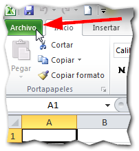
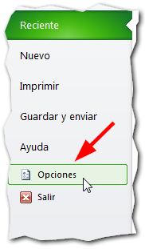
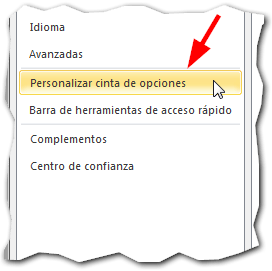
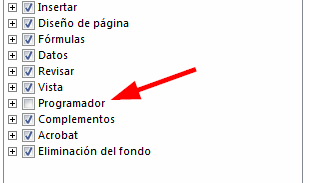
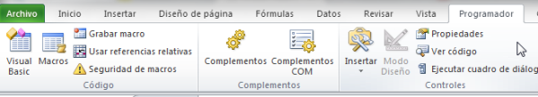

Si vas a comenzar a trabajar con las macros en Excel, necesitarás tener activa la ficha Programador en la cinta de opciones. En este vídeo te muestro cómo hacerlo en 30 segundos.

\[twitter style="vertical" source="RaymundoYcaza" hashtag="#Excel" float="left" lang="es" use\_post\_url="true"\] Esta ficha contiene varias herramientas que te permitirán trabajar con controles avanzados que necesitarás, si es que estás realizando planillas que requieren interactuar con el usuario, más allá de escribir datos en las celdas.

<iframe src="http://www.youtube.com/embed/VirANJa2ZeE" height="315" width="560" allowfullscreen frameborder="0"></iframe>

## Mostrar la Ficha Programador en Excel.

1. Pincha en la pestaña 'Archivo' que está al principio de la cinta de opciones (es la de color verde).  
2. En el panel lateral que aparece, pincha sobre el apartado 'Opciones'. 
3. Verás que se abre una ventana con varias opciones. En esta ventana, debes seleccionar la opción 'Personalizar cinta de opciones'. 
4. Verás otras opciones ahora. En el panel de la derecha podrás encontrar varias casillas de verificación. Debes activar la casilla 'Programador' para que aparezca la pestaña del mismo nombre en la cinta de opciones. 
5. Finalmente, pincha en el botón 'Aceptar' y ahora podrás ver la pestaña 'Programador' con las nuevas opciones que te serán necesarias en las próximas lecciones sobre macros. 

### La Ficha Programador y sus nuevas opciones.

Esta ficha te mostrará nuevas opciones para trabajar con formularios y complementos, que te ayudarán a crear aplicaciones con tus hojas de cálculo.

El grupo código muestra el botón 'Visual Basic' y al pincharlo, te permitirá acceder al editor de Visual Basic, para escribir tus programas directamente.

En este mismo grupo puedes ver el botón 'Grabar macro', el mismo que te permitirá grabar todas las acciones que realices en Excel, para luego repetirlas como si se tratara de un vídeo que reproduces una y otra vez.

### ¡Hazlo ya!

Practica los cinco pasos que te indiqué y activa la Ficha Programador en tu Excel para que puedas seguir con las prácticas en el curso de macros. Si tienes alguna duda, déjamela en los comentarios.

No te olvides de compartir esta entrada, usando los iconos de las redes sociales que están más abajo. Elige tu favorita.

¡Nos vemos!
