Marcar el valor **máximo y mínimo** en un gráfico de Excel, es muy útil para que las personas que ven tu presentación identifiquen rápidamente dónde están estos valores.

Por supuesto, hacerlo manualmente no supone ningún problema; sin embargo, cuando esto debes hacerlo todos los días o semana tras semana, al menos se vuelve tedioso.

Por eso hoy voy a mostrarte cómo hacer un gráfico en Excel que **resalte automáticamente** el valor máximo y el mínimo sin que tu tengas que preocuparte a diario de ubicar la posición del marcador. ¡Comencemos!

### El cuadro de ejemplo.

Usaré nuevamente el típico caso de una tabla que represente las ventas realizadas en el año pasado, desglosadas por mes.

[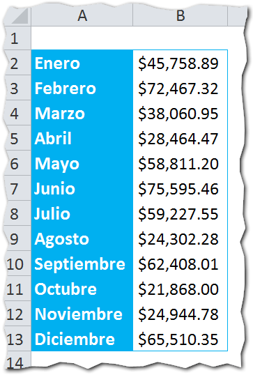](http://raymundoycaza.com/wp-content/uploads/maximo-y-minimo-000333.png)

Me interesa hacer un gráfico de columnas para comparar el resultado de todos los meses y lo que tengo actualmente, es lo siguiente:

[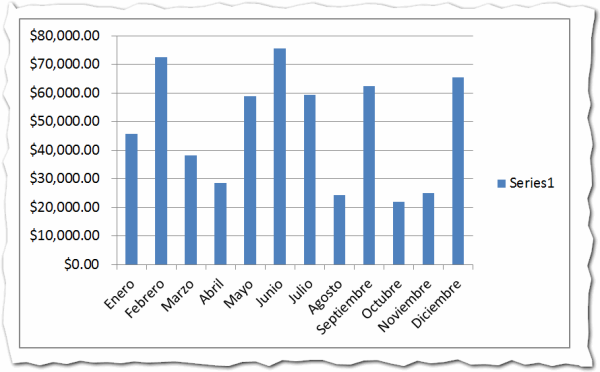](http://raymundoycaza.com/wp-content/uploads/maximo-y-minimo-000334.png)

El valor mínimo está en el mes de octubre; pero no es fácil ubicarlo ¿verdad?

¿Cómo podríamos hacer más evidente este hecho? ¡Exacto! Ubicando una marca que señale directamente dónde está el valor máximo y mínimo de nuestro gráfico.

### La forma de tus marcadores.

El siguiente paso, es elegir la forma que quieres para tus marcadores. Puede ser cualquiera que se te ocurra; pero recuerda que no solo debe ser "bonita" u original, también debe ser práctica para tu presentación.

En mi caso, he elegido la autoforma "Llamada de flecha hacia abajo" que puedes ver en la imagen siguiente:

[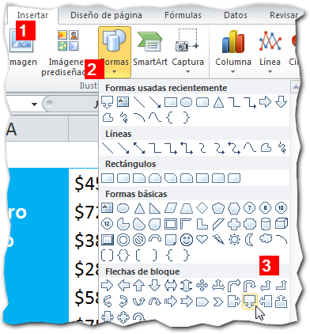](http://raymundoycaza.com/wp-content/uploads/maximo-y-minimo-000336.png)

Debes hacer dos autoformas: una para el máximo (que yo pinté de verde) y otra para el mínimo (que en mi caso pinté de rojo).

### Las columnas auxiliares.

Una vez que ya tengas decidido qué forma usarás para tus marcadores, pasarás a crear una columna auxiliar en la que usarás esta fórmula:

Lo que estás haciendo con esta fórmula es "diciéndole" a Excel que:

Si la celda B2 es igual al valor máximo del rango, entonces mostrar el valor máximo, sino, mostrar el valor '#N/A'.

_**No olvides**_

Anclar la referencia para que no se desplace al copiar la fórmula.

Lo que lograrás con esto, es una columna en la que se mostrará el valor máximo del rango, justo en la línea en que este se encuentra, así:

[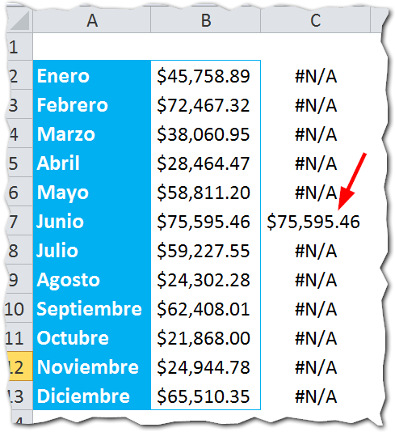](http://raymundoycaza.com/wp-content/uploads/maximo-y-minimo-000338.png)

Como ves, esto te permite encontrar rápidamente el mes en el que hay más ventas.

Ahora crearás otra columna auxiliar; pero esta vez para identificar el valor mínimo.

[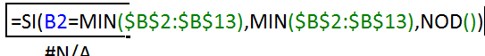](http://raymundoycaza.com/wp-content/uploads/maximo-y-minimo-000340.png)

[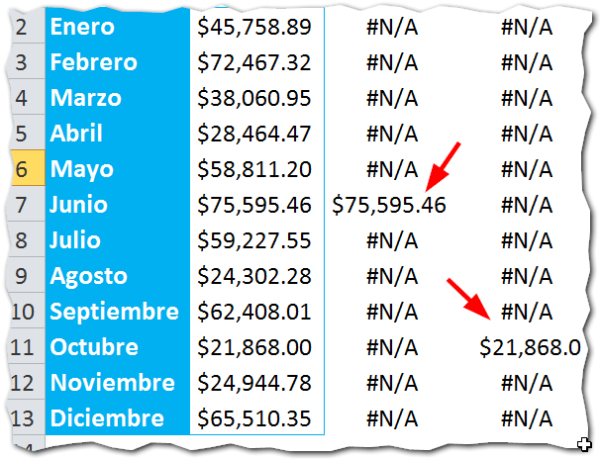](http://raymundoycaza.com/wp-content/uploads/maximo-y-minimo-000339.png)

 

### Dos celdas auxiliares.

 

Hasta ahí, debería de estar listo todo; pero siempre me preocupo por los detalles, así que vamos a usar dos celdas auxiliares que servirán para darle una etiqueta a nuestro marcador. Si no te interesa que tenga etiquetas, puedes saltarte esta parte.

Aquí escribirás sencillamente la fórmula MAX y MIN para mostrar el valor máximo y mínimo del mismo rango.

[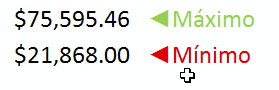](http://raymundoycaza.com/wp-content/uploads/maximo-y-minimo-000341.png)

Estas van a ser las etiquetas de nuestro marcador. Ahora la idea es que se muestren en nuestras formas recién creadas.

Esta parte es muy sencilla, solo debes pinchar sobre la forma de color verde y escribir en la barra de fórmulas la referencia a la celda en la que tienes tu valor máximo, así:

[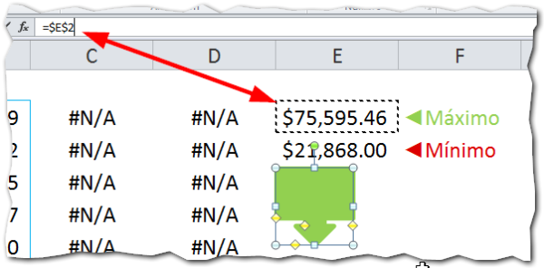](http://raymundoycaza.com/wp-content/uploads/maximo-y-minimo-000342.png)

Ahora, tus marcadores quedarán con su etiqueta y mostrarán el máximo y el mínimo, según corresponda:

[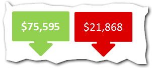](http://raymundoycaza.com/wp-content/uploads/maximo-y-minimo-000343.png)

### Insertando los marcadores.

¿Me sigues? Si no has olvidado ningún paso, hasta ahora todo debería ir bien. El siguiente paso es seleccionar el rango de las dos columnas auxiliares y lo copias.

Selecciona el gráfico y pega (CTRL + V) el rango que copiaste antes para que se agreguen las dos series de máximo y mínimo. Debería de quedarte lo siguiente:

[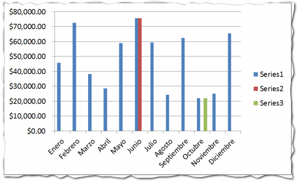](http://raymundoycaza.com/wp-content/uploads/maximo-y-minimo-000344.png)

Selecciona cada una de esas series nuevas (Series2 y Series3) y cámbiale el tipo de gráfico a líneas con puntos. Debería de quedarte así:

[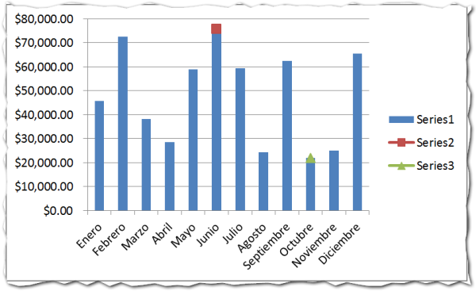](http://raymundoycaza.com/wp-content/uploads/maximo-y-minimo-000345.png)

El siguiente paso, es seleccionar la autoforma del máximo y copiarla. Ahora selecciona el punto de 'Series2' y pega (CTRL + V) la autoforma que copiaste anteriormente. Repite el paso con la segunda autoforma  y pégala en el punto de 'Series3'.

El resultado será el siguiente:

[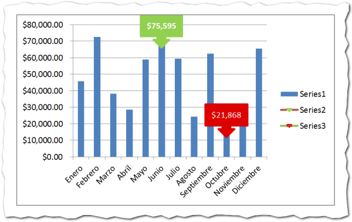](http://raymundoycaza.com/wp-content/uploads/maximo-y-minimo-000347.png)

Solo debes de esconder las series y darle unos retoques a tu gusto, según los colores que uses en tu reporte; pero el trabajo duro ya ha terminado.

### Actualiza los datos.

Ahora simplemente debes actualizar tus datos y los marcadores se ajustarán automáticamente en la posición adecuada y mostrarán el valor correspondiente en su etiqueta. ¡Increíble! ¿No te parece? :)

### Comienza tu presentación.

Con este consejo ya puedes darle un toque diferente a tus presentaciones y no te supondrá un esfuerzo extra cada vez que realices tu reporte. Solo asegúrate de seguir los pasos correctamente la primera vez y deja que la magia de Excel trabaje para ti.

¿Tienes alguna duda? ¿Te ha gustado el artículo? Sería muy importante para mí, que dejaras tus comentarios más abajo para seguir con esta conversación.

¡Nos vemos!

## ¿Quieres descargar el archivo terminado?

Sólo sigue las instrucciones y descárgalo (es gratis)

\[sociallocker id="5276"\][Pincha aquí y descarga el archivo](http://raymundoycaza.com/wp-content/uploads/maximo-y-minimo-en-graficos.xlsx "Descarga el archivo terminado") usado en este artículo.\[/sociallocker\]

\[aviso type="creditos"\]

_**¿Quieres saber más?**_

[No te pierdas el curso sobre gráficos en este blog.](http://raymundoycaza.com/aprende-a-crear-graficos-en-excel/)

\[/aviso\]
