La grabadora de macros es una gran aliada para aprender el funcionamiento de las macros y una buena forma de empezar con este tema.  

\[twitter style="vertical" source="RaymundoYcaza" hashtag="#Excel" float="left" lang="es" use\_post\_url="true"\] Ya has visto qué son las macros y para qué sirven. Al menos has tenido una introducción en la entrada ['Comencemos con las macros en Excel'](http://raymundoycaza.com/macros-en-excel/). Hoy quiero mostrarte **cómo grabar macros** para que tengas tu primera experiencia con esta herramienta.

¿Y cómo es que funciona esto? Te has de preguntar. Pues bien, imagina que tienes una grabadora de sonido, presionas el botón grabar (o llamado REC) y la grabadora comienza a grabar todos los sonidos que hayan en el ambiente, ¿correcto?

Pues exactamente igual se comporta la grabadora de macros, solo que en lugar de grabarlos sonidos, graba lo que hagas en pantalla.

Esta es la idea básica, para que quede más claro, vamos a usar un ejemplo y lo aprenderemos paso a paso.

## Cómo grabar macros en Excel.

La grabadora de macros, puedes encontrarla en la pestaña 'Vista', dentro del grupo 'Macros'.

[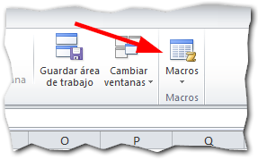](http://raymundoycaza.com/wp-content/uploads/como-grabar-macros-000348.png)

También puedes encontrarla en la pestaña 'Programador' con muchas más opciones que están dedicadas exclusivamente al desarrollo de aplicaciones en Excel. Si no tienes esta pestaña y quieres activarla en Excel 2010, [aquí te muestro cómo hacerlo](http://raymundoycaza.com/ficha-programador/).

### El ejemplo.

Imagina que tienes unos datos que te descargas diariamente de algún sistema dentro de tu empresa. Estos datos bajan sin formato y tú tienes que hacer, todos los días, lo siguiente:

- Pintar los encabezados de amarillo.

- Poner los encabezados en negrita.

- Pintar los bordes de todas las celdas para crear una tabla o rejilla.

Imagina que esto debes hacerlo en 20 o 30 archivos similares todos los días. ¡Qué tedioso! ¿No lo crees?

Pues ahora vamos a grabar esos pasos con la grabadora de macros, para no tener que repetirlos una y otra vez. ¡Comencemos!

### Comenzar la grabación.

Para comenzar con la grabación, solo debes de pinchar en el botón macros (recuerda que se encuentra en la pestaña 'Vista', sección 'Macros') y en el menú que aparece, pincha en 'Grabar macro...'.

[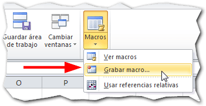](http://raymundoycaza.com/wp-content/uploads/como-grabar-macros-000349.png)

Aparecerá una ventana como la de la imagen siguiente. Aquí debes ponerle un nombre a tu macro, yo le pondré 'FormatearReporte'.

[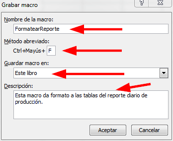](http://raymundoycaza.com/wp-content/uploads/como-grabar-macros-000350.png)

En la sección 'Método abreviado' puedes elegir una letra como atajo de teclado (si no quieres, no lo hagas. No es obligatorio), para el ejemplo, yo usaré la 'F' de formato, y lo pondré usando la tecla 'Mayúsculas'. Recuerda que no puedes usar un atajo de teclado que ya esté asignado.

En la sección 'Guardar macro en', debes elegir 'Este libro' para que la macro se guarde en el mismo libro en el que estás trabajando.

En la sección 'Descripción', debes escribir un texto que te ayude a reconocer la funcionalidad de esta macro, algo que explique para qué sirve. Es buena idea hacerlo, porque cuando tengas muchas macros, va a ser más complicado saber qué hace cada una.

Ya que has terminado de llenar todos los campos, presiona en el botón 'Aceptar'. La macro ha comenzado a grabar todas tus acciones.

### Realizar los pasos con cuidado.

Ahora que Excel está grabando, debes cuidarte de no hacer ninguna acción innecesaria, por eso es buena idea que tengas muy claro lo que vas a hacer desde antes de comenzar a grabar.

Debes realizar los pasos en orden, con calma y siempre la menor cantidad de pasos posible.

En nuestro caso imaginario, los reportes son similares. Todos tienen ocho columnas. La primera columna es la del código y las otras siete son el reporte de unidades producidas de cada producto.

Teniendo en claro esto, los pasos que daremos son los siguientes:

Selecciona las ocho columnas.

[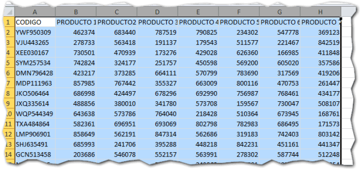](http://raymundoycaza.com/wp-content/uploads/como-grabar-macros-000351.png)

Haz un doble clic entre la unión de dos columnas para que se ajusten automáticamente.

[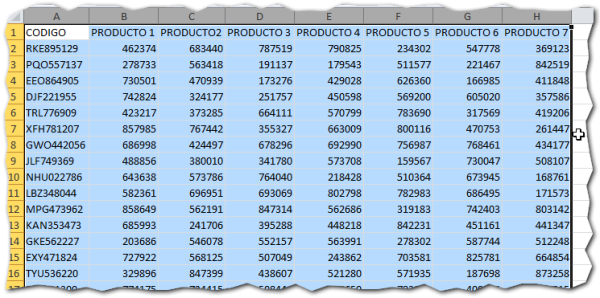](http://raymundoycaza.com/wp-content/uploads/como-grabar-macros-000352.png)

Presiona CTRL + 1 y dibuja los bordes de las celdas.

[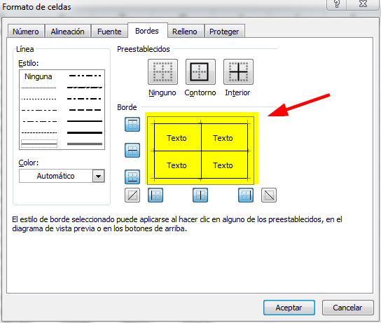](http://raymundoycaza.com/wp-content/uploads/como-grabar-macros-000353.png)

Ahora selecciona los encabezados y píntalos de amarillo. También ponlos en negrita.

[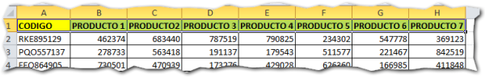](http://raymundoycaza.com/wp-content/uploads/como-grabar-macros-000354.png)

### Detener la grabación.

¡No haremos más! Creo que has captado muy bien la idea hasta ahora.

El siguiente paso es detener la grabación para evitar que se grabe alguna acción que no nos interesa, así que para hacerlo, debes volver a pinchar en el botón 'Macros' de la pestaña 'Vista' y selecciona la opción 'Detener grabación'.

[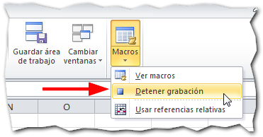](http://raymundoycaza.com/wp-content/uploads/como-grabar-macros-000355.png)

### Ejecutar la macro.

¡Ya está listo! Ahora puedes pinchar en el mismo botón 'Macros' y esta vez seleccionarás la opción 'Ver macros'.

En la ventana que aparece, verás el nombre de la macro que acabas de crear.

[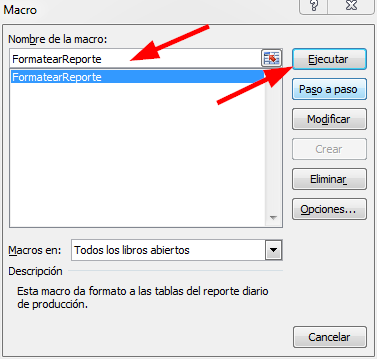](http://raymundoycaza.com/wp-content/uploads/como-grabar-macros-000356.png)

Si quieres poner en acción a tu macro, bastará con que presiones en el botón 'Ejecutar', una vez hayas seleccionado el nombre de tu macro.

Es posible que aparezcan otras macros listadas, ya sea porque tú has grabado algunas macros o porque otras personas grabaron macros en otros libros que tengas abierto.

Si ese fuera el caso, en la sección 'Macros en:', selecciona la opción 'Este libro'. Así solo te aparecerán las macros grabadas en el libro actual, que en este caso, solo es una.

[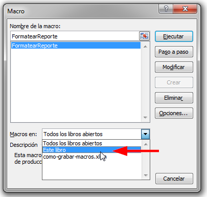](http://raymundoycaza.com/wp-content/uploads/como-grabar-macros-000357.png)

Una vez que has pinchado el botón 'Ejecutar', se ejecutará tu macro, repitiendo exactamente los mismos pasos que hiciste durante su grabación. ¡Alucinante! ¿No te parece?

¡Ah! Y como un adicional, te mostraré que puedes ejecutar tu macro aún más rápido. ¿Recuerdas que escribimos un atajo de teclado? Pues bien, si presionas las teclas CTRL + SHIFT + F, tu macro se ejecutará sin tener que usar el menú 'Macro'.

¡Eso es productividad!

### ¿Y cómo veo el código generado?

La forma de ir directamente a ver el código que se ha generado con tu macro recién grabada, es seleccionando la macro en la misma ventana que te mostré anteriormente y pincha en el botón 'Modificar' en lugar del botón 'Ejecutar'.

Esto te llevará directamente al módulo en el que se grabó tu macro y localiza directamente la porción de código que la forma. Así podrás observar la sintaxis utilizada, de manera que podrás aprender cómo se realiza cada cosa. ¡Excel puede hacer la tarea de profesor!

[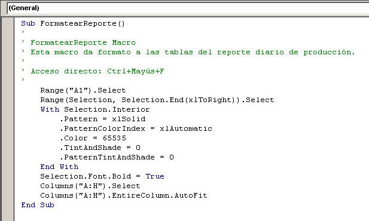](http://raymundoycaza.com/wp-content/uploads/como-grabar-macros.png)

\[highlight\]Gracias a @Carles por su comentario por el cual me di cuenta que esta parte no estaba muy clara.\[/highlight\]

### ¡Disfruta de la automatización!

Ahora ya has realizado tu primera macro y sin saber nada de programación. Esto es una gran ventaja, ¿tú qué opinas?

Anímate y pon a volar tu imaginación. Crea tus propias macros para que te ahorren tiempo en la oficina y lleves tu productividad al siguiente nivel.

\[aviso type="advertencia"\]

_**ADVERTENCIA**_

Todo lo que sea realizado con macros, no puede deshacerse con CTRL + Z. De manera que debes tomar tus precauciones.

Siempre que trabajes con macros sobre algún archivo de tu trabajo, crea una copia de seguridad del mismo. Así te evitarás sorpresas desagradables durante las pruebas.

\[/aviso\]

## Descarga el arhivo terminado.

\[ilink url="http://raymundoycaza.com/wp-content/uploads/como-grabar-macros.xlsm" style="download"\]Pincha aquí\[/ilink\]  para descargar el archivo usado en este ejemplo.

## ¿Qué opinas de tu primera experiencia con las macros?

Si te ha resultado interesante, o alguna cosa no te ha quedado del todo clara, te invito a que me dejes tus impresiones en los comentarios. Esta conversación no sería lo mismo sin ti :)

Anímate y pon en práctica lo aprendido, pronto iré colocando ejemplos más complejos sobre macros y es mejor que estés preparado.

¡Nos vemos!

\[aviso type="creditos"\]

_**¿Quieres saber más?**_

[La grabadora de Macros - Microsoft.](http://office.microsoft.com/es-es/word-help/escribir-o-grabar-una-macro-HA010099769.aspx#BM2)

\[/aviso\]
