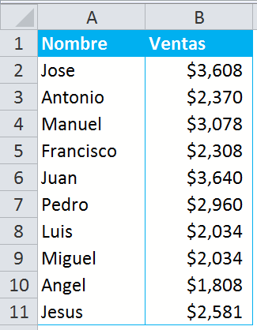
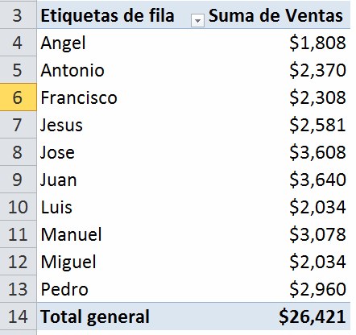
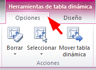
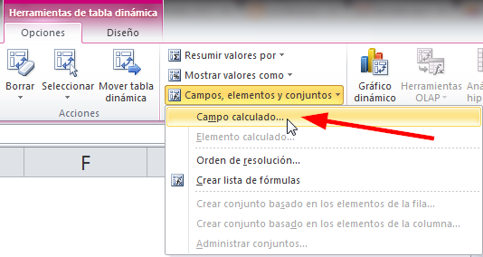
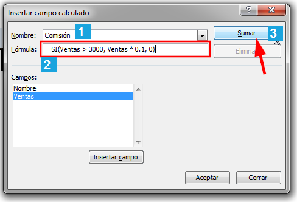
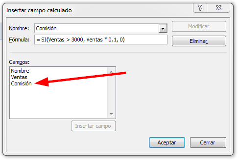
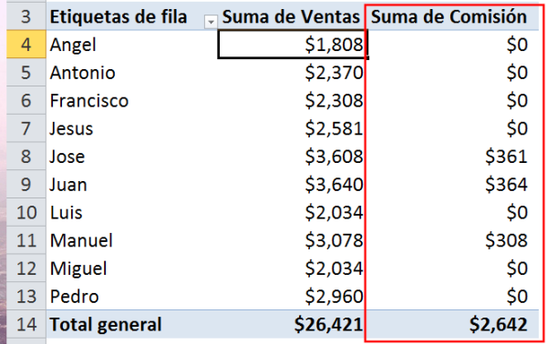

Por lo general, las consultas que recibo sobre Excel apuntan más a temas relacionados con nómina, horarios de trabajo y cartera de cobro en los que las tablas dinámicas casi siempre hacen su aparición.

Por eso, creo que este consejo puede servirte de mucho si lo aplicas en esa hoja de Excel que usas a diario en tu trabajo.

### ¿Calcular una comisión para cada vendedor, directamente en las tablas dinámicas?

Sí, se puede.

De hecho ese es el ejemplo que voy a usar para mostrarte cómo se puede agregar una columna adicional en la tabla dinámica, **sin tener que modificar tu base de datos original**.

Imagina que tienes una base de datos en la que tengas estas dos columnas. Te interesa hacer un reporte por vendedor con su respectivo monto de ventas.

Si sigues los [pasos para crear una tabla dinámica](http://raymundoycaza.com/tablas-dinamicas/) tendrás como resultado algo parecido a esto:

Pero, necesitas asignar una comisión del 10% a aquellos que lograron un total de ventas mayor a $3,000

¿Cómo calculamos eso en las tablas dinámicas?

1. Pincha en cualquier celda dentro de tu tabla dinámica.
2. Pincha en la pestaña 'Opciones'. 
3. Ahora pincha en el botón 'Campos, elementos y conjuntos'. Luego selecciona la opción 'Campo calculado...' como te muestro en la imagen: 
4. Aparecerá un cuadro de diálogo como el de la siguiente imagen, en el que debes hacer lo siguiente:
    
    \- Escribe el nombre de la nueva columna (1) en mi caso, se llamará 'Comisión'
    
    \- Escribe la fórmula que se usará para calcular la nueva columna (2). Yo he usado la fórmula = SI(Ventas > 3000, Ventas \* 0.1, 0)
    
    \- Pincha sobre el botón 'Sumar' (3)
    
    
5. Verás que la nueva columna se agregó a la lista de campos disponibles: 
    
    Solo debes pinchar sobre el botón 'Aceptar y verás una nueva columna en tu tabla dinámica.
    

## ¿Te ha resultado útil?

Espero que sí.

¿Qué opinas de esta característica de las tablas dinámicas?

Muchas personas no la conocen; pero en verdad es algo que te ayudará mucho en tus reportes, sobre todo, porque te permite 'inventarte' columnas sin tener que modificar tu base de datos o tener que copiarla en otra hoja 'temporal' para hacer los cambios.

¿Y tú, ya hiciste tu primer campo calculado?

¡Nos vemos!
