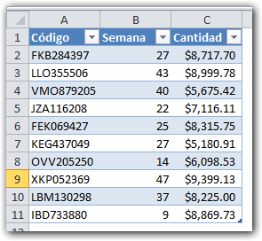
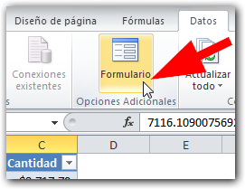
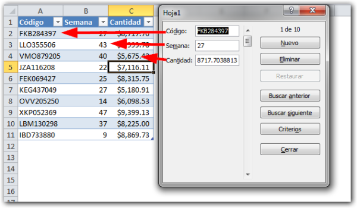

Para continuar con el curso sobre [cómo usar las Tablas en Excel](http://raymundoycaza.com/las-tablas-en-excel/), hoy quiero mostrarte una forma alterna para editar una tabla ya creada, voy a mostrarte **cómo crear formularios en Excel 2010,** para que puedas editar tus tablas de una forma diferente y un poco más ordenada.

¡Comencemos!

## El cómo crear formularios en Excel 2010: Tan solo un botón.

Antes de poder trabajar con formularios sobre tus tablas de Excel, debes de activar un botón que, por defecto, no aparece en la cinta de opciones.

En este vídeo te muestro cómo activarlo para que podamos continuar con el tema.

<iframe src="http://www.youtube.com/embed/ZxaB2aQSyJE" height="315" width="560" allowfullscreen frameborder="0"></iframe>

### La Tabla de datos.

Crearás tu tabla de datos, [tal y como te he mostrado anteriormente](http://raymundoycaza.com/crear-tablas-en-excel-paso-a-paso/). Una vez lista tu tabla, podrás elegir entre editarla directamente o hacerlo a través del formulario.

### Editando con el formulario.

Para editar tu tabla usando un formulario, simplemente debes colocarte sobre dicha tabla y luego pinchas en el botón 'Formulario' que debes tener en la cinta de opciones, si seguiste [los pasos indicados en el vídeo](http://www.youtube.com/watch?v=ZxaB2aQSyJE).

Una vez has pinchado en el botón, aparecerá un formulario que automáticamente mostrará todos los campos necesarios, uno por cada columna de tu tabla de datos, como se muestra en la siguiente imagen:

Todos los cambios que realices en este formulario, se verán reflejados en tu tabla de datos original, de manera que sería como si estuvieras usando una aplicación común y silvestre (al menos en su aspecto).

Puedes navegar entre los registros, filtrar tus datos, crear o eliminar un registro existente, etc.

Nota que en la barra de título del formulario, se muestra el nombre de la hoja en la que está la tabla de datos que estás editando.

### Ventajas de usar un formulario.

Las ventajas de un formulario son 'visibles' dependiendo de tus necesidades. Normalmente es más cómodo editar una tabla usando un formulario de estos, si se trata de una tabla extensa ya sea en columnas, en filas o en ambas.

Otra ventaja que le veo al formulario, es que las columnas que tienen fórmulas no pueden ser editadas desde aquí.

Lo llamo ventaja, porque la idea original de las fórmulas es que no se cambien constantemente y, dado que sus cálculos normalmente son cosa sensible en tus datos, es importante poder tener la seguridad de que no se darán cambios involuntarios en este tipo de columnas.

## Comienza a crear tus propios formularios.

Si tienes una tabla compleja o estás aburrido/a de ingresar los datos de la misma forma, prueba el usar formularios para manipular tus datos. Tal vez encuentres que esta forma es más eficiente para ti.

Ahora te tengo una pregunta: ¿Qué método te gusta más para editar tablas en Excel: editando directamente la tabla o usando formularios?

Espero tu respuesta en los comentarios.

¡Nos vemos!
