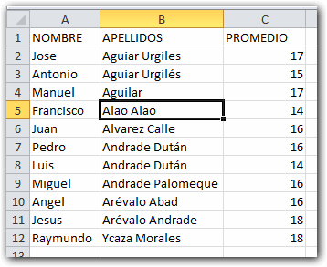
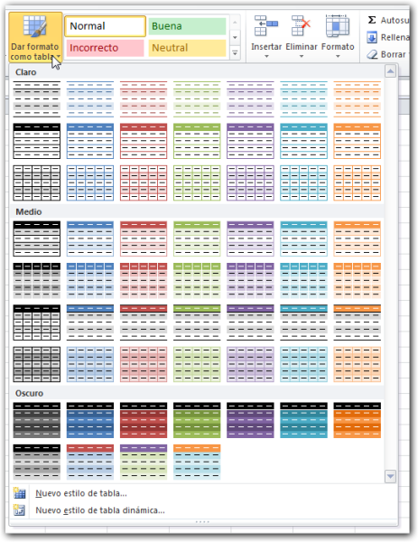
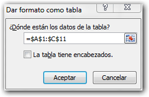
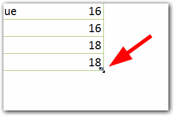
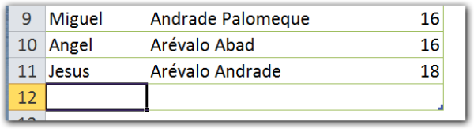
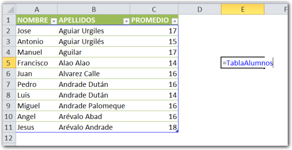
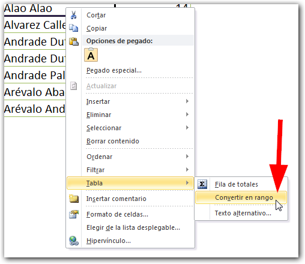
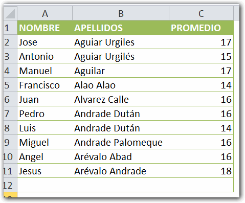

En este vídeo te muestro cómo crear tus **Tablas en Excel**. Esta es solo una forma de hacerlo. Existen otros métodos; pero los principios son los mismos. Más abajo encontrarás la transcripción del vídeo para que tengas la alternativa de leerlo.

<iframe src="http://www.youtube.com/embed/_cQn3vVtf3Q" height="315" width="560" allowfullscreen frameborder="0"></iframe>

Ya hemos conversado sobre las [tablas en Excel y sus ventajas](http://raymundoycaza.com/crear-tablas-en-excel-paso-a-paso/), respecto de trabajar con rangos normales.

Si te interesa crear una tabla para facilitar la manipulación de tus datos, debes seleccionar una celda de tu rango.

Recuerda que debes tener estructurado tu rango como una tabla, es decir, los datos deben estar dispuestos como filas y columnas, sin que existan filas o columnas vacías.

Dentro de la pestaña inicio, buscas la sección 'Estilos'. Pinchas en el botón 'Dar formato como tabla'.

Y se desplegará un menú con varias opciones de estilos para tu tabla.

Todas estas opciones convertirán tu rango en una tabla. Lo único que cambia es el diseño que se utilizará, al momento de darle formato (colores, bandas, encabezados, etc.)

Como puedes ver, Excel tiene clasificados los estilos en tres grupos: Claro, Medio y Oscuro.

Tu elegirás la opción, dependiendo del diseño que se acomode mejor a tus necesidades. Yo generalmente  elijo uno de los estilos del grupo 'Claro'.

En esta ocasión, utilizaré el color verde llamado 'Estilo de tabla claro 11'. Al seleccionarlo, me aparece un cuadro de diálogo llamado 'Dar formato como tabla'.

En este cuadro, automáticamente se ha asignado el rango **A1:C11**, porque lo ha detectado a partir de la celda que seleccioné anteriormente, \[highlight\]por eso es importante que no existan filas o columnas vacías en tu rango si vas a crear la tabla de esta forma\[/highlight\].

### Los encabezados.

También me pregunta si la tabla tiene encabezados. Como mi tabla sí tiene encabezados, es decir, los títulos de las columnas, entonces yo le dejo marcada esta opción.

Si mi tabla no tuviera encabezados, le desmarcaría esta opción y Excel asignaría los encabezados por mí, insertando una fila en la parte superior.

Presiono el botón aceptar y Excel crea la tabla en base al rango especificado.

### Ampliar el rango de la tabla.

Fíjate en un pequeño detalle: en la esquina inferior derecha, hay una flecha o marca. Si colocas el cursor sobre esta marca, este se convierte en una flecha doble.

Pincha sobre la marca y arrastra hacia abajo, verás que el rango de tu tabla se extiende hasta donde tú quieras llevarlo.

Sin embargo, la tabla es capaz de extender automáticamente su rango en cada nuevo registro que ingreses. Si te colocas sobre la última columna y presionas la tecla TAB, inmediatamente la celda activa pasará a la primera columna del siguiente registro.

Aquí  yo escribo nuevamente el nombre, los apellidos y un promedio. Si yo presiono nuevamente la tecla TAB, Excel me deja la tabla lista para ingresar un nuevo registro.

Como ves, no debes preocuparte de estar ajustando la tabla ni de estar copiando el formato hacia abajo 100 y 200 filas. Excel se encarga de esos detalles.

### Todas las Tablas en Excel tienen un nombre.

Este rango que has convertido en tabla, también tiene un nombre que ha sido asignado por Excel.

¿Cómo podemos averiguar este nombre?

Solo dirígete a la ficha contextual 'Diseño'.

\[aviso type="recuerda"\]

**Recuerda:**

Las fichas contextuales solo aparecen cuando tienes seleccionado el objeto de interés.

Si tienes seleccionada una celda en blanco, no verás la ficha 'Diseño'. Si tienes seleccionada una celda de tu tabla, entonces la podrás ver.

\[/aviso\]

Aquí puedes cambiar este nombre por uno más descriptivo, por ejemplo 'TablaAlumnos'.Una vez seleccionada la ficha 'Diseño', y en el grupo 'Propiedades' revisas el atributo 'Nombre de Tabla', el cual te indica que el nombre actual es 'Tabla1'.

\[aviso type="informacion"\]

**Ten en cuenta que:**

Los nombres de las tablas no pueden llevar espacios y siempre deben comenzar con una letra o un guión bajo '\_'.

\[/aviso\]

### Usando el nombre de tu tabla.

Puedes comprobar que el nombre ha cambiado si te colocas sobre cualquier celda en blanco y escribes el signo igual '=', seguido del nuevo nombre de tu tabla ('TablaAlumnos').

Este nombre puedes usarlo desde cualquier fórmula para referirte a esta tabla como un rango dinámico, es decir, un rango que se ajustará automáticamente cada vez que agregues o elimines datos, sin tener que preocuparte de ajustarlo.

Esta es una de las principales ventajas de trabajar con tablas en Excel 2010.

### ¿Y cómo elimino una tabla?

Si por alguna razón tú quisieras regresar de esta tabla a un rango normal, como estaba al principio, simplemente seleccionas cualquier celda dentro de tu tabla y haces un clic derecho.

En el menú contextual que aparece, selecciona la opción 'Tabla' y seleccionas 'Convertir en rango'.

Excel te preguntará si quieres convertir tu tabla a un rango normal, le respondes que sí y tu tabla habrá desaparecido. Ahora es un rango normal, aunque ha conservado el formato como puedes ver.

Esto es una ventaja, ya que te ahorra el trabajo de darle formato a tu rango; pero si aún así quieres eliminar el formato y dejarlo tal cual estaba al principio, debes realizar lo siguiente:

1.   Selecciona todo el rango.

2.   Dirígete a la ficha 'Inicio'.

3.   Busca el grupo 'Modificar', al final de la cinta.

4.   Pincha sobre el botón 'Borrar'.

5.   Selecciona la opción 'Borrar formatos'.

Entonces tu rango habrá regresado a su estado inicial, para que trabajes con él de acuerdo a lo que necesites.

### Esto ha sido todo por hoy.

Si tienes alguna pregunta adicional o algo no ha quedado claro, te invito a que dejes tu comentario y trataré de responderte tan pronto como me sea posible.

Recuerda que puedes acceder a todas las lecciones del curso 'Aprendiendo a usar las Tablas' si pinchas en la opción que encontrarás más abajo.

¡Nos vemos!

\[aviso type="creditos"\]

_**Ver el vídeo en Youtube**_

      _[http://www.youtube.com/watch?v=\_cQn3vVtf3Q](http://www.youtube.com/watch?v=_cQn3vVtf3Q)_

_**Ver todas las lecciones sobre Tablas en Excel.**_

          _[Aprendiendo a usar las Tablas.](http://raymundoycaza.com/las-tablas-en-excel/)_

\[/aviso\]
