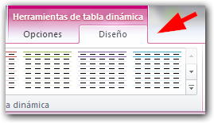
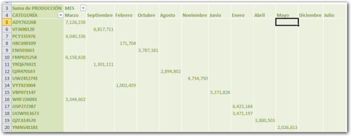
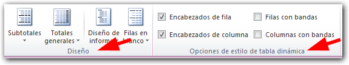
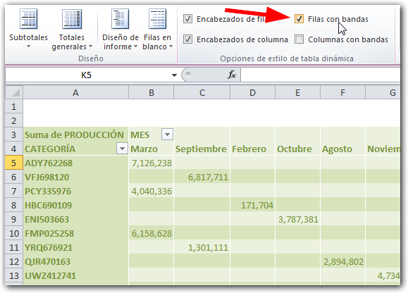
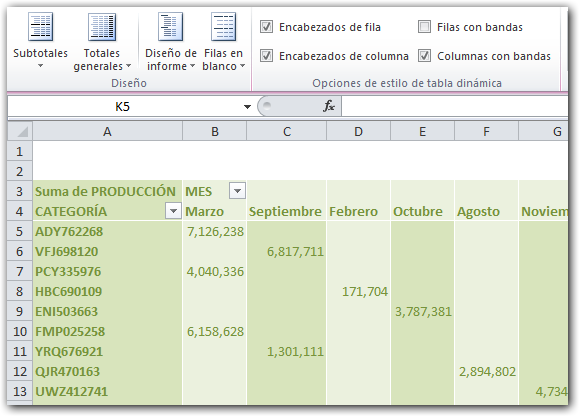
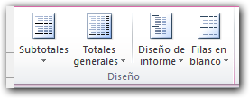
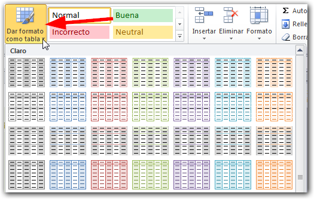

En este vídeo, te muestro en menos de cinco minutos cómo aplicarle un formato a tu **Tabla Dinámica** en un par de clics de ratón. ¡Comencemos!

<iframe src="http://www.youtube.com/embed/77sUp32Agug" height="315" width="560" allowfullscreen frameborder="0"></iframe>

Una vez [creada tu tabla dinámica](http://raymundoycaza.com/crear-una-tabla-dinamica/), Excel te permite aplicarle un formato de manera similar a la que ya usamos con las [Tablas de Datos](http://raymundoycaza.com/crear-tablas-en-excel-y-eliminarlas/).

Para esto, simplemente debes seleccionar tu tabla dinámica y dirigirte a la ficha contextual 'Diseño'.

 

**\[aviso type="recuerda"\]**

**Recuerda:**

que las fichas contextuales, aparecen únicamente cuando tienes seleccionado el objeto de interés. En este caso, tu tabla dinámica.

\[/aviso\]

Una vez en la ficha diseño, dentro de la sección 'Estilos de tabla dinámica', pincha en el botón 'Más'.

Aparecerá un menú en el que se listan todos los estilos disponibles para aplicar en tu tabla dinámica. Tú debes elegir el que más se adapte al diseño de tu reporte.

Tal como vimos en la creación de Tablas de Datos, los estilos se clasifican en: Claro, Medio y Oscuro.

Dependiendo del diseño de tu reporte, tú elegirás uno u otro. Generalmente yo utilizo los tonos medios para las tablas dinámicas, ya que se adaptan al estilo de reportes que hago normalmente.

Selecciono mi estilo favorito y mi tabla ya quedó formateada con su nuevo color, de forma rápida y sencilla.

### Otras opciones.

Ahora bien, habrás notado que dentro de la ficha diseño hay otras dos secciones de las que aún no te he hablado.

Estas secciones también afectan al diseño de la tabla dinámica, ya que te permiten restringir las secciones de tu tabla a la que se le aplicará el formato elegido.

Por ejemplo, podrías necesitar que los encabezados de columna no sean considerados en el formato. O los encabezados de fila.

También podrías requerir que el estilo actual muestre las filas 'bandas'. Esto quiere decir que se mostrarán las filas alternando entre dos colores, tal y como te muestro aquí.

El mismo efecto se puede conseguir con las columnas, tal y como puedes ver.

En la sección 'Diseño', tienes cuatro botones que te permitirán modificar la disposición de algunos elementos en el diseño de tu tabla dinámica.

1. **En el botón 'Subtotales'**, puedes elegir entre no mostrar subtotales o mostrarlos en la parte superior o inferior.
2. **El botón 'Totales'**, te permite activar o desactivar los totales en tu tabla dinámica, e inclusive puedes elegir si los activas solo para las filas o solo para las columnas.
3. **Con el botón 'Diseño de informe'**, puedes realizar otros juegos con la disposición del diseño de tu tabla.
4. **El botón 'Filas en blanco'** te permite elegir si se muestran filas en blanco, después de cada elemento.

Aquí debes probar si estas opciones se adaptan a lo que necesitas lograr con tu diseño de tabla dinámica, aunque de momento estos dos últimos botones no los vas a necesitar mucho.

### Otra forma de hacerlo.

Ahora, déjame contarte que existe otra forma de darle formato a nuestra Tabla Dinámica. Esta consiste en seleccionar la tabla y, en la ficha 'Inicio', pincha sobre el botón 'Dar formato como tabla'.

Verás que aparece un menú similar al que vimos hace un momento.

A partir de aquí, el proceso es el mismo, ya que puedes elegir entre los diferentes estilos disponibles en el menú, de acuerdo a tu necesidad.

¿Y qué hay de ti?

¿Ya estás practicando esta técnica con tu Tabla Dinámica?

¡Nos vemos!

\[aviso type="creditos"\]

**¿Quieres saber más?**

C[urso gratuito de Tablas Dinámicas.](http://raymundoycaza.com/tablas-dinamicas/ "Tablas Dinámicas en Excel.")

[Ver este vídeo en Youtube.](http://www.youtube.com/watch?v=77sUp32Agug "Ver en Youtube")

\[/aviso\]
