Hoy voy a mostrarte cómo escribir tu primera **Macro en Excel**.

Ya vimos [lo que son las macros](http://raymundoycaza.com/macros-en-excel/), para que sirven y ya tienes una idea sobre cuál es la utilidad que le podríamos dar.

También hemos conversado sobre la manera en que puedes crear una macro utilizando [la herramienta de grabación](http://raymundoycaza.com/como-grabar-macros/) disponible en Excel.

Lo que haremos hoy tú y yo, será crear una macro escribiendo directamente el código VBA en el Editor de Visual Basic.

<iframe src="http://www.youtube.com/embed/Q4JJhDKCr_o" height="315" width="560" allowfullscreen frameborder="0"></iframe>

Recuerda que VBA es el acrónimo de **Visual Basic For Aplications** (o Visual Basic para Aplicaciones)  y se trata de un lenguaje de programación que utilizaremos para poder expresarle a Excel las instrucciones que queremos que ejecute.

### El ejemplo: Una sencilla macro en Excel.

Hoy voy a mostrarte un ejemplo sencillo, por lo tanto no voy a entrar en mucho detalle sobre la sintaxis, ya que la idea es darte un primer acercamiento al editor de Visual Basic.

El ejemplo que utilizaré será el de una macro que muestre un valor en una celda determinada de la primera hoja de mi libro.

Antes de empezar, voy a decidir en qué celda quiero que aparezca el valor generado por mi macro. En la hoja 1 de mi libro, elegiré la celda B2 para la prueba y la dejaré resaltada en color amarillo para que no se pierda de vista.

### El editor de Visual Basic.

Para poder escribir el código de tu macro, primero tienes que acceder a la ventana del Editor de Visual Basic. Esto se puede hacer de dos formas:

- **La primera** es accediendo a la ficha 'Programador' (recuerda que si no tienes esta ficha, puedes ver aquí cómo activarla). Una vez aquí, debes buscar la sección 'Código' que está al principio de la cinta. En esta sección, pincha sobre el botón 'Visual Basic'. 
- **La segunda forma** es presionando el atajo de teclado ALT + F11

Una vez realizado cualquiera de estos dos pasos, aparecerá la ventana del editor de Visual Basic en la que ya puedes comenzar a trabajar.

Lo primero que verás será una ventana con una gran área gris y a la izquierda verás dos paneles:

[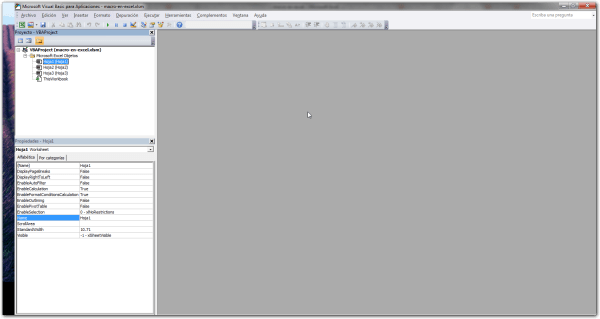](http://raymundoycaza.com/wp-content/uploads/macro-en-ecel-000400.png)

### El panel 'Proyecto'

En este panel se muestran todos los proyectos abiertos al momento. En mi caso, como solo tengo un proyecto abierto, se muestra únicamente el proyecto 'Libro1'.

[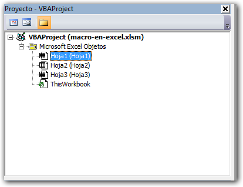](http://raymundoycaza.com/wp-content/uploads/macro-en-ecel-000401.png)

Cada proyecto representa a un libro de Excel y agrupa varios objetos. Los dos objetos que siempre estarán presentes son el libro que se representa con el nombre 'ThisWorkbook'  y la hoja cuyo nombre aparece entre paréntesis. En mi caso tengo tres hojas de trabajo representadas por los nombres 'Hoja1', 'Hoja2' y 'Hoja3'.

### El panel 'Propiedades'

Este panel muestra las propiedades del objeto seleccionado.  Como ves, si yo cambio el objeto seleccionado, cambian las propiedades ya que un libro y una hoja tienen características distintas.

[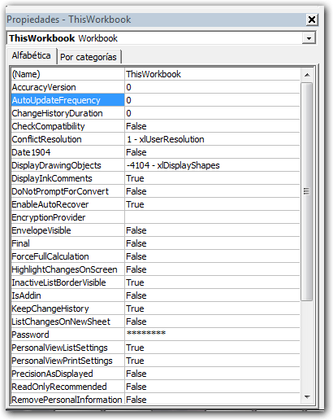](http://raymundoycaza.com/wp-content/uploads/macro-en-ecel-000402.png)

### Escribiendo el código

Para poder comenzar a escribir el código, debes elegir un objeto en el cual incrustarás tu macro. Para el ejemplo elegiré el objeto 'Hoja1' y haré un doble clic sobre él.

Aparece a la derecha un área en blanco en la que debes escribir el código de tu macro.

[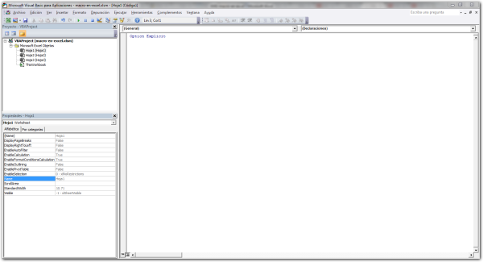](http://raymundoycaza.com/wp-content/uploads/macro-en-ecel-000403.png)

Aquí vas a escribir la palabra 'Sub' que sería algo así como la abreviatura de la palabra Sub-rutina o Sub-proceso.

[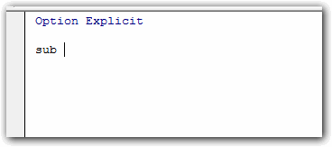](http://raymundoycaza.com/wp-content/uploads/macro-en-ecel-000404.png)

A continuación de la palabra 'Sub' vas a escribir el nombre de la sub-rutina. Esta no debe de tener espacios y debe comenzar por una letra.

En mi caso le pondré el nombre 'MiMacro'.

[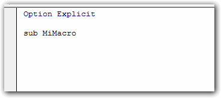](http://raymundoycaza.com/wp-content/uploads/macro-en-ecel-000405.png)

Si presionas la tecla 'Enter' el compilador le pondrá automáticamente los paréntesis (esto es obligatorio) y al final pondrá el texto 'End Sub'.

[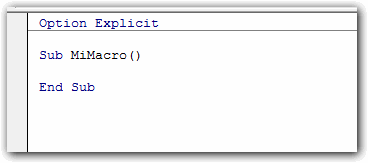](http://raymundoycaza.com/wp-content/uploads/macro-en-ecel-000406.png)

Esto le sirve al compilador para delimitar el alcance del código de mi macro y saber donde comienza y dónde termina este. Es decir, que tienes que escribir tu código entre estas dos líneas que acabas de crear.

Ahora bien, la tarea que nos propusimos era la de mostrar un texto en la celda B2 ¿recuerdas?

Para hacer esto, vas a escribir el siguiente código:

_**\[aviso type="codigo"\]**_

_**Código VBA**_

Range("B2").Value = "Mi primera macro."

\[/aviso\]

### Explicación del código

Con este código que acabo de escribir, le estoy indicando a Excel que el valor (Value) del rango B2 (range("B2")) debe ser el texto entre comillas (Mi primera macro).

[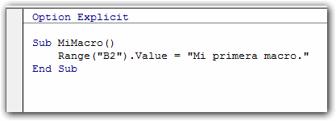](http://raymundoycaza.com/wp-content/uploads/macro-en-ecel-000407.png)

Cuando se ejecute este fragmento de código, Excel mostrará el texto 'Mi primera macro' en la celda B2 que dejamos resaltada en color amarillo al iniciar con este ejemplo.

Ahora regresa a tu hoja de Excel y dirígete nuevamente a la ficha 'Programador' y en el grupo 'Código' pincha sobre el botón 'Macros'.

[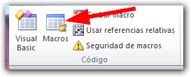](http://raymundoycaza.com/wp-content/uploads/macro-en-ecel-000409.png)

Se mostrará un cuadro de diálogo en el que se listarán todas las macros existentes en los libros abiertos. Como no tengo creada más que una macro, solo aparece la macro titulada 'MiMacro'.

[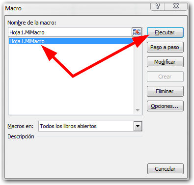](http://raymundoycaza.com/wp-content/uploads/macro-en-ecel-000410.png)

Si  la seleccionas y pinchas en el botón 'Ejecutar', aparecerá el texto que le hemos indicado en el código y aunque podemos borrar este texto, solo es necesario ejecutar nuevamente la macro y aparecerá nuevamente.

[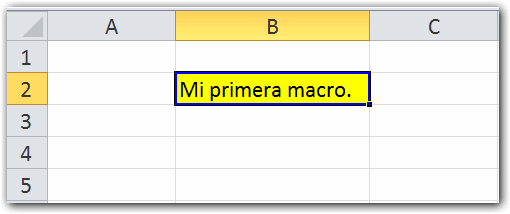](http://raymundoycaza.com/wp-content/uploads/macro-en-ecel-000411.png)

### Un paso más allá.

Si quisieras podrías reemplazar el texto que has usado en este ejemplo por algo un poco más 'Dinámico', por ejemplo podrías, en lugar de mostrar un texto fijo, mostrar la fecha y hora actual.

Esto se consigue con la función predefinida 'Now()'.

\[aviso type="informacion"\]

**Ten en cuenta que:**

A pesar de que utilices la versión de Excel en español, todas las propiedades, funciones predefinidas y funciones nativas de Excel, se usarán en inglés. Es bueno que lo vayas sabiendo desde ahora.

\[/aviso\]

Como sabes, 'Now' significa 'ahora' y como función devuelve la fecha y la hora que tiene el sistema en el momento en que se ejecuta.

Lo que debes hacer en tu código, es reemplazar el texto 'Mi primera macro' por la función Now(), así:

[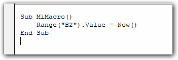](http://raymundoycaza.com/wp-content/uploads/macro-en-ecel-000412.png)

Regresa nuevamente a tu hoja de Excel y ejecuta tu macro una vez más. Verás que aparece la fecha y la hora en la celda elegida.

### 쯏 por qué sub-rutina?

Pues porque cada uno de estos fragmentos de código tendrá asignada una sub-tarea que trabajando en conjunto con todos los demás, podrán resolver el problema planteado.

Esto viene del paradigma de programación\[highlight\] 'Divide una tarea grande en varias tareas pequeñas'.\[/highlight\]

### Eso es todo por hoy.

Este es un ejemplo sencillo de cómo realizar una macro en Excel que servirá para que en las siguientes lecciones el proceso te sea más natural.

Como siempre, si tienes alguna duda sobre la lección de hoy o algo no ha quedado cubierto, te invito a que me dejes tus comentarios para que podamos seguir nuestra conversación.

Sigue practicando que ya vamos entrando en materia con esto de las macros :)

¡Nos vemos!

\[aviso type="creditos"\]

쯈uieres saber más?

[Ir al curso de macros de Excel.](http://raymundoycaza.com/macros-de-excel/)

Ver el vídeo directamente en Youtube.

[http://www.youtube.com/watch?v=Q4JJhDKCr\_o](http://www.youtube.com/watch?v=Q4JJhDKCr_o)

\[/aviso\]
