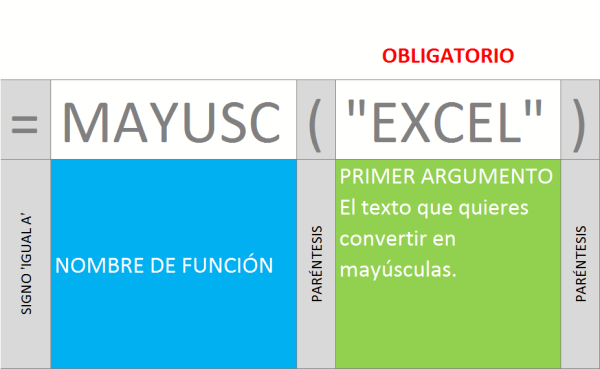

Categoría: Texto Nombre en inglés: **UPPER**

## Sintaxis:

### ¿Qué hace la función MAYUSC?

Convierte el texto que le pases como [argumento](http://raymundoycaza.com/que-son-los-argumentos-en-excel/ "¿ Qué son los argumentos en Excel ?") en mayúsculas.

### ¿Cómo se usa?

Debes escribir el nombre de la función y como primer y único argumento, debes especificar el [rango de la celda](http://raymundoycaza.com/que-es-un-rango-en-excel/ "Entonces, ¿qué es un rango en Excel?") donde está el texto que quieres convertir en mayúsculas o, en lugar de usar [una referencia](http://raymundoycaza.com/que-es-la-referencia/ "¿Qué es la referencia en Excel? Excel desde cero."), puedes escribir directamente el texto entre comillas, como en los siguientes ejemplos:

\[aviso type="codigo"\]

MAYUSC(“Me encanta”) = “ME ENCANTA” MAYUSC(“excel”) = “EXCEL” MAYUSC(“¿y A ti?”) = “¿Y A TI?”

\[/aviso\]

¿Quieres más?

\[aviso type="creditos" \]

Consulta el [Diccionario de Funciones](http://raymundoycaza.com/funciones-en-excel/ "Las Fórmulas y las Funciones en Excel").

\[/aviso\]
