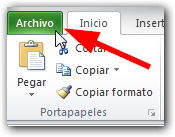
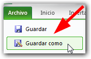
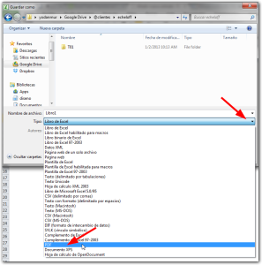
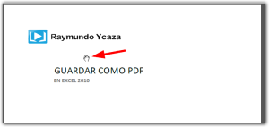

Si en algún momento necesitas **guardar como PDF** tu hoja de Excel 2010, recuerda que no necesitas ningún programa externo. Simplemente debes realizar los siguientes pasos:

1. Pincha en la ficha 'Archivo'.  
2. Selecciona la opción 'Guardar como'.  
3. En el cuadro de diálogo que se abre, debes pinchar en la lista desplegable 'Tipo' y seleccionar la opción PDF como te muestro en la siguiente imagen (pincha para verla más grande):  
4. Dale un nombre a tu nuevo archivo y pincha en el botón 'Guardar'. Tu hoja de Excel ahora será un archivo PDF que podrás enviar por correo sin que se puedan hacer modificaciones (o por la razón que quieras) :)  

### Utiliza el PDF para evitar cambios 'involuntarios' en tus hojas de trabajo.

Es frecuente que nos encontremos en la necesidad de enviar un reporte que hemos hecho en Excel y nos interesa que este no pueda ser modificable o evitar esos 'cambios involuntarios' con los cuales luego nos llega un reclamo debido a 'inconsistencias' en nuestro trabajo.

En estas situaciones, enviar tu hoja en formato PDF puede ser la solución ideal. Si bien es cierto existen programas para hacer cambios en un PDF, ciertamente se la estás poniendo difícil a las manos traviesas y, a partir de aquí, ya no puede considerarse un cambio 'involuntario'.

¿Qué me cuentas tú? ¿Te has encontrado en estos casos en los que necesitas enviar un reporte que no pueda ser modificado? Si aún no te has encontrado con manos traviesas como las que te comenté, ya llegarán. Solo es cuestión de tiempo :)

¡Nos vemos!
