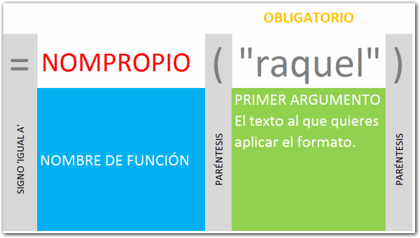

Sintaxis de la función NOMPROPIO:

##  

### ¿Qué hace la función NOMPROPIO?

Convierte la primera letra de cada palabra en mayúscula.

Esta función tiene un solo [argumento](http://raymundoycaza.com/que-son-los-argumentos-en-excel/ "Argumentos en Excel") y es justamente el texto al que le quieres aplicar el formato.

## ¿Cómo se usa?

Debes escribir el nombre de la función y como primer y único argumento, debes especificar el rango de la celda donde está el texto al que le quieres aplicar el formato o, en lugar de usar una referencia, puedes escribir directamente el texto entre comillas, como en los siguientes ejemplos:

\[aviso type="codigo"\]

NOMPROPIO("alberto") = "Alberto"

NOMPROPIO("el sistema solar") = "El Sistema Solar"

\[/aviso\]

## ¿Quieres más?

\[aviso type="creditos"\]

Consulta el [Diccionario de Funciones](http://raymundoycaza.com/funciones-en-excel/).

 

\[/aviso\]
