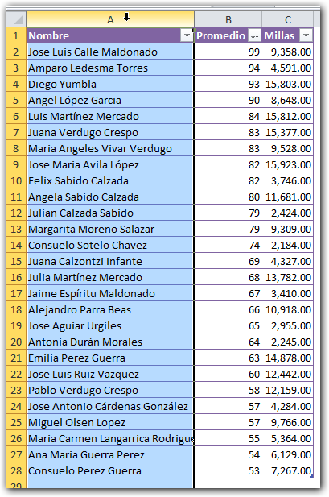
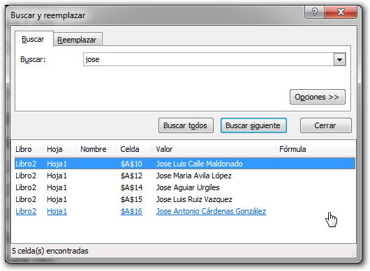
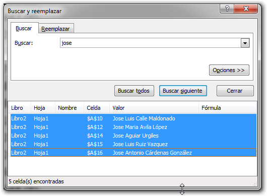
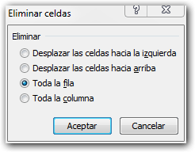
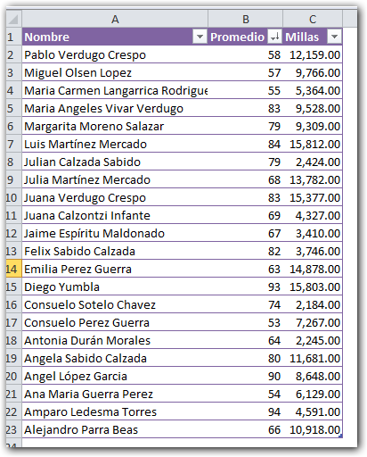

Si en algún momento te ha surgido la necesidad de **eliminar registros** de tu tabla en Excel que contengan una determinada palabra, tal vez no sea necesario utilizar las macros. Con esta técnica, probablemente puedas resolver tu problema **en un minuto**.

## Eliminar registros con la palabra José.

Para el ejemplo, voy a eliminar todos los registros de mi tabla, que tengan la palabra 'José'. Recuerda que puede ser cualquier otra palabra.

Entonces los pasos a seguir, son los siguientes:

1. Selecciona la columna en la que quieres buscar la palabra. 
2. Presiona el atajo de teclado CTRL + B (CTRL + F si tienes Excel en inglés)
3. Pincha sobre el botón 'Buscar todos'. 
4. En el panel que aparece abajo, selecciona el primer registro. 
5. Ahora, mantén presionada la tecla 'Shift' o tecla 'Mayúsculas' y pincha en el último registro. Con esto debes de haber seleccionado todos los registros encontrados: 
6. Pincha en el botón 'Cerrar' de este cuadro de diálogo.
7. Presiona el atajo de teclado CTRL - (Control y la tecla menos).
8. Si Excel te muestra este cuadro de diálogo, elige la opción 'Toda la fila'. 
9. Pincha en 'Aceptar' y se habrán eliminado todos los registros que contengan la palabra mágica :) ¡Sí, así de fácil! 

##  Ni siquiera ha pasado un minuto.

Estoy seguro de que con esta técnica podrás ahorrarte un montón de tiempo y aún así, lo estarás haciendo sin utilizar macros ¡Aunque usted no lo crea! :)

Recuerda que todas estas técnicas puedes combinarlas entre sí y lograrás convertirte en una máquina de productividad. Solo debes practicar y echar a volar la imaginación.

Ahora cuéntame tú: ¿En qué escenarios has utilizado esta técnica? ¿Te ha sacado de algún apuro? Me encantaría saberlo.

Eso es todo por hoy, así iniciamos esta semana y mantente al tanto de las novedades. No olvides suscribirte a la lista de correos si aún no lo has hecho. Pronto habrán sorpresas ahí :)

¡Nos vemos!
