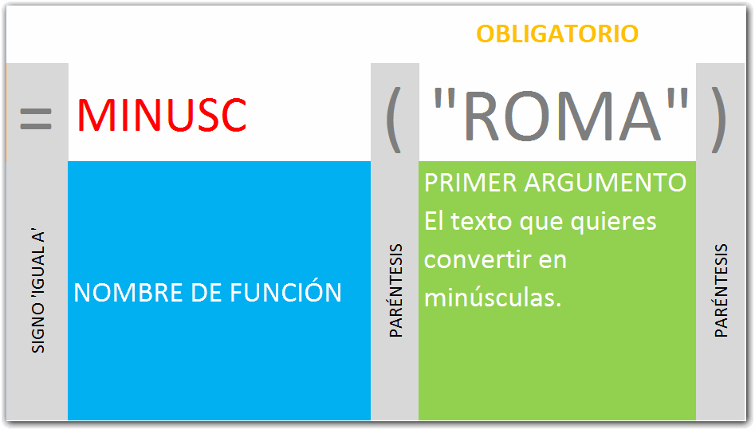

## ¿Qué hace la función MINUSC?

Con esta función puedes convertir todas las letras de un texto o celda en minúsculas.

Toma en cuenta que lo que obtendrás será una copia del contenido de la celda en minúsculas. No es que verás convertirse a la celda misma en minúsculas.

## Sintaxis de la función MINUSC.

## Ejemplo de uso.

\[aviso type="codigo"\] _MINUSC("lA vIdA eS bElLa") = "la vida es bella"_

      _MINUSC("MINÚSCULAS") = "minúsculas"_

\[aviso type="creditos"\]

_**¿Quieres saber más?**_

Consulta el [Diccionario de Funciones](http://raymundoycaza.com/tag/diccionario-de-funciones/) para ver las demás funciones disponibles en Excel.

\[/aviso\]
