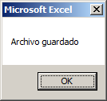
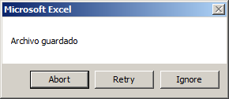
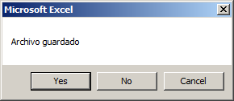
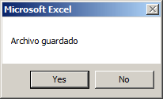
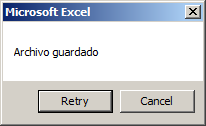
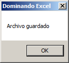

Una de las tareas más comunes y útiles, es la de mostrar un mensaje al usuario para hacerle saber que ha ocurrido un evento o, en situaciones menos deseadas, un error. En esta entrada te explicaré rápidamente cómo hacerlo.

## La palabra mágica

El nombre de la función que realiza esta tarea es `MsgBox`. Esto es la abreviación de 'Message Box' o en español: 'Cuadro de Mensaje'.

## El argumento o parámetro principal

Esta función debe ser utilizada con al menos un [argumento](http://raymundoycaza.com/que-son-los-argumentos-en-excel// "Argumento") y debe ser el mensaje que pretendes mostrar al usuario.

Así, por ejemplo, si quisieras mostrar un mensaje 'Archivo guardado', el código que deberías utilizar sería el siguiente:

`MsgBox "Archivo guardado"`

Nota que la frase está encerrada entre comillas dobles. Esto es porque se trata de una cadena de texto y, de no hacerlo así, nos marcaría un error.

## Los argumentos adicionales

Existen cuatro argumentos adicionales aparte del mensaje de los cuales, normalmente, utilizaremos solo dos:

- Buttons (Botones)
- Title (Título)

El argumento 'Buttons', es el segundo y sirve para indicarle a Excel qué tipo de botones queremos utilizar en nuestro mensaje.

### vbOKCancel

Si quieres un cuadro de mensaje que solo muestre el botón 'OK', deberías pasarle el valor constante `vbOKOnly`.

La línea completa quedaría así:

`MsgBox "Archivo guardado", vbOKOnly`

Notarás que es un cuadro exactamente igual al que vimos anteriormente. Esto es porque el valor `vbOKOnly` es el que trae por defecto este cuadro de mensaje.

Si cambias esta constante por cualquiera de las listadas a continuación podrás cambiar los botones que aparecerán en tu mensaje.

### vbOKCancel

Si quieres mostrar los botones 'OK' y 'Cancelar', debes usar la constante `vbOKCancel`.

`MsgBox "Archivo guardado", vbOKCancel`

### 

### vbAbortRetryIgnore

Si quieres mostrar los botones 'Abortar', 'Reintentar' e 'Ignorar', debes usar la constante 'vbAbortRetryIgnore'.

`MsgBox "Archivo guardado", vbAbortRetryIgnore`

### 

### vbYesNoCancel

Si quieres mostrar los botones 'Sí', 'No' y 'Cancelar', debes usar la constante 'vbYesNoCancel'.

`MsgBox "Archivo guardado", vbYesNoCancel`

### 

### vbYesNo

Si quieres mostrar los botones 'Sí' y 'No', debes usar la constante 'vbYesNo'.

`MsgBox "Archivo guardado", vbYesNo`

### 

### vbRetryCancel

Si quieres mostrar los botones 'Reintentar' y 'Cancelar', debes usar la constante 'vbRetryCancel'.

`MsgBox "Archivo guardado", vbRetryCancel`

### 

### El argumento 'title'

El tercer argumento es el llamado 'title' (Título) y es el que define cuál será el título de la caja de mensaje.

Si has estado atento, habrás notado que en la parte superior de la caja de mensaje siempre aparecía la leyenda 'Microsoft Excel'. Esto es porque nunca le especificamos qué debía aparecer ahí, de manera que se asignó el valor por defecto que es el nombre de la aplicación.

Si ahora le pasamos en el tercer argumento una cadena de texto, verás que este título cambia.

La leyenda que colocaré será 'Dominando Excel', así:

`MsgBox "Archivo guardado",vbyes,"Dominando Excel"`

Y este es el resultado.

## Pero aún hay más

Hasta aquí, hemos visto el uso básico de una caja de mensaje. Aún queda por ver cómo recoger las selecciones del usuario y cómo mostrar iconos en tus diálogos.

Esto y más lo veremos en una próxima entrada. Por ahora, practica lo aprendido y utilízalo en proyectos reales, así lograrás una mayor comprensión del tema.

¡Nos vemos!
