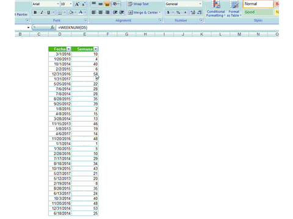

Una de mis alumnas me hizo la siguiente pregunta: ¿Cómo puedo en Excel **filtrar las celdas que tienen fórmulas**?

Al menos en la versión 2007 que estaba usando, esta opción no está disponible directamente. Pero con un par de trucos, podemos lograr que Excel realice esta labor:

1. Primero debes seleccionar la columna (o columnas) por la cual quieres filtrar.
2. Luego, presiona la tecla **F5** para que te aparezca el cuadro de diálogo 'Go To'
3. Presiona el botón Special...
4. Selecciona la opción Formulas
5. Presiona el botón Ok.

Como habrás notado, las celdas que contienen fórmulas se han seleccionado. Ahora lo que tienes que hacer es ponerle un color de fondo a esas celdas. Yo seleccionaré el color amarillo.

Al final, hemos logrado resaltar con color amarillo todas aquellas celdas en las que existe una fórmula. Lo único que nos resta por hacer, es un **filtro por color**.

En la siguiente animación puedes ver cómo se ejecuta este truco:

Un problema nuevo resuelto de una forma sencilla ¿No lo crees?

Si tú tienes una forma diferente de hacerlo, me gustaría conocerla. Anímate a dejar tu propio tip en los comentarios. Y si conoces a alguien a quien le puede servir este tip, no lo dudes y comparte el artículo usando los botones de abajo.

\[aviso type="creditos" icon="http://static.raymundoycaza.com/icono.gif"\]

#### _**Más información:**_

[http://office.microsoft.com/en-us/excel-help/select-cells-that-contain-formulas-HP010205613.aspx](http://office.microsoft.com/en-us/excel-help/select-cells-that-contain-formulas-HP010205613.aspx "Celdas con F&oacute;rmulas")

\[/aviso\]
