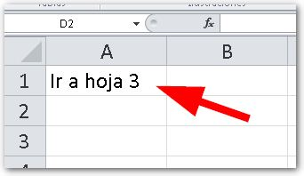
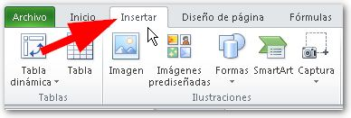
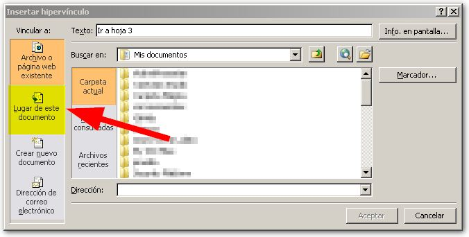
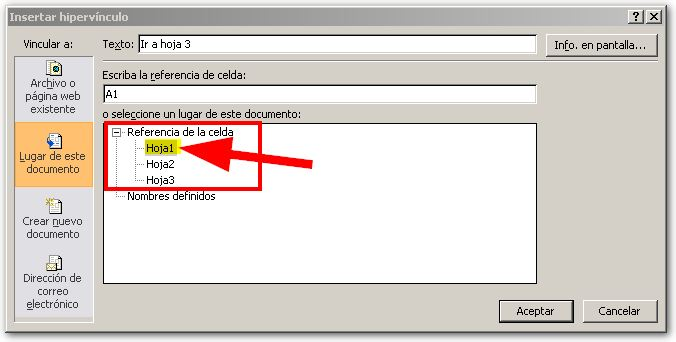
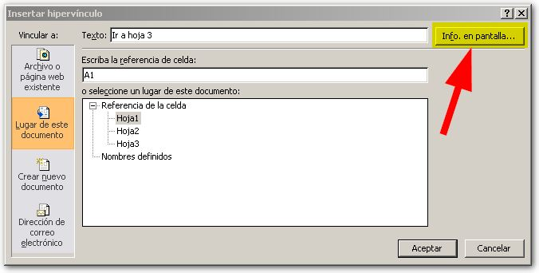
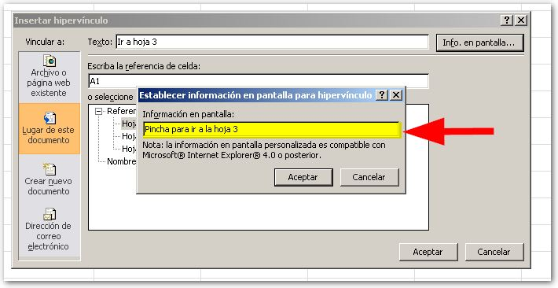
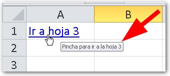

\[twitter style="vertical" source="RaymundoYcaza" hashtag="#Excel" float="left" lang="es" use\_post\_url="true"\]Insertar hipervínculos en Excel para la tarea. O tal vez porque alguien te sugirió que usaras hipervínculos para mejorar tus modelos en Excel. Sea cual sea la razón por la que lees esto, hoy voy a mostrarte cómo insertar hipervínculos en Excel y de qué manera pueden ayudarte.

¿Qué son los hipervínculos?

También llamados **hiperenlaces**, los hipervínculos son algo así como un ‘punto de salto’ hacia otro lugar del documento en Excel o hacia algún recurso externo.

Si deseas un concepto más amplio de lo que son los hipervínculos, te dejo esta [definición de la wikipedia](http://es.wikipedia.org/wiki/Hiperenlace) para que puedas consultarla.

### ¿Y para qué me sirven los hipervínculos?

Imagina que tienes un libro con muchas hojas en él. Ahora imagina tener que estar buscando esa hoja que necesitas cada vez, entre 20, 30 y hasta 50 hojas o más.

¿Verdad que sería cansino?

Pues aquí es donde los hipervínculos acuden a tu rescate. Si insertas un hipervínculo en, por ejemplo, la primera hoja, al pinchar sobre él puedes ‘saltar’ hasta la hoja número cincuenta en un solo clic.

También puedes crear un listado de hipervínculos que apunten a cada una de tus hojas en una especie de menú que te permitirá acceder fácil y rápidamente a la información deseada.

¿Suena bien, verdad?

Pues vamos directamente a ver cómo insertar un hipervínculo en 3 pasos.

## Insertar hipervínculos en Excel.

Antes de crear tu hipervínculo, debes tener claro donde vas a insertarlo y hacia donde quieres apuntar.

Para el ejemplo, vamos a utilizar un libro con tres hojas e insertaremos un hipervínculo en la hoja 1, que apunte a la hoja 3. ¿De acuerdo?

¡Comencemos!

### 1\. Seleccionar la celda deseada.

Primero debes seleccionar la celda deseada, como ya tienes claro donde vas a colocar tu hipervínculo, entonces vas a seleccionar esa celda. En mi caso, será la celda A1, en donde tengo escrito el texto “Ir a hoja 3”.

### 2\. Insertar hipervínculo.

Ahora, dirígete a la ficha “Insertar” y, en el apartado “Vínculos”, pincha sobre el botón “Hipervínculo”.

### 3\. Elegir el lugar.

Verás que se abre un cuadro de diálogo llamado “Insertar hipervínculo”. Aquí tienes cuatro opciones en el panel de la izquierda. Para el ejemplo que estamos realizando, vas a elegir la opción “Lugar de este documento”.

Verás que tienes en a parte inferior un listado en el que aparecen listadas todas las hojas (y más abajo los nombres definidos, si existieren).

Si aún no sabes cómo crear nombres definidos, puedes [pasarte por este artículo](http://raymundoycaza.com/nombres-de-rango-en-excel/).

Como ya tienes claro a donde quieres apuntar, vas a elegir la hoja 3 para que al pinchar sobre el hipervínculo, Excel te lleve directamente a esa hoja.

### Información adicional

En el mismo cuadro de diálogo que se abrió, puedes ver, en la parte superior derecha, un botón llamado “Info. en pantalla…”.

Si pinchas sobre este botón, se abrirá un nuevo cuadro de diálogo en el que puedes escribir un texto informativo que se mostrará al pasar el puntero del ratón encima de tu hipervínculo. Así, el usuario sabrá, antes de pinchar, hacia donde lo enviará ese hipervínculo.

## Un gran cambio, ¡en solo 3 pasos!

Como te has dado cuenta, has agregado una funcionalidad a tus hojas de Excel que te cambian completamente el panorama ¡y en solo 3 pasos! Imagínate lo que podrías hacer con algo más de tiempo ;)

Ahora puedes comenzar a utilizar hipervínculos en tus hojas de Excel que te ayudarán a organizarte y ahorrar tiempo en tu trabajo, al no tener que estar buscando pestaña a pestaña o utilizando el scroll en el menú contextual de éstas.

Aprovéchalo y cuéntame cómo te fue. De verdad me interesa saber ;)

¡Nos vemos!
